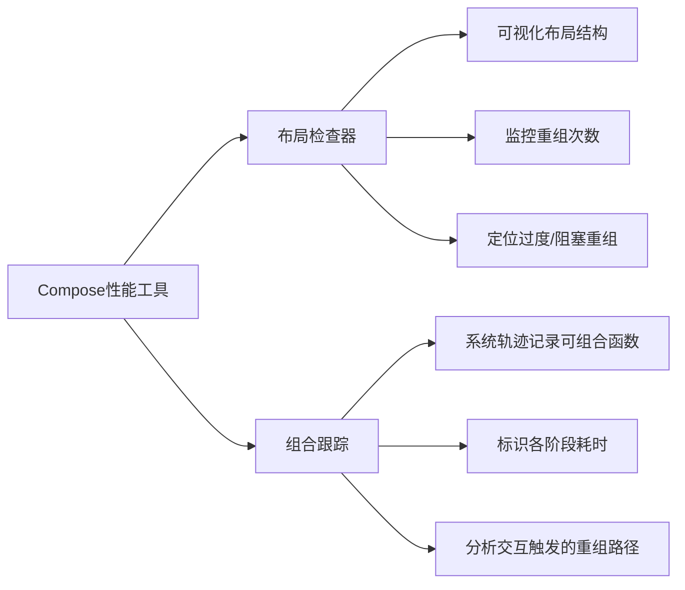

# 工具

原地址：<https://developer.android.google.cn/develop/ui/compose/performance/tooling?hl=zh-cn>

## 一、布局检查器

### 1. 核心功能

- **布局分析**：可视化检查Compose界面的布局结构，查看元素层级、尺寸、间距等属性是否符合预期。
- **重组计数追踪**：监控可组合项的重组次数，识别过度重组或重组不足的问题。

### 2. 应用场景

- **过度重组**：因状态设计不当或参数不稳定导致界面频繁无意义重组，消耗性能。
- **重组阻塞**：代码逻辑错误导致状态变化未触发重组，界面更新滞后。
- **示例**：当按钮点击未触发界面更新时，通过布局检查器查看对应可组合项的重组计数，判断是否因状态未正确关联导致。

### 3. 使用价值

- 快速定位编码错误：如错误使用可变对象作为可组合项参数，导致重组策略失效。
- 验证优化效果：优化稳定性或状态管理后，对比重组次数变化评估性能提升。

### 4. 延伸文档

- 参考[布局检查器的重组计数文档](https://developer.android.google.cn/jetpack/compose/tooling/layout-inspector?hl=zh-cn)，深入学习重组跟踪的具体操作和指标解读。

## 二、组合跟踪

### 1. 核心功能

- **系统轨迹集成**：将可组合函数的执行流程记录到Android系统性能轨迹（如通过Android Profiler生成的Trace文件）。
- **函数级追踪**：在轨迹中标识可组合项的组合、布局、绘制阶段耗时，以及重组触发路径。

### 2. 应用场景

- **初始性能调研**：首次定位性能瓶颈时，通过轨迹分析确定卡顿发生的具体可组合项或阶段（如组合阶段耗时占比过高）。
- **交互性能分析**：跟踪用户操作（如滑动、点击）触发的重组范围，判断是否存在不必要的深层重组。

### 3. 使用价值

- **假设验证**：基于轨迹数据推断性能问题根源，例如发现某个复杂列表项频繁重组，进而优化其状态依赖或参数稳定性。
- **阶段优化方向**：通过各阶段耗时分布，决定优先优化组合逻辑（如减少高开销计算）或布局算法（如延迟布局）。

### 4. 操作要点

- 结合Android Profiler的CPU Profiler或Energy Profiler，同步分析CPU占用、电池消耗与可组合项执行的关联关系。

