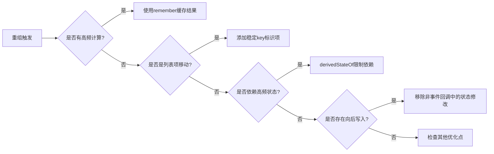

# 遵循最佳做法

原地址：<https://developer.android.google.cn/develop/ui/compose/performance/bestpractices?hl=zh-cn>

```mindmap
## **使用remember减少开销**
- 场景：频繁重组中的复杂计算
- 优化：缓存计算结果，仅在依赖变化时重新计算
- 示例：列表排序缓存
## **延迟布局键（key）**
- 作用：帮助Compose识别移动项，避免全量重组
- 实现：为列表项提供稳定唯一的`key`（如`id`）
- 案例：列表项移动时减少重组次数
## **使用derivedStateOf限制重组**
- 目的：仅在必要状态变化时触发重组
- 场景：监听列表滚动状态时优化重组范围
- 实现：通过`derivedStateOf`包装状态依赖
## **延迟读取状态**
- 方法：将状态读取封装在lambda中
- 优化层级：优先在布局/绘制阶段读取状态
- 案例：滚动偏移量通过lambda传递，避免组合阶段重组
## **避免向后写入**
- 定义：读取状态后修改状态导致的无限重组
- 危害：触发无限重组循环
- 解决方案：仅在事件回调中修改状态
```

## 一、使用`remember`减少开销计算

### 1. 核心目标

避免可组合函数中高频次、高成本的计算重复执行，通过缓存结果减少重组耗时。

### 2. 问题场景

```kotlin
// 每次重组都会重新排序列表，性能低下
@Composable
fun ContactList(contacts: List<Contact>, comparator: Comparator<Contact>) {
    LazyColumn {
        items(contacts.sortedWith(comparator)) { contact -> ... }
    }
}
```

### 3. 优化方案

```kotlin
// 使用remember缓存排序结果，仅在参数变化时重新计算
@Composable
fun ContactList(contacts: List<Contact>, comparator: Comparator<Contact>) {
    val sortedContacts = remember(contacts, comparator) {
        contacts.sortedWith(comparator)
    }
    LazyColumn {
        items(sortedContacts) { contact -> ... }
    }
}
```

### 4. 效果

- 首次组合时执行排序，后续依赖不变则复用缓存结果
- 减少重组时的计算量，提升列表加载效率

## 二、使用延迟布局键（`key`）

### 1. 核心作用

帮助Compose识别列表项的稳定性，避免因位置移动导致的全量重组。

### 2. 问题场景

```kotlin
// 未提供key时，列表项移动会触发全量重组
@Composable
fun NotesList(notes: List<Note>) {
    LazyColumn {
        items(notes) { note -> NoteRow(note) }
    }
}
```

### 3. 优化方案

```kotlin
// 提供稳定唯一的key（如数据模型id），避免无效重组
@Composable
fun NotesList(notes: List<Note>) {
    LazyColumn {
        items(notes, key = { note.id }) { note -> NoteRow(note) }
    }
}
```

### 4. 原理

- 通过`key`标识项的唯一性，Compose可判断项是否为“移动”而非“删除-新增”
- 仅重组数据变更的项，保持其他项的状态不变

## 三、使用`derivedStateOf`限制重组范围

### 1. 核心目标

仅在必要状态变化时触发重组，避免高频状态（如滚动位置）导致的无效重组。

### 2. 问题场景

```kotlin
// 每次滚动都触发重组，性能损耗高
val showButton = listState.firstVisibleItemIndex > 0
AnimatedVisibility(visible = showButton) { ... }
```

### 3. 优化方案

```kotlin
// 通过derivedStateOf包装，仅在最终值变化时触发重组
val showButton by remember {
    derivedStateOf { listState.firstVisibleItemIndex > 0 }
}
AnimatedVisibility(visible = showButton) { ... }
```

### 4. 优势

- 分离状态依赖，仅响应关键值变化（如从`false`→`true`）
- 减少重组频率，尤其适用于动画、滚动等高频更新场景

## 四、延迟读取状态

### 1. 核心思想

将状态读取延迟到布局或绘制阶段，避免组合阶段的不必要重组。

### 2. 层级优化

#### （1）基础：Lambda封装读取

```kotlin
// 组合阶段读取，触发父级重组
Title(snack, scroll.value) 

// 延迟到子项读取，限制重组范围
Title(snack) { scroll.value } 
```

#### （2）进阶：布局阶段读取

```kotlin
// 组合阶段计算偏移量
Modifier.offset(y = scroll.value.toDp()) 

// 布局阶段计算偏移量（跳过组合阶段）
Modifier.offset { IntOffset(y = scroll.value) } 
```

#### （3）高级：绘制阶段读取

```kotlin
// 组合阶段触发重组（每一帧）
Modifier.background(color) 

// 绘制阶段更新（跳过组合和布局）
Modifier.drawBehind { drawRect(color) } 
```

### 3. 效果对比

| 优化层级       | 重组阶段       | 性能影响 |
|----------------|----------------|----------|
| 组合阶段读取   | 组合+布局+绘制 | 高       |
| 布局阶段读取   | 布局+绘制     | 中       |
| 绘制阶段读取   | 仅绘制         | 低       |

## 五、避免向后写入状态

### 1. 定义

在读取状态后立即修改该状态，导致Compose无限触发重组的循环。

### 2. 错误示例

```kotlin
@Composable
fun BadComposable() {
    var count by remember { mutableStateOf(0) }
    Text("$count") 
    count++ // 向后写入：读取后修改，触发无限重组
    Button(onClick = { count++ }) { Text("Click") }
}
```

### 3. 正确做法

```kotlin
@Composable
fun GoodComposable() {
    var count by remember { mutableStateOf(0) }
    Button(onClick = { count++ }) { // 仅在事件回调中修改状态
        Text("Count: $count")
    }
}
```

### 4. 危害

- 导致界面卡顿、电池消耗激增
- 可能触发Compose的重组保护机制，强制终止应用

## 六、优化流程图



## 七、关键对比表

| 优化场景               | 未优化表现                     | 优化后表现                     |
|------------------------|--------------------------------|--------------------------------|
| 列表排序               | 每次重组都重新排序             | 仅依赖变化时重新排序           |
| 列表项移动             | 全量重组                       | 仅重组数据变更项               |
| 滚动状态监听           | 每一帧触发重组                 | 仅值变化时触发重组             |
| 状态读取位置           | 组合阶段触发父级重组           | 布局/绘制阶段触发子级更新       |
| 向后写入状态           | 无限重组循环                   | 正常响应事件                   |

## 八、最佳实践总结

1. **优先缓存计算**：对耗时操作（如排序、过滤）使用`remember`
2. **列表必加key**：任何列表组件均需提供稳定唯一的`key`
3. **控制重组范围**：通过`derivedStateOf`和延迟读取缩小重组影响域
4. **状态修改原则**：仅在事件回调或副作用中修改状态，禁止组合阶段写入
5. **层级优化策略**：能在绘制阶段处理的逻辑，绝不提升到布局或组合阶段
