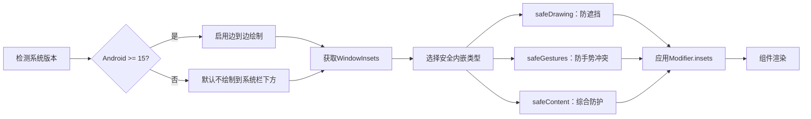

# 窗口边衬区简介 - Jetpack Compose 系统边衬区适配指南  

[原文地址](https://developer.android.google.cn/develop/ui/compose/system/insets?hl=zh-cn)  

## 一、核心概念：系统界面与边衬区  

### 1. 系统界面的影响  

- **状态栏（Status Bar）**：显示时间、通知图标等，位于屏幕顶部。  
- **导航栏（Navigation Bar）**：提供返回、主页等导航按钮，位于屏幕底部（或侧边）。  
- **显示屏缺口（Display Cutout）**：前置摄像头区域，如刘海屏、挖孔屏。  
- **软件键盘（IME）**：输入时弹出，占据屏幕底部空间。  

- **边到边设计**：应用内容延伸至系统界面后方（Android 15+强制要求以SDK 35为目标的应用采用），需通过 `WindowInsets` 处理内边距避免遮挡。  

### 2. `WindowInsets` 的作用  

- 提供系统界面的位置和尺寸信息（像素值），分为 **可见状态** 和 **忽略可见状态** 两类（后者在系统栏隐藏时仍返回固定值）。  
- 核心目标：  
  1. 防止内容被系统栏遮挡（如状态栏覆盖标题）。  
  2. 避免手势冲突（如底部导航栏与应用内滑动手势冲突）。  
  3. 适配异形屏（如缺口、瀑布屏弯曲区域）。  

## 二、边衬区类型与分类  

### 1. 系统栏相关类型  

| **类型**                          | **描述**                                                                 |  
|-----------------------------------|--------------------------------------------------------------------------|  
| `statusBars`                      | 状态栏内边距（顶部，包含图标区域）。                                      |  
| `navigationBars`                  | 导航栏内边距（底部/侧边，包含返回按钮等）。                                |  
| `systemBars`                      | 状态栏 + 导航栏 + 标题栏的并集。                                         |  
| `displayCutout`                   | 显示屏缺口内边距（如刘海区域）。                                          |  
| `waterfall`                       | 瀑布屏边缘弯曲区域内边距（屏幕向侧边延伸的弧形区域）。                     |  

### 2. 输入与手势相关类型  

| **类型**                          | **描述**                                                                 |  
|-----------------------------------|--------------------------------------------------------------------------|  
| `ime`                             | 软件键盘占据的底部空间内边距。                                           |  
| `systemGestures`                  | 系统拦截手势的边距（如边缘滑动返回），可通过 `Modifier.systemGestureExclusion` 排除应用处理的区域。 |  
| `mandatorySystemGestures`         | 系统强制处理的手势边距（不可排除）。                                      |  

### 3. 安全内嵌类型（关键）  

| **类型**                          | **作用**                                                                 |  
|-----------------------------------|--------------------------------------------------------------------------|  
| `safeDrawing`                     | 确保内容不在任何系统界面下绘制（避免遮挡），如文本、按钮。                |  
| `safeGestures`                    | 保护应用手势不与系统手势冲突（如底部栏滑动冲突）。                        |  
| `safeContent`                     | 组合 `safeDrawing` + `safeGestures`，同时避免视觉和手势冲突。              |  

## 三、适配流程与实现方法  

### 1. 获取边衬区数据  

通过 `LocalWindowInsets.current` 获取当前窗口的边衬区信息：  

```kotlin
val windowInsets = LocalWindowInsets.current
val statusBarInsets = windowInsets.statusBars // 状态栏内边距（顶部像素值）
val navigationBarInsets = windowInsets.navigationBars // 导航栏内边距（底部像素值）
```

### 2. 应用内边距  

使用 `Modifier.insets(Insets)` 为组件添加安全边距：  

```kotlin
Box(
    modifier = Modifier
        .fillMaxSize()
        .padding(
            // 应用状态栏和导航栏内边距，避免内容被遮挡
            WindowInsets.safeDrawing.only(InsetsType.WindowInsetsType.statusBars or InsetsType.WindowInsetsType.navigationBars)
        )
) {
    Text("Content with safe insets")
}
```

### 3. 手势冲突处理  

- **排除系统手势区域**：允许应用处理特定区域的手势（如底部动作栏）。  

  ```kotlin
  Modifier.systemGestureExclusion(
      windowInsets.systemGestures // 排除系统手势处理的边距区域
  )
  ```  

- **强制系统手势区域**：`mandatorySystemGestures` 不可排除（如边缘返回手势），需避免在此区域放置关键交互组件。  

### 4. Android 15+ 适配要点  

- **强制边到边**：以SDK 35为目标时，系统强制内容延伸至系统栏后方，需通过 `safeDrawing` 手动添加内边距。  
- **Material组件支持**：使用 `Scaffold` 组件自动处理系统栏内边距，简化适配：  

  ```kotlin
  Scaffold(
      topBar = { TopAppBar { Text("Title") } }, // 自动适配状态栏内边距
      bottomBar = { BottomAppBar { /* 导航栏内容 */ } } // 自动适配导航栏内边距
  ) { contentPadding ->
      Box(Modifier.padding(contentPadding)) { /* 内容 */ }
  }
  ```  

## 四、流程图：边衬区适配全流程  



## 五、关键对比与最佳实践  

| **场景**               | **推荐方案**                          | **代码示例**                                                                 |  
|------------------------|---------------------------------------|-----------------------------------------------------------------------------|  
| 防止状态栏遮挡标题     | `safeDrawing.statusBars`              | `.padding(WindowInsets.safeDrawing.statusBars)`                             |  
| 底部按钮避开导航栏     | `safeDrawing.navigationBars`          | `.padding(WindowInsets.safeDrawing.navigationBars)`                         |  
| 处理屏幕缺口           | `displayCutout`                       | `.padding(LocalWindowInsets.current.displayCutout)`                         |  
| 自定义底部手势区域     | `systemGestureExclusion` + `safeGestures` | `.systemGestureExclusion(Insets.systemGestures)` + `.padding(Insets.safeGestures)` |  
| Android 15+ 全面适配   | `Scaffold` + `safeContent`            | 使用Material组件自动处理内边距，搭配`safeContent`确保手势安全              |  

**注意事项**：  

- 避免在 `mandatorySystemGestures` 区域放置可点击组件（如边缘返回区域）。  
- 动态监测键盘显示（`ime` 类型），调整列表或表单布局（如使用 `AnimatedVisibility` 配合键盘动画）。  
- 使用 `WindowInsetsController` 动态隐藏/显示系统栏（需配合 `LocalWindowInsetsController.current`）。  

## 六、总结  

`WindowInsets` 是Compose适配系统界面的核心工具，通过合理应用安全内嵌类型，可有效解决内容遮挡和手势冲突问题。重点需关注Android版本差异（尤其是Android 15+的强制边到边要求），优先使用Material组件简化适配，并通过实时监测系统栏状态动态调整布局。结合 `systemGestureExclusion` 和 `safeGestures`，可在保证系统交互的同时，保留应用自定义手势的灵活性。
