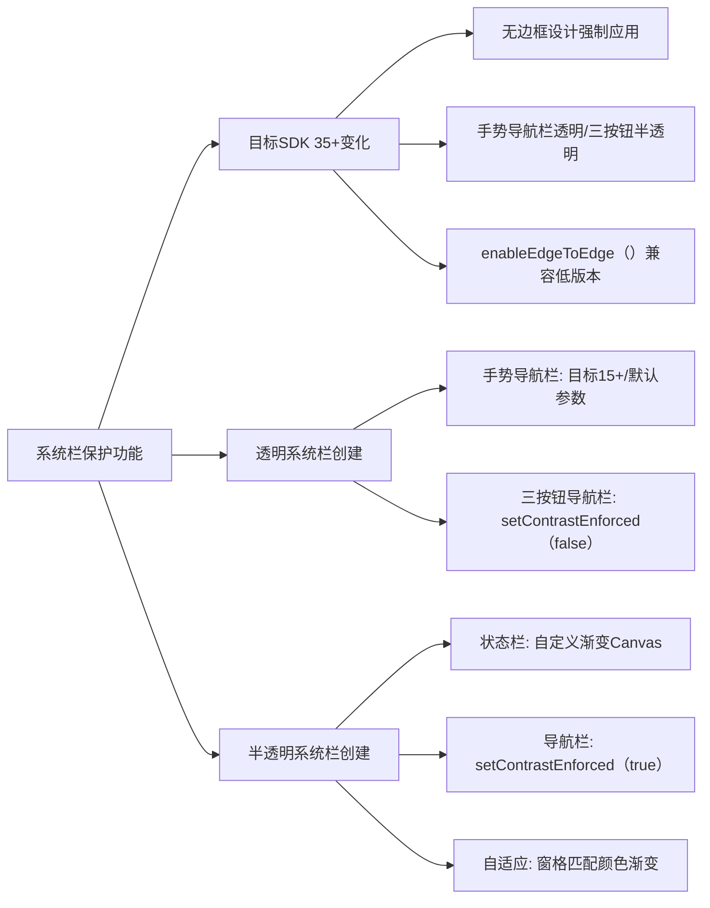

# 系统栏保护功能简介

原地址：<https://developer.android.google.cn/develop/ui/compose/system/system-bars?hl=zh-cn>

## 一、目标 SDK 35+ 系统栏变化

### 1. 强制无边框设计

- **适用范围**：当应用以 **SDK 35（Android 15）或更高版本** 为目标平台时生效。
- **默认效果**：
  - **状态栏和手势导航栏**：透明（完全透明，内容可延伸至系统栏区域）。
  - **三按钮导航栏**：半透明（系统自动添加半透明遮罩）。
- **兼容性处理**：调用 `enableEdgeToEdge()` 方法可实现向后兼容（适配低版本系统）。

### 2. 设计指南参考

- 透明/半透明系统栏的使用场景可参考：
  - [Android 系统栏设计指南](https://developer.android.google.cn/design/components/system-bars)
  - [边到边设计指南](https://developer.android.google.cn/design/layout/edge-to-edge)

## 二、创建透明系统栏

### 1. 手势导航栏透明

- **条件**：
  - 目标平台为 **Android 15 或更高版本**。
  - 或调用 `enableEdgeToEdge()` 时使用默认参数（适配低版本）。
- **效果**：导航栏完全透明，内容可延伸至屏幕边缘。

### 2. 三按钮导航栏透明

- **额外配置**：需手动将 `Window.setNavigationBarContrastEnforced` 设置为 `false`，否则系统会强制添加半透明遮罩。
- **代码示例**：

  ```kotlin
  enableEdgeToEdge() // 启用边到边兼容
  Window.setNavigationBarContrastEnforced(false) // 移除三按钮导航栏的半透明遮罩
  ```

## 三、创建半透明系统栏

### 1. 半透明状态栏

- **实现原理**：通过自定义可组合项绘制渐变层，覆盖状态栏区域，模拟半透明效果。
- **代码实现**：

  ```kotlin
  @Composable
  private fun StatusBarProtection(
      color: Color = MaterialTheme.colorScheme.surfaceContainer,
      heightProvider: () -> Float = calculateGradientHeight()
  ) {
      Canvas(Modifier.fillMaxSize()) {
          val calculatedHeight = heightProvider()
          // 创建垂直渐变（从不透明到透明）
          val gradient = Brush.verticalGradient(
              colors = listOf(
                  color.copy(alpha = 1f),   // 底部不透明色
                  color.copy(alpha = 0.8f), // 中间半透明色
                  Color.Transparent         // 顶部透明色
              ),
              startY = 0f,
              endY = calculatedHeight
          )
          // 绘制渐变矩形，高度由系统栏Insets计算
          drawRect(brush = gradient, size = Size(size.width, calculatedHeight))
      }
  }

  @Composable
  fun calculateGradientHeight(): () -> Float {
      val statusBars = WindowInsets.statusBars // 获取系统状态栏Insets
      val density = LocalDensity.current         // 获取屏幕密度
      return { statusBars.getTop(density) * 1.2f } // 计算渐变高度（基于Insets并放大1.2倍）
  }
  ```

### 2. 半透明导航栏

- **配置方法**：将 `Window.setNavigationBarContrastEnforced` 设置为 `true`（默认值）。
- **效果**：系统自动为三按钮导航栏添加半透明遮罩，手势导航栏仍保持透明。

## 四、自适应应用处理

- **场景**：当应用需要适配折叠屏、分屏等多窗格场景时。
- **解决方案**：在每个窗格中插入与该窗格颜色匹配的自定义 `StatusBarProtection` 可组合项，确保渐变效果与界面风格一致。


