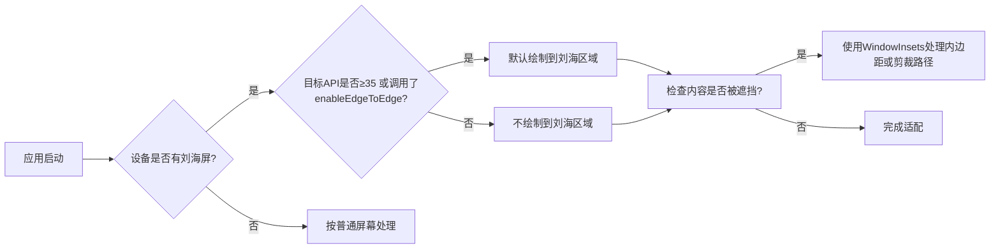

# 刘海屏简介

原地址：<https://developer.android.google.cn/develop/ui/compose/system/cutouts?hl=zh-cn>

## 一、刘海屏基本概念

### 1. 定义

- 设备显示屏上延伸出的特殊区域，用于容纳传感器（如摄像头、听筒），同时提供全面屏体验。
- 示例：图1（人像模式剪裁）、图2（横屏刘海区域）。

### 2. 系统支持

- **原生支持**：Android 9（API 28）及以上版本。
- **厂商适配**：Android 8.1及更低版本可能由设备制造商自定义支持。

## 二、不同API级别的默认绘制行为

| 目标API级别/配置         | Android 15以下设备       | Android 15及以上设备     |
|-------------------------|-------------------------|-------------------------|
| **API ≤34 或未调用`enableEdgeToEdge`** | 不绘制到刘海区域（除非绘制到系统栏） | 不绘制到刘海区域         |
| **API ≥35 或调用`enableEdgeToEdge`**  | 不适用                  | 绘制到刘海区域（默认行为） |

**关键规则**：

- Android 15+且API≥35时，`LAYOUT_IN_DISPLAY_CUTOUT_MODE_DEFAULT`等模式会被视为`ALWAYS`（非浮动窗口）。

## 三、手动处理刘海区域的核心方法

### 1. 核心工具类：`WindowInsets`

| 属性                | 作用                                                                 |
|---------------------|----------------------------------------------------------------------|
| `displayCutout`     | 获取刘海区域的矩形信息（位置、尺寸）                                 |
| `safeContent`       | 包含系统栏和刘海区域的安全内边距（确保内容不被遮挡）                 |
| `safeDrawing`       | 类似`safeContent`，但适用于绘制层（如Canvas）                         |

### 2. 推荐实践：使用内边距适配

```kotlin
// 在Compose中为组件添加刘海区域内边距
Box(
    modifier = Modifier
        .fillMaxSize()
        .windowInsetsPadding(WindowInsets.displayCutout) // 关键适配代码
) {
    Text("内容避开刘海区域", Modifier.padding(16.dp))
}
```

### 3. 高级场景：自定义剪裁路径

```kotlin
// 通过LocalView获取原始剪裁路径（适用于复杂绘制需求）
@Composable
fun CustomCutoutHandling() {
    val rootWindowInsets = LocalView.current.rootWindowInsets
    val cutoutPath = rootWindowInsets.displayCutout.shape.toOutline().path // 获取剪裁区域路径
    
    Canvas(modifier = Modifier.fillMaxSize()) {
        drawPath(cutoutPath, color = Color.Red, style = Stroke(2.dp.toPx())) // 绘制剪裁边界
    }
}
```

## 四、适配流程图



## 五、注意事项

1. **禁止硬编码**：  
   避免手动设置状态栏高度（如`padding(top = 24.dp)`），应始终通过`WindowInsets`动态获取安全区域。
2. **触摸灵敏度**：  
   刘海区域的触摸精度可能较低，重要交互元素（如按钮）需避开该区域或增加点击热区。
3. **横屏适配**：  
   部分设备横屏时刘海位置可能变化，需同时处理`displayCutout`在不同方向的尺寸。

## 六、总结

| 场景                | 解决方案                                                                 |
|---------------------|--------------------------------------------------------------------------|
| **基础适配**        | 使用`modifier.windowInsetsPadding(WindowInsets.displayCutout)`           |
| **复杂绘制**        | 通过`rootWindowInsets.displayCutout.shape`获取原始剪裁路径               |
| **版本兼容性**      | 针对API≥35和Android 15+设备需特别注意默认绘制行为的变化                 |

**核心目标**：确保内容不被刘海遮挡，同时遵循系统默认的绘制策略，平衡视觉效果与交互体验。
