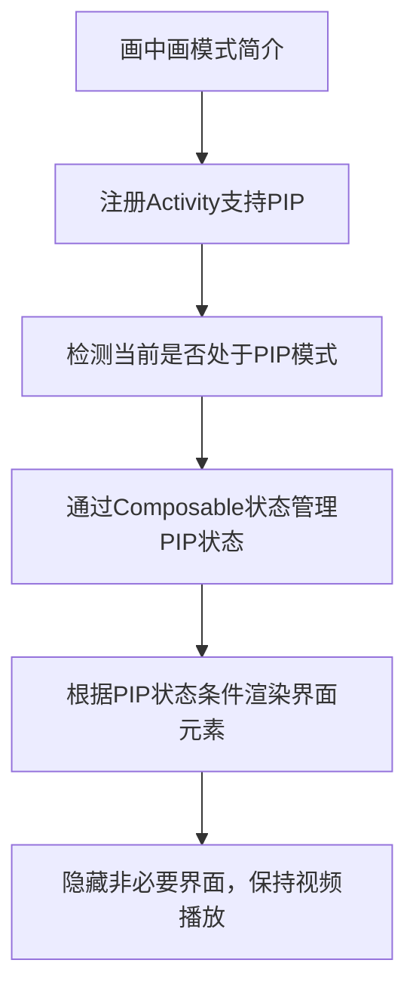

# 画中画 (PIP) 简介

原地址：<https://developer.android.google.cn/develop/ui/compose/system/picture-in-picture?hl=zh-cn>

## 流程图



## 详细知识点总结

### 一、画中画 (PIP) 模式概述

- **定义**：一种特殊的多窗口模式，常用于视频播放场景，允许用户在固定小窗口中观看内容，同时切换至其他应用或主屏幕。
- **技术实现**：基于Android 7.0（API 24）引入的多窗口模式API，通过Activity的PIP模式切换实现。
- **核心需求**：
  1. 注册Activity以支持PIP模式。
  2. 处理PIP模式下的界面显示（如隐藏非必要元素）。
  3. 确保内容（如视频）在PIP模式下持续播放。

### 二、检测当前是否处于PIP模式

#### 1. 使用Compose实现状态监听

通过`OnPictureInPictureModeChangedProvider`接口监听Activity的PIP模式变化，并通过Compose状态保存状态。

#### 2. 关键代码实现

```kotlin
@Composable
fun rememberIsInPipMode(): Boolean {
    if (Build.VERSION.SDK_INT >= Build.VERSION_CODES.O) {
        val activity = LocalContext.current.findActivity()
        var pipMode by remember { mutableStateOf(activity.isInPictureInPictureMode) }
        
        DisposableEffect(activity) {
            // 创建监听器，更新PIP状态
            val observer = Consumer<PictureInPictureModeChangedInfo> { info ->
                pipMode = info.isInPictureInPictureMode
            }
            // 添加监听器到Activity
            activity.addOnPictureInPictureModeChangedListener(observer)
            
            // 清理回调（避免内存泄漏）
            onDispose {
                activity.removeOnPictureInPictureModeChangedListener(observer)
            }
        }
        return pipMode
    } else {
        // 低于Android O版本不支持PIP
        return false
    }
}
```

- **关键点**：
  - `remember`：确保状态在重组间保持。
  - `DisposableEffect`：在组件存活时绑定监听器，销毁时移除（通过`onDispose`）。
  - `LocalContext.current.findActivity()`：获取当前Activity引用（需确保Context为Activity类型）。

### 三、根据PIP状态条件渲染界面

#### 1. 核心逻辑

通过`rememberIsInPipMode()`返回的布尔值`inPipMode`，控制界面元素的显示/隐藏。

#### 2. 示例代码

```kotlin
val inPipMode = rememberIsInPipMode()

Column(modifier = modifier) {
    // 仅在非PIP模式显示文本
    if (!inPipMode) {
        Text(text = "Picture in Picture")
    }
    // 始终显示视频播放器（PIP模式下保持播放）
    VideoPlayer()
}
```

- **场景说明**：
  - 非PIP模式：显示标题文本和视频播放器。
  - PIP模式：隐藏标题文本，仅保留视频播放器窗口（需配合系统自动处理窗口缩放）。

### 四、PIP模式下的界面处理最佳实践

1. **隐藏非必要元素**：
   - 在PIP模式下，建议隐藏导航栏、按钮等交互元素，仅保留核心内容（如视频画面）。
   - 通过`inPipMode`状态控制组件可见性（如`Visibility`修饰符）。

2. **媒体播放管理**：
   - 确保视频播放器在PIP模式下继续播放，需处理`Activity`的生命周期回调（如`onPause`/`onResume`）。
   - 结合`LifecycleObserver`或`rememberUpdatedState`保持播放状态与PIP模式同步。

3. **兼容性处理**：
   - 对于Android O以下版本，直接返回`false`，不支持PIP模式。
   - 使用`android:supportsPictureInPicture`属性在Manifest中声明Activity支持PIP。

### 五、相关API与配置

- **Manifest配置**：

  ```xml
  <activity
      android:name=".VideoActivity"
      android:supportsPictureInPicture="true"
      android:configChanges="screenSize|smallestScreenSize|orientation|screenLayout">
  </activity>
  ```

- **Activity方法**：
  - `enterPictureInPictureMode()`：主动触发PIP模式。
  - `isInPictureInPictureMode`：当前是否处于PIP模式（布尔值）。

## 总结

通过Compose的状态管理和Effect机制，结合Android系统的PIP API，可以便捷地实现画中画功能。核心步骤包括：注册Activity支持PIP、通过`rememberIsInPipMode`监听状态、根据状态条件渲染界面。实际应用中需注意兼容性处理和媒体播放的生命周期管理，以提供流畅的多窗口体验。
