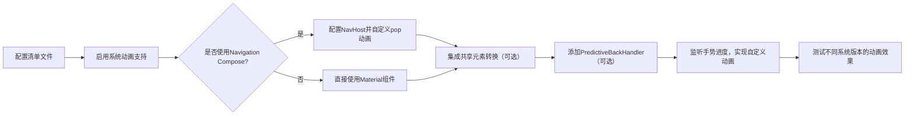

# Compose 中的预测性返回 - Jetpack Compose 导航动画指南  

[原文地址](https://developer.android.google.cn/develop/ui/compose/system/predictive-back?hl=zh-cn)  

## 一、核心概念：预测性返回手势  

**预测性返回** 是Android的手势导航功能，用户滑动返回时可预览目标界面，提升导航流畅性。Compose通过集成系统动画、导航组件和自定义回调，实现无缝的返回过渡效果。  

- **核心优势**：  
  - 可视化返回路径，减少用户认知成本。  
  - 支持跨Activity、跨任务的系统级动画。  
  - 与Material组件和Navigation Compose深度整合。  

## 二、启用预测性返回手势  

### 1. 配置清单文件  

在`AndroidManifest.xml`中声明对返回回调的支持：  

```xml
<application 
    android:enableOnBackInvokedCallback="true"
    ...>
    <activity 
        android:enableOnBackInvokedCallback="true"
        .../>
</application>
```  

**注意**：使用`BackHandler`或`PredictiveBackHandler`处理返回事件，替代已废弃的`onBackPressed`。  

### 2. 系统动画支持  

- **Android 15+**：默认启用“返回主屏幕”“跨Activity”“跨任务”动画。  
- **Android 13/14**：需在开发者选项手动启用“预测性返回手势动画”。  
- **依赖要求**：更新`androidx.activity`至1.6.0+，确保系统动画正常运行。  

## 三、Navigation Compose 集成  

### 1. 基础配置  

确保使用`navigation-compose` 2.8.0+版本，默认提供屏幕间的交叉淡出动画。  

```kotlin
NavHost(
    navController = navController,
    startDestination = "home"
) {
    composable("home") { HomeScreen() }
    composable("detail") { DetailScreen() }
}
```  

### 2. 自定义返回动画  

通过`popEnterTransition`和`popExitTransition`控制返回时的进出动画：  

```kotlin
NavHost(
    navController = navController,
    startDestination = "home",
    popExitTransition = { // 退出屏幕动画（返回时）
        scaleOut(targetScale = 0.9f, transformOrigin = TransformOrigin(0.5f, 0.5f))
    },
    popEnterTransition = { // 进入屏幕动画（返回后）
        fadeIn()
    }
)
```  

- **常用动画**：`scaleOut`（缩放退出）、`fadeOut`（淡出退出）、`slideInHorizontally`（水平滑入）。  
- **区别常规动画**：`enterTransition`/`exitTransition`作用于所有导航，而`pop`系列仅影响返回操作。  

## 四、Material Compose 组件支持  

### 1. 内置支持的组件  

| 组件名称                  | 支持场景                     | 配置要点                                  |  
|---------------------------|------------------------------|-------------------------------------------|  
| `SearchBar`               | 搜索栏返回时的过渡动画       | 自动适配预测性返回手势，无需额外配置      |  
| `ModalBottomSheet`        | 底部弹 sheet 返回时的动画    | 自动处理滑动关闭与预览效果                |  
| `ModalNavigationDrawer`   | 抽屉式导航的返回联动        | 需将`drawerState`传递给抽屉内容组件      |  

### 2. 抽屉导航示例  

```kotlin
val drawerState = rememberDrawerState(DrawerValue.Closed)
ModalNavigationDrawer(
    drawerState = drawerState,
    drawerContent = { DrawerContent() }
) {
    // 内容组件需接收drawerState以联动返回手势
    Content(drawerState = drawerState)
}
```  

## 五、高级定制：PredictiveBackHandler  

### 1. 手势进度监听  

通过`PredictiveBackHandler`拦截返回手势，获取实时进度（`progress`：0→1）和触摸坐标（`touchX`/`touchY`）：  

```kotlin
PredictiveBackHandler(enabled = true) { progressFlow ->
    LaunchedEffect(progressFlow) {
        progressFlow.collect { backEvent ->
            val progress = backEvent.progress
            // 根据进度更新动画状态（如缩放、平移）
            boxScale.value = 1f - progress // 进度0时完全显示，进度1时缩至0
        }
    }
}
```  

### 2. 与抽屉导航集成  

**需求**：滑动返回时，根据手势进度联动抽屉的打开状态。  

```kotlin
var drawerTranslation by remember { mutableStateOf(0f) }
val velocityTracker = remember { VelocityTracker() }

PredictiveBackHandler(true) { progressFlow ->
    progressFlow.collect { event ->
        when (event) {
            is BackEventCompat.Start -> velocityTracker.reset()
            is BackEventCompat.InProgress -> {
                drawerTranslation = event.progress * drawerWidth // 按进度移动抽屉
            }
            is BackEventCompat.Completed -> {
                // 手势完成，关闭抽屉
                animateTo(0f, velocity = velocityTracker.calculateVelocity())
            }
            is BackEventCompat.Canceled -> {
                // 手势取消，恢复原状态
                animateTo(drawerWidth, velocity = velocityTracker.calculateVelocity())
            }
        }
    }
}
```  

## 六、共享元素转换与动画测试  

### 1. 共享元素集成  

结合`navigatorSharedElementEnterTransition`和`navigatorSharedElementExitTransition`，实现跨屏幕的元素共享动画（如图片预览返回时的无缝过渡）。  

### 2. 测试步骤  

- **Android 13/14**：进入“设置→系统→开发者选项”，启用“预测性返回手势动画”。  
- **Android 15+**：默认启用，直接通过手势操作测试动画效果。  
- **关键验证点**：  
  1. 返回手势是否触发预览动画。  
  2. 自定义动画是否按预期执行（如缩放、平移）。  
  3. 组件联动（如抽屉、底部栏）是否流畅无卡顿。  

## 七、流程图：预测性返回实现流程  



## 八、最佳实践建议  

1. **优先使用系统默认**：避免过度自定义导致动画不一致，Material组件的内置支持是首选。  
2. **处理手势冲突**：在`PredictiveBackHandler`中通过`velocityTracker`平滑处理手势速度，提升用户体验。  
3. **版本兼容性**：针对Android 15+强制边到边设计，确保返回动画与系统栏适配（参考`WindowInsets`处理）。  
4. **性能优化**：避免在手势回调中执行复杂计算，动画状态更新应基于`remember`或`mutableStateOf`。  

通过以上步骤，可在Compose中高效实现预测性返回功能，结合系统动画和自定义逻辑，打造流畅的导航体验。
