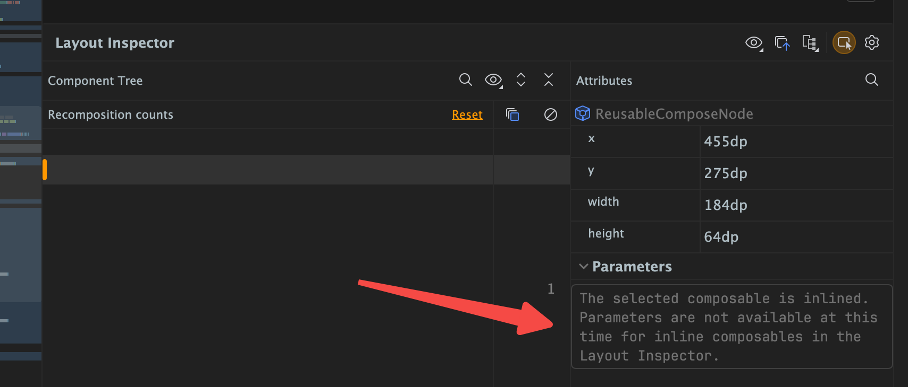

# Layout Inspector无法读取Compose的UI



在 Compose 中，Layout Inspector 提示 **“The selected composable is inlined...”** 是因为 **内联（`inline`）的 Composable 函数会丢失调试元数据**，导致工具无法解析参数。以下是针对性解决方案：

## **核心原因：内联函数的影响**  

Compose 的 `inline` 关键字会让函数体直接内联到调用处，编译后丢失原始函数的参数信息，因此 Layout Inspector 无法读取内联 Composable 的参数。  

## **解决方案（分步骤）**  

### **1. 检查代码中的 `inline` 修饰符**  

找到报错的 Composable 函数，检查是否用了 `inline` 修饰：  

```kotlin
// 错误示例：内联导致 Layout Inspector 无法解析
@Composable
inline fun MyInlinedComposable(
    text: String
) { ... }
```  

- **临时方案**：调试阶段移除 `inline`（发布时再恢复，或通过构建变体区分）。  
- **必要内联场景**：若必须用 `inline`（如 `@Preview` 或高阶函数），则需通过其他方式调试（见步骤 4）。  

### **2. 确保使用 Debug 构建变体**  

Release 构建会开启代码优化（包括强制内联），导致调试信息丢失：  

- 在 Android Studio 右上角，确认构建变体为 **`debug`**（而非 `release`）。  
- 在 `build.gradle` 中关闭 Debug 构建的优化：  

  ```gradle
  android {
      buildTypes {
          debug {
              minifyEnabled false // 关闭混淆
              zipAlignEnabled false
              // 额外禁用编译器优化（可选）
              compileOptions {
                  optimizationLevel = "none"
              }
          }
      }
  }
  ```  

### **3. 更新工具链版本**  

旧版 Android Studio/Compose 对 inline Composable 的调试支持不足：  

- **Android Studio**：升级到 **Hedgehog (2023.1.1)** 或更高版本。  
- **Compose 依赖**：确保 `compose-compiler` 与 Gradle 插件版本兼容（推荐用 [Compose BOM](https://developer.android.com/jetpack/compose/bom) 管理依赖）：  

  ```gradle
  dependencies {
      implementation platform('androidx.compose:compose-bom:2024.06.01')
      implementation 'androidx.compose.ui:ui'
      ...
  }
  ```  

### **4. 临时禁用内联优化（调试专用）**  

若必须保留 `inline`，可通过 Kotlin 编译器参数强制关闭内联：  
在模块的 `build.gradle` 中添加：  

```gradle
android {
    buildTypes {
        debug {
            kotlinOptions {
                freeCompilerArgs += ["-Xno-inline"] // 全局禁用内联
            }
        }
    }
}
```  

⚠️ 注意：该配置仅用于调试，**发布版本必须移除**（否则会严重影响性能）。  

### **5. 重启与清除缓存**  

若以上步骤无效，尝试：  

- 重启 Android Studio（`File > Invalidate Caches / Restart`）。  
- 重启设备，确保应用以 Debug 模式重新安装。  

## **验证方法**  

1. 移除/禁用 `inline` 后，重新运行应用。  
2. 打开 Layout Inspector（`Tools > Layout Inspector`），选择当前运行的进程。  
3. 检查 Composable 的参数是否正常显示（如无 `inlined` 提示）。  

## **进阶：针对必须内联的场景**  

如果 Composable 因业务需求必须内联（如 `@Composable inline fun` 配合 DSL），可通过以下方式“曲线调试”：  

- **拆分逻辑**：将参数相关的逻辑抽离到非内联函数中。  
- **日志辅助**：在 Composable 内部添加 `Log.d` 打印参数，替代 Layout Inspector 查看。  

通过以上步骤，90% 的“内联 Composable 无法调试”问题均可解决。核心思路是 **让调试构建保留足够的元数据，避免内联对工具的干扰**。
