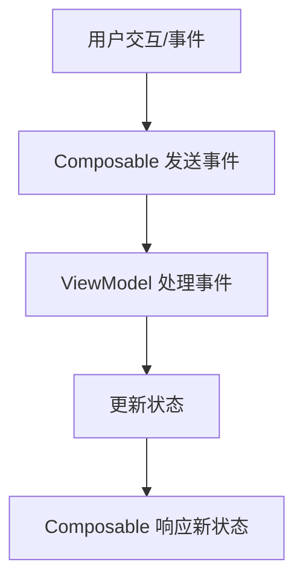

# 单向数据流架构模式

在 Jetpack Compose 中，**单向数据流（Unidirectional Data Flow）** 是构建可维护、可测试应用的核心架构模式。结合 **ViewModel**、**状态（State）** 和 **事件（Event）** 的设计，可以创建清晰的 UI 逻辑分层。以下是这些概念的完整解析：

---

## 一、核心概念架构



---

## 二、单向数据流详解

### 1. **核心原则**

- **数据流向**：  
  - **状态（State）** 从父组件流向子组件（只读）  
  - **事件（Event）** 从子组件流向父组件/ViewModel  
- **不可变性**：状态对象应为不可变（immutable）或受控可变（通过 `MutableState` 封装）

### 2. **优势**

- **可预测性**：状态变化来源单一  
- **易测试**：UI 与业务逻辑解耦  
- **可维护性**：明确的数据流动路径  

---

## 三、定义可组合项参数

### 1. **无状态组件（Stateless Composable）**

```kotlin
@Composable
fun CounterDisplay(
    count: Int,               // 状态通过参数传入
    onIncrement: () -> Unit   // 事件通过回调传递
) {
    Column {
        Text("Count: $count")
        Button(onClick = onIncrement) {
            Text("Increment")
        }
    }
}
```

### 2. **有状态容器（Stateful Container）**

```kotlin
@Composable
fun CounterScreen(viewModel: CounterViewModel = viewModel()) {
    val count by viewModel.count.collectAsState()
    
    CounterDisplay(
        count = count,
        onIncrement = { viewModel.handleEvent(CounterEvent.Increment) }
    )
}
```

---

## 四、ViewModel 的角色

### 1. **职责划分**

| 组件 | 职责 |
|------|------|
| **Composable** | 展示 UI、收集用户事件 |
| **ViewModel** | 管理业务逻辑、维护状态、处理事件 |

### 2. **状态管理示例**

```kotlin
class CounterViewModel : ViewModel() {
    // 私有可变状态
    private val _count = MutableStateFlow(0)
    // 对外暴露只读状态
    val count: StateFlow<Int> = _count.asStateFlow()

    // 事件处理
    fun handleEvent(event: CounterEvent) {
        when (event) {
            CounterEvent.Increment -> _count.value++
            CounterEvent.Reset -> _count.value = 0
        }
    }
}

// 事件定义
sealed interface CounterEvent {
    object Increment : CounterEvent
    object Reset : CounterEvent
}
```

---

## 五、状态与事件的最佳实践

### 1. **状态设计原则**

- **使用数据类封装 UI 状态**：

  ```kotlin
  data class LoginState(
      val username: String = "",
      val password: String = "",
      val isLoading: Boolean = false,
      val error: String? = null
  )
  ```

- **分离 UI 状态与业务逻辑**：

  ```kotlin
  class LoginViewModel : ViewModel() {
      private val _state = MutableStateFlow(LoginState())
      val state: StateFlow<LoginState> = _state.asStateFlow()
      
      fun login(username: String, password: String) {
          // 业务逻辑处理...
      }
  }
  ```

### 2. **事件处理模式**

- **使用密封类定义事件**：

  ```kotlin
  sealed class UserEvent {
      data class NameChanged(val name: String) : UserEvent()
      data class AgeChanged(val age: Int) : UserEvent()
      object Submit : UserEvent()
  }
  ```

- **集中事件处理**：

  ```kotlin
  fun handleEvent(event: UserEvent) {
      when (event) {
          is UserEvent.NameChanged -> updateName(event.name)
          is UserEvent.AgeChanged -> updateAge(event.age)
          UserEvent.Submit -> submitData()
      }
  }
  ```

---

## 六、完整实现示例

### 1. **ViewModel**

```kotlin
class TodoViewModel : ViewModel() {
    private val _todos = MutableStateFlow<List<Todo>>(emptyList())
    val todos: StateFlow<List<Todo>> = _todos.asStateFlow()

    private val _showDialog = MutableStateFlow(false)
    val showDialog: StateFlow<Boolean> = _showDialog.asStateFlow()

    fun handleEvent(event: TodoEvent) {
        when (event) {
            is TodoEvent.AddTodo -> addTodo(event.text)
            TodoEvent.ToggleDialog -> toggleDialog()
            is TodoEvent.DeleteTodo -> deleteTodo(event.id)
        }
    }

    private fun addTodo(text: String) {
        _todos.update { list ->
            list + Todo(id = UUID.randomUUID().toString(), text = text)
        }
    }

    private fun toggleDialog() {
        _showDialog.update { !it }
    }

    private fun deleteTodo(id: String) {
        _todos.update { list ->
            list.filterNot { it.id == id }
        }
    }
}

// 事件定义
sealed class TodoEvent {
    data class AddTodo(val text: String) : TodoEvent()
    data class DeleteTodo(val id: String) : TodoEvent()
    object ToggleDialog : TodoEvent()
}
```

### 2. **Composable**

```kotlin
@Composable
fun TodoScreen(viewModel: TodoViewModel = viewModel()) {
    val todos by viewModel.todos.collectAsState()
    val showDialog by viewModel.showDialog.collectAsState()

    Column(modifier = Modifier.padding(16.dp)) {
        Button(onClick = { viewModel.handleEvent(TodoEvent.ToggleDialog) }) {
            Text("Add Todo")
        }
        
        LazyColumn {
            items(todos, key = { it.id }) { todo ->
                TodoItem(
                    todo = todo,
                    onDelete = { viewModel.handleEvent(TodoEvent.DeleteTodo(todo.id)) }
                )
            }
        }
        
        if (showDialog) {
            AddTodoDialog { text ->
                viewModel.handleEvent(TodoEvent.AddTodo(text))
                viewModel.handleEvent(TodoEvent.ToggleDialog)
            }
        }
    }
}

@Composable
private fun TodoItem(todo: Todo, onDelete: () -> Unit) {
    Row(
        verticalAlignment = Alignment.CenterVertically,
        modifier = Modifier.fillMaxWidth()
    ) {
        Text(todo.text, modifier = Modifier.weight(1f))
        IconButton(onClick = onDelete) {
            Icon(Icons.Default.Delete, "Delete")
        }
    }
}
```

---

## 七、关键优化技巧

### 1. **状态提升策略**

```kotlin
// 将滚动状态提升到父级
@Composable
fun ScrollableList(items: List<String>) {
    val scrollState = rememberLazyListState()
    
    LazyColumn(state = scrollState) {
        items(items) { item ->
            Text(item)
        }
    }
}
```

### 2. **避免无效重组**

```kotlin
@Composable
fun StableItem(user: StableUser) { // 使用 @Stable 注解类
    // ...
}

@Stable
data class StableUser(val id: String, val name: String)
```

---

## 八、常见问题解决方案

### **问题 1：事件处理混乱**

- **现象**：事件分散在多处处理  
- **解决**：统一使用密封类事件 + ViewModel 集中处理

### **问题 2：状态同步延迟**

- **现象**：UI 未及时响应状态变化  
- **解决**：使用 `StateFlow`/`LiveData` + `collectAsState()`

### **问题 3：过度参数传递**

- **现象**：深层嵌套组件需要逐层传递参数  
- **解决**：使用 `CompositionLocal` 或状态管理库（如 `Hilt` + ViewModel）

---

## 总结

通过遵循 **单向数据流** 架构：  

1. **Composable** 只负责展示 UI 和转发事件  
2. **ViewModel** 集中管理状态和业务逻辑  
3. **事件** 通过密封类明确传递意图  

可以实现以下优势：  

- **清晰的代码分层**：UI 与逻辑解耦  
- **高效的状态管理**：精准控制重组范围  
- **更强的可测试性**：独立测试 UI 和业务逻辑  

建议结合 [官方架构指南](https://developer.android.com/jetpack/guide) 和 [Now in Android 示例](https://github.com/android/nowinandroid) 进行实践。
