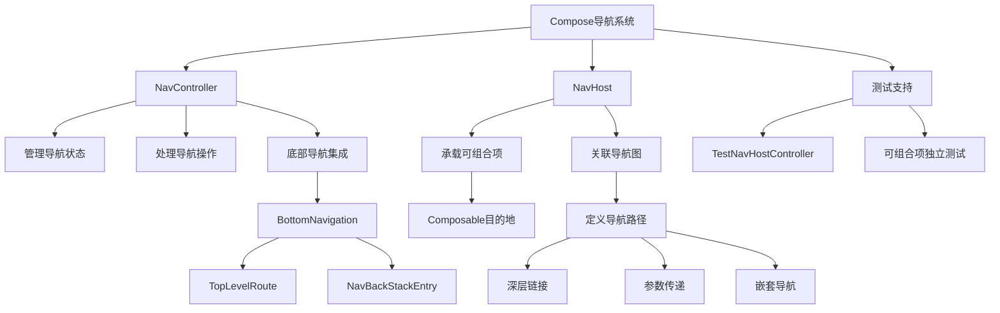

# 使用 Compose 进行导航

原地址：<https://developer.android.google.cn/develop/ui/compose/navigation?hl=zh-cn>

## 一、设置

在应用模块的`build.gradle`文件中添加 Navigation Compose 依赖项，以支持 Compose 导航功能。

```groovy
dependencies {
    def nav_version = "2.9.0"
    implementation "androidx.navigation:navigation-compose:$nav_version"
}
```

```kotlin
dependencies {
    val nav_version = "2.9.0"
    implementation("androidx.navigation:navigation-compose:$nav_version")
}
```

## 二、开始使用

### （一）实现导航的核心组件

在应用中实现导航时，需实现以下核心组件：

1. **导航宿主（NavHost）**：用于承载可组合项的导航容器。
2. **导航图**：定义应用中所有可组合项的导航路径和关系。
3. **导航控制器（NavController）**：管理导航操作和状态。

### （二）创建 NavController

在 Compose 中创建`NavController`，用于控制导航流程。

### （三）创建 NavHost

在 Compose 中创建`NavHost`，并将其与`NavController`关联，作为可组合项的导航宿主。

### （四）导航到可组合项

通过`navController.navigate()`方法导航到指定的可组合项目的地。

## 三、使用参数进行导航

### （一）参数传递原则

强烈建议在导航时不要传递复杂的数据对象，而是传递最少的必要信息（如唯一标识符或 ID）。

```kotlin
// 导航时仅传递用户 ID 作为参数
navController.navigate(Profile(id = "user1234"))
```

### （二）数据加载方式

1. 复杂对象存储在数据层（单一可信来源）中。
2. 导航到达目的地后，使用传递的 ID 从数据层加载所需信息。
3. 在`ViewModel`中通过`SavedStateHandle`检索参数并加载数据：

```kotlin
class UserViewModel(
    savedStateHandle: SavedStateHandle,
    private val userInfoRepository: UserInfoRepository
) : ViewModel() {
    private val profile = savedStateHandle.toRoute<Profile>()
    private val userInfo: Flow<UserInfo> = userInfoRepository.getUserInfo(profile.id)
    // 其他代码...
}
```

### （三）优势

这种方式可防止配置更改期间的数据丢失，避免相关对象更新时出现不一致。

## 四、深层链接

### （一）在可组合项中定义深层链接

通过`composable()`函数的`deepLinks`参数定义深层链接，接受一系列`NavDeepLink`对象，可使用`navDeepLink()`方法创建。

```kotlin
@Serializable data class Profile(val id: String)
val uri = "https://www.example.com"

composable<Profile>(
    deepLinks = listOf(
        navDeepLink<Profile>(basePath = "$uri/profile")
    )
) { backStackEntry ->
    ProfileScreen(id = backStackEntry.toRoute<Profile>().id)
}
```

### （二）在清单文件中配置深层链接

如需向外部应用公开深层链接，需在`manifest.xml`的`<activity>`元素中添加`intent-filter`。

```xml
<activity …>
    <intent-filter>
        ...
        <data android:scheme="https" android:host="www.example.com" />
    </intent-filter>
</activity>
```

### （三）创建深层链接的 PendingIntent

可用于构建包含深层链接的`PendingIntent`，以便在需要时打开应用的相应目的地。

```kotlin
val id = "exampleId"
val context = LocalContext.current
val deepLinkIntent = Intent(
    Intent.ACTION_VIEW,
    "https://www.example.com/profile/$id".toUri(),
    context,
    MyActivity::class.java
)

val deepLinkPendingIntent: PendingIntent? = TaskStackBuilder.create(context).run {
    addNextIntentWithParentStack(deepLinkIntent)
    getPendingIntent(0, PendingIntent.FLAG_UPDATE_CURRENT)
}
```

## 五、嵌套导航结构

如需创建嵌套导航图，可参考官方文档中的“嵌套图”部分。

## 六、与底部导航栏集成

### （一）添加依赖

在`build.gradle`中添加`androidx.compose.material`依赖：

```groovy
dependencies {
    implementation "androidx.compose.material:material:1.8.2"
}
android {
    buildFeatures {
        compose true
    }
    composeOptions {
        kotlinCompilerExtensionVersion = "1.5.15"
    }
    kotlinOptions {
        jvmTarget = "1.8"
    }
}
```

```kotlin
dependencies{
    implementation("androidx.compose.material:material:1.8.2")
}
android{
    buildFeatures{
        compose=true
    }
    composeOptions{
        kotlinCompilerExtensionVersion="1.5.15"
    }
    kotlinOptions{
        jvmTarget="1.8"
    }
}
```

### （二）定义顶部路由类

定义包含路线、名称和图标的类，用于底部导航项。

```kotlin
data class TopLevelRoute<T : Any>(val name: String, val route: T, val icon: ImageVector)
```

### （三）集成底部导航栏

在`Scaffold`的`bottomBar`中使用`BottomNavigation`，通过`NavController.currentBackStackEntryAsState()`获取当前状态，确定底部导航项的选中状态，并处理点击导航。

```kotlin
val navController = rememberNavController()
Scaffold(
    bottomBar = {
        BottomNavigation {
            val navBackStackEntry by navController.currentBackStackEntryAsState()
            val currentDestination = navBackStackEntry?.destination
            topLevelRoutes.forEach { topLevelRoute ->
                BottomNavigationItem(
                    icon = { Icon(topLevelRoute.icon, contentDescription = topLevelRoute.name) },
                    label = { Text(topLevelRoute.name) },
                    selected = currentDestination?.hierarchy?.any { it.hasRoute(topLevelRoute.route::class) } == true,
                    onClick = {
                        navController.navigate(topLevelRoute.route) {
                            popUpTo(navController.graph.findStartDestination().id) {
                                saveState = true
                            }
                            launchSingleTop = true
                            restoreState = true
                        }
                    }
                )
            }
        }
    }
) { innerPadding ->
    NavHost(
        navController,
        startDestination = Profile,
        Modifier.padding(innerPadding)
    ) {
        composable<Profile> { ProfileScreen(...) }
        composable<Friends> { FriendsScreen(...) }
    }
}
```

## 七、互操作性

### （一）两种导航方式

1. **基于 Fragment 的导航**：使用基于 fragment 的 Navigation 组件定义导航图，适用于 Compose 和 View 混合应用。
2. **基于 Compose 的导航**：通过`NavHost`在 Compose 中定义导航图，仅适用于所有界面均为可组合项的情况。

### （二）从 Compose 导航到 Fragment

在 Compose 中公开导航事件，在 fragment 中通过`NavController`处理导航。

```kotlin
// Compose 中的可组合项
@Composable
fun MyScreen(onNavigate: (Int) -> Unit) {
    Button(onClick = { onNavigate(R.id.nav_profile) } { /* ... */ }
}

// Fragment 中处理导航
override fun onCreateView( /* ... */ ) {
    setContent {
        MyScreen(onNavigate = { dest -> findNavController().navigate(dest) })
    }
}
```

## 八、测试

### （一）测试原则

将导航代码与可组合项分离，通过传递导航回调而非直接传递`NavController`，以便独立测试可组合项。

### （二）可组合项设计

可组合项接受导航回调而非`NavController`：

```kotlin
@Composable
fun ProfileScreen(
    userId: String,
    navigateToFriendProfile: (friendUserId: String) -> Unit
) {
    // 可组合项内容...
}
```

### （三）封装导航逻辑

在`composable` lambda 中封装导航逻辑：

```kotlin
@Serializable data class Profile(id: String)

composable<Profile> { backStackEntry ->
    val profile = backStackEntry.toRoute<Profile>()
    ProfileScreen(userId = profile.id) { friendUserId ->
        navController.navigate(route = Profile(id = friendUserId))
    }
}
```

### （四）测试 NavHost

1. 添加导航测试依赖：

```kotlin
dependencies {
    // ...
    androidTestImplementation "androidx.navigation:navigation-testing:$navigationVersion"
    // ...
}
```

2. 封装`NavHost`以便测试：

```kotlin
@Composable
fun AppNavHost(navController: NavHostController){
    NavHost(navController = navController){ ... }
}
```

3. 编写测试用例：

```kotlin
class NavigationTest {
    @get:Rule
    val composeTestRule = createComposeRule()
    lateinit var navController: TestNavHostController

    @Before
    fun setupAppNavHost() {
        composeTestRule.setContent {
            navController = TestNavHostController(LocalContext.current)
            navController.navigatorProvider.addNavigator(ComposeNavigator())
            AppNavHost(navController = navController)
        }
    }

    @Test
    fun appNavHost_verifyStartDestination() {
        composeTestRule.onNodeWithContentDescription("Start Screen").assertIsDisplayed()
    }
}
```

### （五）测试导航操作

通过点击界面元素或比较当前路线验证导航：

```kotlin
@Test
fun appNavHost_clickAllProfiles_navigateToProfiles() {
    composeTestRule.onNodeWithContentDescription("All Profiles")
        .performScrollTo()
        .performClick()

    assertTrue(navController.currentBackStackEntry?.destination?.hasRoute<Profile>() ?: false)
}
```

## 九、Compose 导航流程图


