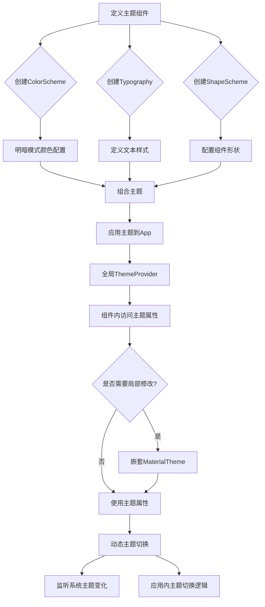

# Android Compose 主题详解

主题概栏：<https://developer.android.google.cn/develop/ui/compose/designsystems?hl=zh-cn>

## 一、主题系统概述

Compose 主题基于 Material Design 规范，通过统一管理颜色、排版、形状等视觉元素，实现应用界面的一致性和可维护性。主题系统具有以下核心特性：  

- **分层设计**：全局主题可被局部主题覆盖，支持细粒度定制  
- **响应式适配**：自动适应系统明暗模式（Light/Dark Theme）  
- **类型安全**：通过类型化接口访问主题属性，避免字符串硬编码  

## 二、主题核心组成部分

### 1. 主题三大基础组件

#### （1）ColorScheme - 颜色方案

包含应用的主色、辅助色、背景色等关键色值，分为明暗两种模式：  

```kotlin
val MyAppTheme = darkColorScheme(
    primary = Purple800,
    secondary = Purple400,
    background = DarkBackground,
    surface = DarkSurface
) + lightColorScheme(
    primary = Purple400,
    secondary = Purple800,
    background = LightBackground,
    surface = LightSurface
)
```

#### （2）Typography - 排版方案

定义文本样式（字体、字号、字重等），支持自定义字体资源：  

```kotlin
val MyTypography = typography.copy(
    bodyLarge = TextStyle(
        fontFamily = FontFamily.SansSerif,
        fontSize = 16.sp,
        lineHeight = 24.sp,
        fontWeight = FontWeight.Normal
    ),
    titleLarge = TextStyle(
        fontSize = 22.sp,
        fontWeight = FontWeight.Bold
    )
)
```

#### （3）ShapeScheme - 形状方案

管理组件边框圆角、边角样式等：  

```kotlin
val MyShapes = shapes.copy(
    small = RoundedCornerShape(4.dp),
    medium = RoundedCornerShape(8.dp),
    large = RoundedCornerShape(16.dp)
)
```

### 2. 主题组合与定义

通过 `Theme` 组合上述组件，创建完整主题：  

```kotlin
@Composable
fun MyAppTheme(
    darkTheme: Boolean = isSystemInDarkTheme(),
    content: @Composable () -> Unit
) {
    val colorScheme = if (darkTheme) MyDarkColorScheme else MyLightColorScheme
    MaterialTheme(
        colorScheme = colorScheme,
        typography = MyTypography,
        shapes = MyShapes,
        content = content
    )
}
```

## 三、主题应用与定制

### 1. 全局主题设置

在应用入口处通过 `CompositionLocalProvider` 提供主题：  

```kotlin
// MainActivity.kt
setContent {
    MyAppTheme {
        Surface(color = MaterialTheme.colorScheme.background) {
            AppContent()
        }
    }
}
```

### 2. 局部主题覆盖

使用 `LocalTheme` 或 `MaterialTheme` 嵌套修改局部样式：  

```kotlin
@Composable
fun FeatureScreen() {
    // 局部修改文本颜色
    MaterialTheme(
        typography = MaterialTheme.typography.copy(
            bodyLarge = MaterialTheme.typography.bodyLarge.copy(
                color = MaterialTheme.colorScheme.primary
            )
        )
    ) {
        Text("重要内容")
    }
}
```

### 3. 主题属性访问

通过 `MaterialTheme` 静态属性获取主题值：  

```kotlin
@Composable
fun ButtonComponent() {
    Button(
        onClick = { /* 点击事件 */ },
        colors = ButtonDefaults.buttonColors(
            containerColor = MaterialTheme.colorScheme.primary,
            contentColor = MaterialTheme.colorScheme.onPrimary
        )
    ) {
        Text(
            text = "按钮",
            style = MaterialTheme.typography.bodyMedium
        )
    }
}
```

## 四、动态主题切换

### 1. 监听系统主题变化

通过 `rememberSystemUiController` 和 `LaunchedEffect` 实现动态更新：  

```kotlin
@Composable
fun DynamicThemeDemo() {
    val systemUiController = rememberSystemUiController()
    val useDarkTheme = isSystemInDarkTheme()
    
    LaunchedEffect(useDarkTheme) {
        systemUiController.setSystemBarsColor(
            color = if (useDarkTheme) DarkStatusBar else LightStatusBar
        )
    }
    
    // 主题切换逻辑...
}
```

### 2. 自定义主题切换

通过状态管理实现应用内主题切换：  

```kotlin
@Composable
fun ThemeSelector() {
    var isDarkTheme by remember { mutableStateOf(isSystemInDarkTheme()) }
    
    ToggleButton(
        checked = isDarkTheme,
        onCheckedChange = { isDarkTheme = !it }
    ) {
        Text("切换深色模式")
    }
    
    // 重新应用主题
    ProvideWindowInsets {
        MyAppTheme(darkTheme = isDarkTheme) {
            // 应用内容
        }
    }
}
```

## 五、自定义主题属性

### 1. 扩展主题接口

通过 `compositionLocalOf` 添加自定义属性：  

```kotlin
// 定义自定义主题属性
val LocalAppTheme = compositionLocalOf {
    AppThemeColors(
        accentColor = Color.Unspecified,
        gradientStart = Color.Unspecified,
        gradientEnd = Color.Unspecified
    )
}

data class AppThemeColors(
    val accentColor: Color,
    val gradientStart: Color,
    val gradientEnd: Color
)

// 在主题中提供属性
@Composable
fun MyAppThemeWithCustom(
    darkTheme: Boolean = isSystemInDarkTheme(),
    content: @Composable () -> Unit
) {
    val customColors = if (darkTheme) {
        AppThemeColors(
            accentColor = Blue800,
            gradientStart = Blue900,
            gradientEnd = Blue700
        )
    } else {
        AppThemeColors(
            accentColor = Blue400,
            gradientStart = Blue500,
            gradientEnd = Blue300
        )
    }
    
    CompositionLocalProvider(LocalAppTheme provides customColors) {
        MyAppTheme(darkTheme = darkTheme, content = content)
    }
}
```

### 2. 访问自定义属性

```kotlin
@Composable
fun CustomThemeComponent() {
    val appColors = LocalAppTheme.current
    
    Box(
        modifier = Modifier
            .fillMaxSize()
            .background(
                brush = LinearGradient(
                    colors = listOf(appColors.gradientStart, appColors.gradientEnd),
                    start = Offset.Zero,
                    end = Offset(1f, 1f)
                )
            )
    ) {
        Text(
            text = "自定义主题",
            color = appColors.accentColor,
            style = MaterialTheme.typography.headlineMedium
        )
    }
}
```

## 六、主题最佳实践

1. **避免硬编码颜色**：始终通过 `MaterialTheme.colorScheme` 访问颜色  
2. **响应式排版**：使用 `sp` 单位（可缩放像素）适配不同设备和字体设置  
3. **深色模式兼容性**：确保明暗主题下内容对比度符合 WCAG 标准  
4. **主题分层设计**：全局主题定义基础样式，局部主题处理特殊场景  
5. **性能优化**：减少主题嵌套层级，避免频繁重建主题组件  

## 七、流程图：Compose 主题实现流程


