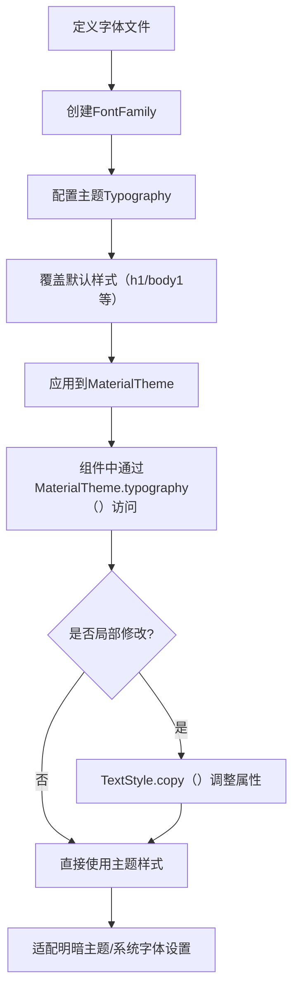

# Android Compose 主题 Typography 深度解析  

## 一、Typography 核心概念  

**Typography（排版系统）** 是 Compose 主题的核心组件，用于统一管理应用中所有文本的视觉样式，包括字体、字号、字重、行高、颜色等。它基于 Material Design 规范，提供 13 种默认文本样式（如标题、正文、按钮等），支持全局配置和局部覆盖，确保界面文本的一致性和可读性。

### 1.1 核心作用  

- **品牌一致性**：通过统一字体和样式强化品牌识别（如新闻类应用的清晰字体、时尚类应用的个性字体）。  
- **场景适配**：针对不同文本场景（标题、正文、按钮）预设最佳样式，避免重复编码。  
- **动态响应**：自动适配明暗主题，支持字体大小跟随系统设置缩放（`sp` 单位）。  

## 二、默认 Typography 样式解析  

Compose 内置 13 种文本样式，对应不同使用场景，源码定义如下：  

```kotlin
val Typography = Typography(
    h1 = TextStyle(fontSize = 96.sp, fontWeight = FontWeight.W300, letterSpacing = (-1.5).sp),
    h2 = TextStyle(fontSize = 60.sp, fontWeight = FontWeight.W300, letterSpacing = (-0.5).sp),
    h3 = TextStyle(fontSize = 48.sp, fontWeight = FontWeight.Normal),
    h4 = TextStyle(fontSize = 34.sp, fontWeight = FontWeight.Normal, letterSpacing = 0.25.sp),
    h5 = TextStyle(fontSize = 24.sp, fontWeight = FontWeight.Normal),
    h6 = TextStyle(fontSize = 20.sp, fontWeight = FontWeight.Medium, letterSpacing = 0.15.sp),
    subtitle1 = TextStyle(fontSize = 16.sp, fontWeight = FontWeight.Normal, letterSpacing = 0.15.sp),
    subtitle2 = TextStyle(fontSize = 14.sp, fontWeight = FontWeight.Medium, letterSpacing = 0.1.sp),
    body1 = TextStyle(fontSize = 16.sp, fontWeight = FontWeight.Normal, lineHeight = 24.sp), // 正文默认
    body2 = TextStyle(fontSize = 14.sp, fontWeight = FontWeight.Normal, lineHeight = 20.sp),
    button = TextStyle(fontSize = 14.sp, fontWeight = FontWeight.Medium, letterSpacing = 1.25.sp),
    caption = TextStyle(fontSize = 12.sp, fontWeight = FontWeight.Normal, letterSpacing = 0.4.sp),
    overline = TextStyle(fontSize = 10.sp, fontWeight = FontWeight.Normal, letterSpacing = 1.5.sp)
)
```  

### 关键样式说明  

| 样式名   | 用途                     | 典型场景                     | 设计规范                          |  
|----------|--------------------------|------------------------------|-----------------------------------|  
| `h1-h6`  | 标题系列                 | 页面标题、章节头             | 字号递减，字重从轻到中，适配不同层级 |  
| `body1`  | 主正文                   | 文章内容、长文本             | 16sp，行高 24sp（舒适阅读距离）   |  
| `button` | 按钮文本                 | 按钮、操作标签               | 14sp，中等字重，字母间距加宽      |  
| `caption`| 辅助信息                 | 时间戳、版权说明             | 12sp，小字适配边缘场景           |  

## 三、自定义 Typography 实战  

### 3.1 步骤 1：添加自定义字体  

1. 将字体文件（`.ttf`/`.otf`）放入 `res/font/` 目录  
2. 定义字体家族（支持多字重/样式）：  

```kotlin
val CustomFont = FontFamily(
    Font(R.font.custom_regular, FontWeight.Normal), // 常规
    Font(R.font.custom_bold, FontWeight.Bold),     // 粗体
    Font(R.font.custom_italic, fontStyle = FontStyle.Italic) // 斜体
)
```

### 3.2 步骤 2：配置主题 Typography  

在主题中覆盖默认样式，示例（明暗主题统一字体）：  

```kotlin
@Composable
fun MyAppTheme(darkTheme: Boolean = isSystemInDarkTheme(), content: @Composable () -> Unit) {
    MaterialTheme(
        typography = Typography(
            // 全局字体
            fontFamily = CustomFont,
            // 覆盖标题样式
            h1 = TextStyle(fontSize = 32.sp, fontWeight = FontWeight.Bold),
            // 覆盖正文样式（继承默认行高）
            body1 = MaterialTheme.typography.body1.copy(
                color = if (darkTheme) Color.White else Color.Black
            ),
            // 按钮样式添加下划线
            button = TextStyle(
                textDecoration = TextDecoration.Underline,
                letterSpacing = 0.8.sp
            )
        ),
        content = content
    )
}
```

### 3.3 步骤 3：组件中使用主题样式  

```kotlin
@Composable
fun TypographyDemo() {
    MyAppTheme {
        Column(Modifier.padding(16.dp)) {
            // 标题：使用自定义 h1 样式
            Text("Main Title", style = MaterialTheme.typography.h1)
            
            // 正文：继承主题字体 + 自定义颜色
            Text(
                "Long article content...",
                style = MaterialTheme.typography.body1.copy(color = Color.Gray)
            )
            
            // 按钮：应用主题 button 样式（含下划线）
            Button(onClick = {}) {
                Text("Click Me", style = MaterialTheme.typography.button)
            }
        }
    }
}
```

## 四、TextStyle 高级属性解析  

`TextStyle` 除字体相关属性外，还支持复杂文本效果（基于摘要 2 源码分析）：  

### 4.1 视觉增强属性  

| 属性名          | 说明                                                                 | 示例代码                                  |  
|-----------------|----------------------------------------------------------------------|-------------------------------------------|  
| `letterSpacing` | 字母间距（支持负间距压缩）                                          | `letterSpacing = (-0.5).sp`（标题更紧凑）  |  
| `lineHeight`    | 行高（建议正文设为 1.5 倍字号）                                      | `lineHeight = 24.sp`（16sp 正文适配）      |  
| `textDecoration`| 下划线/删除线（支持组合）                                            | `TextDecoration.combine(underline, lineThrough)` |  
| `baselineShift` | 基线偏移（上标/下标）                                                | `baselineShift = BaselineShift.Superscript` |  
| `shadow`        | 文本阴影（颜色、偏移、模糊）                                         | `shadow = Shadow(Color.Gray, Offset(2f, 2f), 4f)` |  

### 4.2 国际化适配  

- **文本方向**：`textDirection = TextDirection.Rtl`（适配阿拉伯语等右向语言）  
- **字体合成**：`fontSynthesis = FontSynthesis.Weight`（自动生成缺失字重）  

## 五、最佳实践与注意事项  

### 5.1 响应式设计  

- **使用 `sp` 单位**：字体大小随系统设置缩放（Settings > 显示 > 字体大小）  
- **明暗主题适配**：通过 `MaterialTheme.colorScheme.onSurface` 动态获取文本颜色，确保对比度（≥4.5:1）  

### 5.2 性能优化  

- **避免过度嵌套**：全局主题定义基础样式，局部通过 `copy()` 修改，减少 `TextStyle` 实例创建  
- **缓存字体家族**：`@Composable` 外定义 `FontFamily`，避免重复解析字体文件  

### 5.3 可访问性  

- **明确字体用途**：标题用粗体、正文用常规，避免纯靠颜色区分（如红色+斜体表示错误）  
- **测试工具**：使用 Android Studio 的 Accessibility Insights 检查文本对比度  

## 六、流程图：Typography 实现流程  



## 七、总结  

Typography 是 Compose 主题中**最易感知**的部分，直接影响用户体验。通过合理定义字体家族、覆盖默认样式，并结合 `TextStyle` 的高级属性，可实现：  

- 品牌化的文本风格（如电商的加粗标题、资讯的清晰正文）  
- 动态适配明暗模式和系统设置  
- 复杂场景的文本效果（上标、阴影、RTL 支持）  

**记住**：始终通过 `MaterialTheme.typography` 访问样式，避免硬编码，让主题成为真正的“视觉源代码”。
