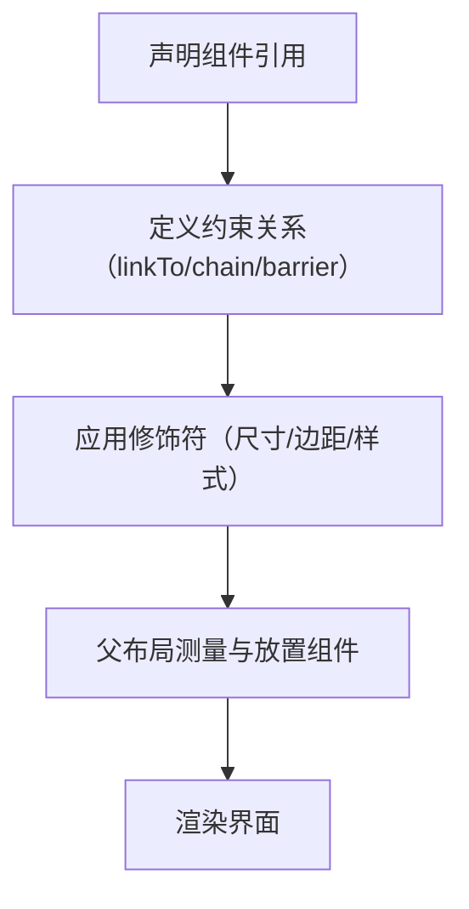

# Compose 中 ConstraintLayout 开发指南  

原地址：<https://developer.android.google.cn/develop/ui/compose/layouts/constraintlayout?hl=zh-cn>  

## 一、ConstraintLayout 核心优势  

### （一）布局灵活性  

- **扁平化层级**：通过约束关系替代嵌套布局（如 `Row`+`Column` 多层嵌套），减少界面树深度。  
- **复杂对齐**：支持组件间边缘对齐、基线对齐、百分比定位等高级功能。  

### （二）性能优势  

- **单遍测量**：继承 Compose 单遍测量机制，避免传统 View 系统中多层嵌套的性能损耗。  
- **轻量级实现**：相比 XML 版本，Compose 版 `ConstraintLayout` 更简洁，编译时优化布局逻辑。  

## 二、基础用法与关键概念  

### （一）添加依赖  

```gradle
dependencies {
    implementation "androidx.constraintlayout:constraintlayout-compose:1.0.1"
}
```  

### （二）基础布局结构  

```kotlin
@Composable
fun BasicConstraintLayout() {
    ConstraintLayout(modifier = Modifier.fillMaxSize()) {
        // 声明布局引用
        val (text, button) = createRefs()
        
        Text(
            "Hello ConstraintLayout",
            modifier = Modifier.constrainAs(text) {
                top.linkTo(parent.top, margin = 16.dp) // 顶部约束到父容器顶部，边距16dp
                start.linkTo(parent.start, margin = 16.dp) // 左侧约束到父容器左侧
            }
        )
        
        Button(
            onClick = { },
            modifier = Modifier.constrainAs(button) {
                top.linkTo(text.bottom, margin = 16.dp) // 顶部约束到文本底部
                start.linkTo(parent.start, margin = 16.dp) // 左侧约束到父容器左侧
            }
        ) {
            Text("Click Me")
        }
    }
}
```  

### （三）核心概念  

1. **约束（Constraints）**：  
   - 组件通过 `linkTo()` 方法连接到父容器或其他组件的边缘（`top`/`bottom`/`start`/`end` 等）。  
   - 支持边距（`margin`）和偏移（`offset`）设置。  
2. **引用（References）**：  
   - 通过 `createRefs()` 或 `createRefFor` 声明组件引用，建立约束关系。  

## 三、高级布局功能  

### （一）链（Chains）  

#### 水平链示例  

```kotlin
@Composable
fun ChainExample() {
    ConstraintLayout {
        val (btn1, btn2, btn3) = createRefs()
        
        Button(
            onClick = { },
            modifier = Modifier.constrainAs(btn1) {
                start.linkTo(parent.start, margin = 16.dp)
                top.linkTo(parent.top, margin = 16.dp)
            }
        ) { Text("Btn1") }
        
        Button(
            onClick = { },
            modifier = Modifier.constrainAs(btn2) {
                start.linkTo(btn1.end, margin = 8.dp)
                top.linkTo(btn1.top)
            }
        ) { Text("Btn2") }
        
        Button(
            onClick = { },
            modifier = Modifier.constrainAs(btn3) {
                start.linkTo(btn2.end, margin = 8.dp)
                top.linkTo(btn2.top)
            }
        ) { Text("Btn3") }
        
        // 创建水平链（默认 Packed 模式）
        createHorizontalChain(btn1, btn2, btn3, chainStyle = ChainStyle.Spread)
    }
}
```  

#### 链模式  

| 模式         | 效果描述                          |  
|--------------|-----------------------------------|  
| `Packed`     | 组件紧密排列（默认）              |  
| `Spread`     | 组件均匀分布，首尾对齐父容器边缘  |  
| `SpreadInside`| 组件均匀分布，首尾留边            |  
| `Weighted`   | 组件按权重分配剩余空间            |  

### （二）障碍（Barriers）  

#### 场景：根据最高组件调整布局  

```kotlin
@Composable
fun BarrierExample() {
    ConstraintLayout {
        val (image, text1, text2, barrier) = createRefsAndBarrier() // 创建障碍引用
        
        Image(
            painterResource(R.drawable.image),
            contentDescription = null,
            modifier = Modifier
                .constrainAs(image) {
                    top.linkTo(parent.top, margin = 16.dp)
                    start.linkTo(parent.start, margin = 16.dp)
                }
                .size(100.dp)
        )
        
        Text(
            "Long Text Example",
            modifier = Modifier.constrainAs(text1) {
                top.linkTo(image.bottom, margin = 16.dp)
                start.linkTo(image.start)
                end.linkTo(barrier) // 右侧约束到障碍
            }
        )
        
        Text(
            "Short Text",
            modifier = Modifier.constrainAs(text2) {
                top.linkTo(text1.bottom, margin = 8.dp)
                start.linkTo(image.start)
            }
        )
        
        // 创建水平障碍，基于 image 和 text1 的右侧边缘
        createEndBarrier(barrier, image, text1)
    }
}
```  

### （三）指南线（Guidelines）  

#### 百分比指南线  

```kotlin
@Composable
fun GuidelineExample() {
    ConstraintLayout {
        val guideline = createGuidelineFromStart(fraction = 0.5f) // 50% 位置指南线
        
        Text(
            "Left",
            modifier = Modifier.constrainAs(leftText) {
                end.linkTo(guideline) // 右侧约束到指南线
            }
        )
        
        Text(
            "Right",
            modifier = Modifier.constrainAs(rightText) {
                start.linkTo(guideline) // 左侧约束到指南线
            }
        )
    }
}
```  

#### 绝对距离指南线  

```kotlin
val guideline = createGuidelineFromTop(80.dp) // 距离顶部80dp的垂直指南线
```  

### （四）层叠与对齐  

```kotlin
@Composable
fun OverlayExample() {
    ConstraintLayout {
        val (box1, box2) = createRefs()
        
        Box(
            modifier = Modifier
                .constrainAs(box1) {
                    centerTo(parent) // 居中对齐父容器
                }
                .size(100.dp)
                .background(Color.Red)
        )
        
        Box(
            modifier = Modifier
                .constrainAs(box2) {
                    centerTo(box1) // 居中对齐 box1
                }
                .size(60.dp)
                .background(Color.Blue)
        )
    }
}
```  

## 四、性能优化与最佳实践  

### （一）避免过度约束  

- 每个组件需至少有 2 个独立约束（如水平和垂直方向各一个），避免约束冲突或歧义。  
- 反模式：仅设置 `top.linkTo(parent.top)` 而无水平约束，可能导致宽度为 0。  

### （二）使用可视化工具  

- Android Studio 的 **Layout Inspector** 可实时查看约束关系，辅助调试。  
- 在 XML 布局中设计原型，通过 **Convert to Jetpack Compose** 工具生成初始代码。  

### （三）响应式布局  

结合 `WindowSizeClass` 和百分比约束，实现不同屏幕尺寸适配：  

```kotlin
@Composable
fun ResponsiveLayout() {
    val windowSizeClass = calculateWindowSizeClass()
    ConstraintLayout {
        val guideline = if (windowSizeClass.widthSizeClass == WindowSizeClass.Expanded) {
            createGuidelineFromStart(fraction = 0.3f) // 大屏显示30%左侧栏
        } else {
            createGuidelineFromStart(fraction = 1f) // 小屏隐藏左侧栏
        }
        
        // 左侧栏和主内容的约束逻辑
    }
}
```  

## 五、流程图：ConstraintLayout 布局流程  



## 六、总结  

`ConstraintLayout` 是 Compose 中处理复杂布局的首选方案，尤其适合需要灵活对齐、响应式设计或减少嵌套层级的场景。通过链、障碍、指南线等功能，可高效实现从简单按钮到复杂页面的布局需求。建议结合官方示例和可视化工具，逐步掌握约束逻辑，提升布局开发效率。
