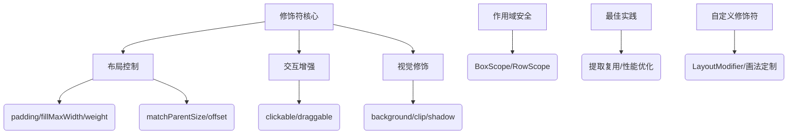

# Jetpack Compose 修饰符（Modifier）全面解析 🎨

## 一、修饰符核心作用与设计理念

### （一）核心能力

- **布局控制**：调整尺寸、边距、对齐方式（如 `padding`、`fillMaxWidth`）
- **交互增强**：添加点击、滚动、拖动（如 `clickable`、`draggable`）
- **视觉修饰**：背景色、形状裁剪、偏移（如 `background`、`clip`）
- **语义补充**：无障碍标签、测试标识（如 `contentDescription`、`testTag`）

### （二）设计优势

- **链式调用**：通过 `Modifier` 函数链实现原子操作组合（例：`padding().clickable().fillMaxWidth()`）
- **作用域安全**：限定修饰符适用范围（如 `matchParentSize` 仅在 `Box` 中生效）
- **性能优化**：单遍测量机制 + 不可变对象设计，避免重复计算

## 二、核心概念与关键规则

### （一）修饰符顺序决定行为（必知！）

| 顺序                | 代码示例                                                                 | 效果差异                                                                 |
|---------------------|--------------------------------------------------------------------------|--------------------------------------------------------------------------|
| **clickable → padding** | `Modifier.clickable().padding(16.dp)`                                   | 点击区域包含 padding 空间（推荐）                                       |
| **padding → clickable** | `Modifier.padding(16.dp).clickable()`                                   | 点击区域不包含 padding 空间（边缘不可点击）                             |

#### 示意图：顺序影响点击区域

  
*（官方示意图：左图点击区域包含内边距，右图仅内容区可点击）*

### （二）布局约束与修饰符优先级

1. **父约束优先**：子项默认遵守父容器传递的 `minWidth/maxHeight` 等约束
2. **强制覆盖**：使用 `requiredSize(150.dp)` 可突破父约束（可能导致溢出）
3. **自适应填充**：`fillMaxWidth()` 根据父可用空间扩展（受限于父约束）

## 三、内置修饰符分类与详解 📊

### （一）布局相关修饰符

| 修饰符                | 作用域       | 典型用法                                                                 | 特殊说明                                                                 |
|-----------------------|--------------|--------------------------------------------------------------------------|--------------------------------------------------------------------------|
| `padding(dp)`         | 全局         | `Modifier.padding(16.dp)`                                               | 内边距，影响背景范围                                                    |
| `fillMaxWidth()`      | 全局         | `Modifier.fillMaxWidth()`                                                | 填充父容器剩余宽度                                                      |
| `matchParentSize()`   | `BoxScope`   | `Box { Image(Modifier.matchParentSize()) }`                             | 子项尺寸等于父 `Box` 尺寸（不改变父尺寸）                              |
| `weight(ratio)`       | `Row/Column` | `Row { Text(Modifier.weight(2f)) Text(Modifier.weight(1f)) }`          | 按比例分配剩余空间（类似 Flexbox）                                      |
| `offset(x, y)`        | 全局         | `Text("偏移", Modifier.offset(8.dp, 4.dp))`                             | 相对父容器的布局偏移（受布局方向影响）                                  |
| `absoluteOffset(x)`   | 全局         | `Icon(Icons.Filled.Check, Modifier.absoluteOffset(right = 8.dp))`       | 绝对偏移（固定向右偏移，无视布局方向）                                  |

### （二）视觉与交互修饰符

```kotlin
@Composable
fun DecoratedCard() {
    Card(
        modifier = Modifier
            .size(200.dp) // 固定尺寸
            .padding(16.dp) // 内边距
            .background(Color.White, RoundedCornerShape(8.dp)) // 带圆角的背景
            .clickable(indication = rememberRipple()) {  // 点击涟漪效果
                // 点击逻辑
            }
            .shadow(4.dp, RoundedCornerShape(8.dp)) // 阴影
    ) {
        Text("Jetpack Compose", Modifier.align(Alignment.Center))
    }
}
```

### （三）作用域限定修饰符（关键！）

| 修饰符            | 有效作用域         | 错误场景示例                                      | 正确用法示例                                  |
|-------------------|--------------------|---------------------------------------------------|-----------------------------------------------|
| `matchParentSize` | `BoxScope`         | `Row { Image(Modifier.matchParentSize()) }` ❌    | `Box { Image(Modifier.matchParentSize()) }` ✅ |
| `weight`          | `RowScope/ColumnScope` | `Box { Text(Modifier.weight(1f)) }` ❌            | `Column { Text(Modifier.weight(1f)) }` ✅      |
| `align`           | `Row/Column/Box`   | `Text(Modifier.align(Alignment.Center))` ❌（无父容器） | `Box { Text(Modifier.align(Alignment.Center)) }` ✅ |

## 四、高级技巧与最佳实践

### （一）提取复用修饰符（性能优化）

```kotlin
// 全局复用（无状态）
val CardModifier = Modifier
    .padding(16.dp)
    .background(Color.White)
    .clip(RoundedCornerShape(8.dp))
    .shadow(4.dp)

// 含状态的动态修饰符（避免重组时重复创建）
@Composable
fun DynamicCard(modifier: Modifier = Modifier) {
    val ripple = rememberRipple()
    Card(
        modifier = modifier.then(CardModifier.clickable(ripple) {}) // 组合固定修饰符
    ) { /* ... */ }
}
```

### （二）自定义修饰符（扩展能力）

```kotlin
// 自定义带呼吸动画的修饰符
fun Modifier.breathingAnimation() = this.then(
    object : LayoutModifier {
        override fun MeasureScope.measure(
            measurable: Measurable,
            constraints: Constraints
        ): MeasureResult {
            val size = measurable.measure(constraints).size
            return layout(size.width, size.height) {
                val animatedScale = animateFloatAsState(1f + sin(animateMillis(1000)) * 0.1f)
                drawScale(scaleX = animatedScale.value, scaleY = animatedScale.value) {
                    measurable.place(0, 0)
                }
            }
        }
    }
)

// 使用示例
Text("呼吸效果", Modifier.breathingAnimation())
```

### （三）性能敏感场景优化

1. **避免在重组中创建新修饰符**：

   ```kotlin
   // 反模式：每次重组创建新对象
   Text(modifier = Modifier.padding(16.dp + animateDpAsState(0.dp).value))

   // 正确做法：分离动态值与固定修饰符
   val padding = 16.dp + animateDpAsState(0.dp).value
   Text(modifier = Modifier.padding(padding)) // 仅值变化，修饰符实例不变
   ```

2. **延迟测量修饰符**：
   使用 `offset { ... }` 替代 `offset(x, y)`，在测量阶段动态计算偏移（避免重组触发重绘）

## 五、常见问题与解决方案

### （一）外边距（Margin）如何实现？

**Compose 没有直接的 `margin` 修饰符**，通过以下方式模拟：

1. 父容器添加 `padding`（推荐）：

   ```kotlin
   Column(modifier = Modifier.padding(16.dp)) {  // 相当于子项外边距
       Text("内容")
   }
   ```

2. 子项包裹一层透明 Box：

   ```kotlin
   Box(modifier = Modifier.padding(16.dp)) {
       Text("内容")
   }
   ```

### （二）背景色与内边距的关系

- **`background` 在前**：padding 是外边距（背景不包含 padding 区域）
- **`padding` 在前**：padding 是内边距（背景包含 padding 区域）

```kotlin
// 内边距（背景覆盖 padding）
Modifier.padding(16.dp).background(Color.Red)

// 外边距（背景不覆盖 padding）
Modifier.background(Color.Red).padding(16.dp)
```

## 六、总结与学习路径

### （一）知识图谱（流程图）



### （二）官方学习资源

1. [修饰符完整列表](https://developer.android.com/reference/kotlin/androidx/compose/ui/Modifier)
2. [布局基础知识 Codelab](https://developer.android.com/codelabs/jetpack-compose-layouts)
3. [Now in Android 代码库](https://github.com/android/nowinandroid)（搜索 `Modifier` 查看实战用法）

通过掌握修饰符的链式组合、作用域规则和性能优化技巧，可大幅提升 Compose 布局的开发效率与灵活性。建议结合官方示例与自定义场景，逐步构建自己的修饰符工具库 🛠️。
