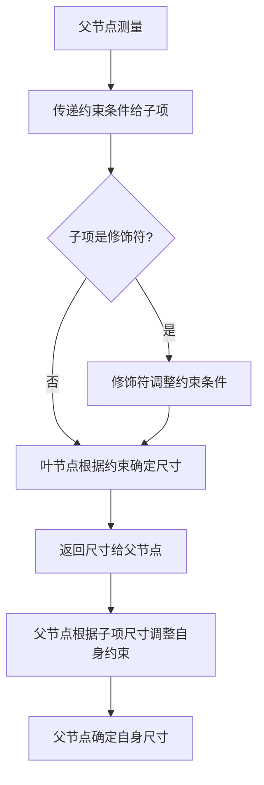
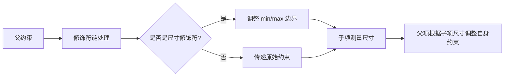

# Compose 约束条件与修饰符顺序深度解析 📐

## 一、界面树中的修饰符结构

### （一）修饰符链的封装模型

修饰符以链式结构封装布局节点，形成「修饰符容器树」，每个修饰符节点包裹内部节点并影响测量逻辑。

- **示例结构**：

  ```txt
  Row（父布局）
    ├─ Image（子项）
    │   ├─ clip(CircleShape) （修饰符1）
    │   └─ size(40.dp) （修饰符2）
    └─ Column（子项）
        └─ padding(start=8.dp) （修饰符）
  ```

- **关键结论**：
  - 修饰符顺序决定约束处理优先级（先应用的修饰符先处理约束）。
  - 布局节点（如Row/Column）组织子项，修饰符节点调整子项属性。

### （二）可视化模型

  
*图1：修饰符作为容器节点封装布局元素*

## 二、布局约束条件基础

### （一）约束条件类型

| 类型       | 描述                                                                 | 示例（宽×高）               |
|------------|----------------------------------------------------------------------|-----------------------------|
| **受限**   | 有明确最小/最大边界（`min≤size≤max`）                               | `100dp≤width≤300dp`          |
| **无界**   | 无尺寸限制（`min=0`，`max=无穷大`）                                 | `width=∞`，`height=∞`        |
| **精确**   | 最小=最大（强制固定尺寸）                                           | `width=300dp`，`height=200dp`|
| **组合**   | 混合类型（如宽度精确，高度受限）                                   | `width=300dp`，`100dp≤height≤200dp` |

### （二）约束条件传递流程



流程图：约束条件从父到子的深度优先传递过程

## 三、影响约束条件的核心修饰符

### （一）尺寸控制修饰符对比

| 修饰符          | 作用                                                                 | 约束条件处理方式                          | 优先级 |
|-----------------|----------------------------------------------------------------------|-------------------------------------------|--------|
| `size(width, height)` | 设置首选尺寸，受父约束限制（`min≤value≤max`）                     | 调整约束为 `[value, value]`，超出父约束则取边界 | 低     |
| `requiredSize(size)`   | 强制覆盖父约束，设置确切尺寸（无视父约束）                         | 直接替换为 `[size, size]`                   | 高     |
| `width(value)`/`height(value)` | 固定宽/高，另一侧自适应（受父约束）                              | 调整宽/高为 `value`，另一侧保持父约束       | 中     |
| `sizeIn(min, max)`     | 设置尺寸范围（最小/最大边界）                                      | 约束=max(父min, 修饰符min) ~ min(父max, 修饰符max) | 中     |

### （二）修饰符优先级示例

```kotlin
// 场景：父容器约束为 300x200（宽×高）
Image(
    modifier = Modifier
        .fillMaxSize() // 先应用：约束变为 300x200（精确）
        .size(50.dp)   // 后应用：受限于父约束，无效
)
// 结果：图片尺寸 300x200（size 被覆盖）
```

## 四、复杂修饰符组合案例

### （一）案例1：`fillMaxSize + wrapContentSize + size`

```kotlin
Image(
    modifier = Modifier
        .fillMaxSize()       // 约束变为 300x200（精确）
        .wrapContentSize()   // 重置为父容器原始约束（无界：0-300, 0-200）
        .size(50.dp)         // 最终约束 50x50
)
// 结果：图片尺寸 50x50，居中显示在父容器中
```

  
*图2：wrapContentSize 重置约束流程*

### （二）案例2：`clip + padding + size`

```kotlin
Image(
    modifier = Modifier
        .clip(CircleShape)   // 不影响约束，仅绘制时剪裁
        .padding(10.dp)      // 减少可用空间：300-20=280（宽），200-20=180（高）
        .size(100.dp)        // 约束为 100x100（在 padding 后的空间内）
)
// 测量阶段：图片尺寸 100x100
// 绘制阶段：padding 扩展为 120x120，clip 剪裁为圆形
```

  
*图3：修饰符对测量和绘制的分离影响*

## 五、关键规则与最佳实践

### （一）修饰符顺序黄金法则

1. **布局相关优先**：`size`/`fillMaxSize` 等影响约束的修饰符前置。
2. **视觉修饰后置**：`clip`/`shadow` 等不影响约束的修饰符后置。
3. **交互修饰最后**：`clickable` 等响应用户输入的修饰符置于链尾。

### （二）约束冲突解决方案

| 冲突场景                | 解决方案                                                                 |
|-------------------------|--------------------------------------------------------------------------|
| 多个 `size` 修饰符      | 仅第一个有效，后续被忽略                                               |
| `size` 与父约束冲突    | 用 `requiredSize` 强制覆盖或 `sizeIn` 调整范围                          |
| 自适应布局              | 结合 `weight`（Row/Column）和 `fillMaxWidth` 实现比例分配              |

## 六、总结：修饰符与约束条件关系模型



- 核心逻辑：修饰符链决定约束的「过滤」和「转换」，影响节点测量结果

通过理解修饰符顺序与约束传递机制，可精准控制布局尺寸。复杂场景建议用 `debugLayout` 可视化约束传递辅助调试 🛠️。
