# Compose 自定义修饰符开发指南 🛠️

## 一、自定义修饰符核心概念

### （一）组成部分

1. **修饰符工厂**：扩展`Modifier`的函数，提供链式调用API（如`Modifier.myModifier()`）。
2. **修饰符元素**：实现具体逻辑的核心部分，分为两种实现方式：
   - **组合现有修饰符**：通过现有修饰符组合实现（简单场景）。
   - **使用`Modifier.Node`**：底层API，支持自定义测量、绘制、交互等复杂逻辑。

### （二）实现方式对比

| 方式                | 适用场景                     | 性能       | 复杂度 |
|---------------------|------------------------------|------------|--------|
| 链接现有修饰符      | 简单样式组合（如圆角+背景）   | 高         | 低     |
| 可组合项修饰符工厂  | 需要动画或组合本地变量       | 中（需注意重组开销） | 中     |
| `Modifier.Node`      | 自定义测量、绘制、手势等     | 最高       | 高     |

## 二、快速入门：链接现有修饰符

### （一）基础用法

将多个现有修饰符封装为一个复合修饰符，简化重复代码。

```kotlin
// 组合padding、clip、background为自定义修饰符
fun Modifier.myCard(modifier: Modifier = Modifier, color: Color) = this
    .then(modifier)
    .padding(16.dp)
    .clip(RoundedCornerShape(8.dp))
    .background(color)
```

### （二）优势与限制

- **优势**：开发成本低，复用性高。
- **限制**：无法实现测量/绘制级别的自定义逻辑。

## 三、进阶用法：可组合项修饰符工厂

### （一）实现带状态的修饰符

利用Compose状态机制（如`animate*AsState`）实现动态效果。

```kotlin
@Composable
fun Modifier.fade(enabled: Boolean): Modifier {
    val alpha by animateFloatAsState(if (enabled) 0.5f else 1.0f)
    return this.then(Modifier.graphicsLayer { this.alpha = alpha })
}
```

### （二）注意事项

1. **组合本地变量作用域**：
   - 组合本地变量在修饰符创建时解析，而非使用时（可能导致预期外行为）。
   - **解决方案**：改用`Modifier.Node`在使用位置解析。
2. **性能开销**：
   - 每次重组都会调用可组合工厂，频繁重组场景需谨慎（如列表项）。

## 四、高级用法：使用`Modifier.Node`

### （一）核心三要素

```mermaid
graph LR
    A[修饰符工厂] --> B[创建ModifierNodeElement]
    B --> C[实例化Modifier.Node]
    C --> D[实现具体逻辑（测量/绘制/交互）]
```



#### 1. `Modifier.Node`：逻辑实现

```kotlin
// 绘制圆形的Node（实现DrawModifierNode）
private class CircleNode(var color: Color) : DrawModifierNode, Modifier.Node() {
    override fun ContentDrawScope.draw() {
        drawCircle(color, size = size) // size为父容器尺寸
        drawContent() // 绘制子内容
    }
}
```

#### 2. `ModifierNodeElement`：节点管理

```kotlin
// 管理CircleNode的创建和更新
private data class CircleElement(val color: Color) : ModifierNodeElement<CircleNode>() {
    override fun create() = CircleNode(color)
    override fun update(node: CircleNode, element: CircleElement) {
        node.color = element.color // 仅更新颜色，复用节点实例
    }
}
```

#### 3. 修饰符工厂：暴露API

```kotlin
// 提供链式调用接口
fun Modifier.circle(color: Color) = this.then(CircleElement(color))
```

### （二）常见应用场景

#### 1. **零参数修饰符**（固定内边距）

```kotlin
fun Modifier.fixedPadding() = this.then(FixedPaddingElement)

private object FixedPaddingElement : ModifierNodeElement<FixedPaddingNode>() {
    override fun create() = FixedPaddingNode()
    override fun update(node: FixedPaddingNode, element: FixedPaddingElement) {}
}

class FixedPaddingNode : LayoutModifierNode {
    private val PADDING = 16.dp
    override fun MeasureScope.measure(measurable: Measurable, constraints: Constraints): MeasureResult {
        val placeable = measurable.measure(constraints.offset(-PADDING.roundToPx()))
        return layout(placeable.width + 2*PADDING.roundToPx(), placeable.height + 2*PADDING.roundToPx()) {
            placeable.place(PADDING.roundToPx(), PADDING.roundToPx())
        }
    }
}
```

#### 2. **监听组合本地变量**（动态颜色背景）

```kotlin
class DynamicBackgroundNode : DrawModifierNode, CompositionLocalConsumerModifierNode {
    override fun ContentDrawScope.draw() {
        val color = currentValueOf(LocalContentColor) // 在使用位置解析组合本地变量
        drawRect(color.copy(alpha = 0.5f))
        drawContent()
    }
}

fun Modifier.dynamicBackground() = this.then(DynamicBackgroundElement)
```

#### 3. **动画修饰符**（颜色淡入淡出）

```kotlin
class AnimatedCircleNode(color: Color) : DrawModifierNode, Modifier.Node() {
    private val alpha = Animatable(1f)
    init {
        coroutineScope.launch {
            alpha.animateTo(0f, infiniteRepeatable(tween(1000), RepeatMode.Reverse))
        }
    }
    override fun ContentDrawScope.draw() {
        drawCircle(color, alpha = alpha.value)
        drawContent()
    }
}
```

#### 4. **状态共享**（点击涟漪效果）

```kotlin
class ClickableWithRippleNode : DelegatingNode() {
    private val interactionData = InteractionData()
    val focusableNode = delegate(FocusableNode(interactionData))
    val rippleNode = delegate(IndicationNode(interactionData, RippleIndication()))
}
```

#### 5. **停用自动失效**（精细控制重绘）

```kotlin
class SmartInvalidateNode(var color: Color, var size: IntSize) : DrawModifierNode {
    override val shouldAutoInvalidate: Boolean get() = false // 关闭自动失效

    fun updateColor(newColor: Color) {
        if (color != newColor) {
            color = newColor
            invalidateDraw() // 仅重绘
        }
    }

    fun updateSize(newSize: IntSize) {
        if (size != newSize) {
            size = newSize
            invalidateMeasurement() // 仅重新测量
        }
    }
}
```

## 五、性能优化与最佳实践

### （一）避免过度重组

- **反模式**：在可组合工厂中创建状态对象（每次重组都会重新创建）。

  ```kotlin
  @Composable
  fun Modifier.inefficientModifier() = this.then(Modifier.clickable { /*...*/ }) // 每次重组创建新clickable节点
  ```

- **最佳实践**：提取不变修饰符，避免在可组合函数内创建节点。

  ```kotlin
  val staticModifier = Modifier.clickable { /*...*/ } // 提升到组合外，避免重复创建
  @Composable
  fun EfficientComposable() {
      Box(modifier = staticModifier.then(Modifier.alpha(0.5f)))
  }
  ```

### （二）正确实现`equals`和`hashCode`

- 使用数据类自动生成（推荐）：

  ```kotlin
  private data class CircleElement(val color: Color) : ModifierNodeElement<CircleNode>() { /*...*/ }
  ```

- 手动实现（非数据类场景）：

  ```kotlin
  override fun equals(other: Any?): Boolean = other is CircleElement && other.color == color
  override fun hashCode(): Int = color.hashCode()
  ```

### （三）优先使用现有修饰符

- 在实现自定义修饰符前，检查是否可通过现有修饰符组合实现（如`graphicsLayer`+`clip`实现圆角）。

## 六、总结：选择合适的实现方式

| 需求场景                     | 推荐方式                   | 示例场景                          |
|------------------------------|----------------------------|-----------------------------------|
| 简单样式组合                 | 链接现有修饰符             | 统一卡片样式（padding+background）|
| 需要动画或组合本地变量       | 可组合项修饰符工厂         | 动态透明度、基于主题的颜色       |
| 自定义测量/绘制/手势         | `Modifier.Node`            | 圆形裁剪、自定义布局、拖动排序   |
| 高性能要求（如列表项）       | `Modifier.Node`            | 复杂列表项动画、手势交互         |

通过合理选择实现方式，结合Compose的状态管理和性能优化策略，可高效创建灵活且高性能的自定义修饰符。推荐从简单组合开始，逐步过渡到`Modifier.Node`实现复杂逻辑，并利用官方文档和Codelab示例加深理解。
