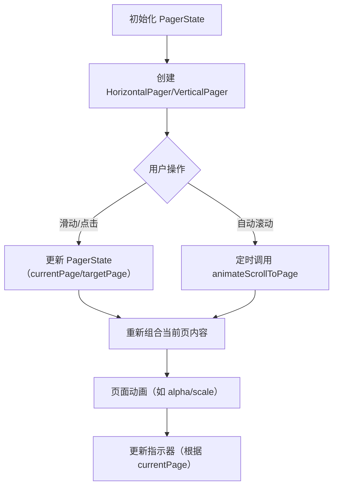

# Compose 中的分页器开发指南  

原地址：<https://developer.android.google.cn/develop/ui/compose/layouts/pager?hl=zh-cn>  

## 一、核心组件与基本用法  

### （一）水平分页器 `HorizontalPager`  

- **功能**：创建左右滚动的分页效果，类似 View 系统的 `ViewPager`。  
- **基础代码**：  

  ```kotlin
  val pagerState = rememberPagerState(pageCount = { 10 })
  HorizontalPager(state = pagerState) { page ->
      Text("Page: $page", modifier = Modifier.fillMaxWidth())
  }
  ```

- **特点**：默认占据全屏宽度，一次滑动一页。  

### （二）垂直分页器 `VerticalPager`  

- **功能**：创建上下滚动的分页效果。  
- **基础代码**：  

  ```kotlin
  val pagerState = rememberPagerState(pageCount = { 10 })
  VerticalPager(state = pagerState) { page ->
      Text("Page: $page", modifier = Modifier.fillMaxWidth())
  }
  ```

## 二、核心功能与配置  

### （一）状态管理 `PagerState`  

- **创建**：通过 `rememberPagerState()` 获取分页状态，包含当前页、滚动状态等。  
- **关键属性**：  
  - `currentPage`：当前接近贴靠位置的页面。  
  - `settledPage`：动画结束后的稳定页面。  
  - `targetPage`：滚动目标页面。  
- **滚动控制**：  
  - 立即滚动：`pagerState.scrollToPage(page)`  
  - 带动画滚动：`pagerState.animateScrollToPage(page)`  

### （二）延迟加载与预加载  

- **延迟创建**：页面在需要时动态组合，提升性能。  
- **预加载屏幕外页面**：通过 `beyondBoundsPageCount` 设置预加载数量（默认 0）。  

  ```kotlin
  HorizontalPager(state = pagerState, beyondBoundsPageCount = 2) { ... } // 预加载当前页前后各 2 页  
  ```

### （三）页面指示器  

- **实现方式**：通过 `pagerState.currentPage` 判断当前页，绘制指示器（如圆形进度条）。  
- **示例代码**：  

  ```kotlin
  Row(Modifier.align(Alignment.BottomCenter)) {
      repeat(pagerState.pageCount) { index ->
          val isSelected = pagerState.currentPage == index
          Box(Modifier.size(16.dp).padding(2.dp).clip(CircleShape).background(if (isSelected) Color.DarkGray else Color.LightGray))
      }
  }
  ```

## 三、高级用法与自定义  

### （一）页面大小与内边距  

- **固定页面大小**：通过 `pageSize` 设置固定尺寸（如 `PageSize.Fixed(200.dp)`）。  
- **自适应页面大小**：自定义计算逻辑，基于可用空间分配。  

  ```kotlin
  val threePagesPerViewport = object : PageSize {
      override fun Density.calculateMainAxisPageSize(availableSpace: Int, pageSpacing: Int): Int {
          return (availableSpace - 2 * pageSpacing) / 3 // 每行显示 3 页，含间距  
      }
  }
  ```

- **内容内边距**：通过 `contentPadding` 调整页面边距，支持居中或偏移。  

  ```kotlin
  HorizontalPager(state = pagerState, contentPadding = PaddingValues(horizontal = 32.dp)) { ... } // 左右内边距各 32dp  
  ```

### （二）滚动效果与动画  

- **页面偏移监听**：通过 `currentPageOffsetFraction` 获取当前页偏移比例，实现缩放、透明度等动画。  

  ```kotlin
  Card(Modifier.graphicsLayer {
      val pageOffset = (pagerState.currentPage - page + pagerState.currentPageOffsetFraction).absoluteValue
      alpha = lerp(0.5f, 1f, 1f - pageOffset.coerceIn(0f, 1f)) // 非当前页透明度降低  
  })
  ```

- **自定义滚动行为**：修改 `flingBehavior` 调整滑动灵敏度或分页距离。  

  ```kotlin
  val fling = PagerDefaults.flingBehavior(state = pagerState, pagerSnapDistance = PagerSnapDistance.atMost(10))
  ```

### （三）自动滚动分页器  

- **实现逻辑**：结合 `LaunchedEffect` 定时滚动，通过 `interactionSource` 监听用户操作暂停自动滚动。  
- **关键代码**：  

  ```kotlin
  if (!pagerState.interactionSource.collectIsDraggedAsState().value) {
      LaunchedEffect(Unit) {
          while (true) {
              delay(2000) // 每 2 秒滚动一页  
              pagerState.animateScrollToPage((pagerState.currentPage + 1) % pageCount)
          }
      }
  }
  ```

## 四、流程图：分页器核心逻辑  



## 五、最佳实践与注意事项  

1. **性能优化**：  
   - 避免在页面内容中使用重绘成本高的修饰符（如复杂阴影）。  
   - 通过 `beyondBoundsPageCount` 合理预加载，平衡内存与流畅度。  
2. **交互设计**：  
   - 指示器需明确当前页位置，建议搭配动画反馈（如缩放）。  
   - 自动滚动需提供暂停机制（如检测用户触摸）。  
3. **兼容性**：  
   - 适配不同屏幕尺寸时，结合 `WindowSizeClass` 调整 `pageSize`。  

通过 `HorizontalPager` 和 `VerticalPager`，Compose 提供了灵活且高性能的分页解决方案，适用于图片轮播、多步骤表单、长列表分页等场景。结合状态管理与自定义动画，可构建丰富的用户交互体验。
