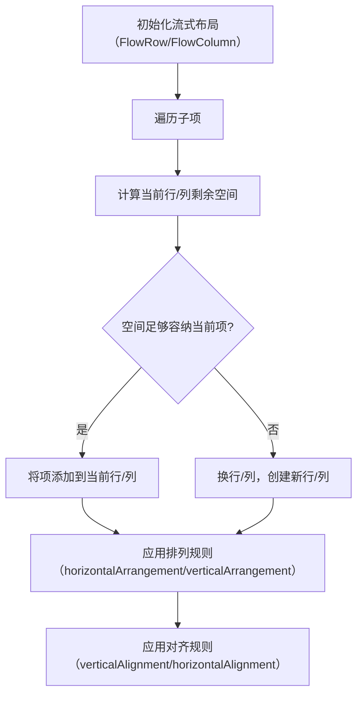

# Compose 中的流式布局开发指南  

原地址：<https://developer.android.google.cn/develop/ui/compose/layouts/flow?hl=zh-cn>  

## 一、核心组件与基本用法  

### （一）流式布局核心组件  

- **`FlowRow`**：水平排列子项，空间不足时自动换行（类似 HTML 的 `flex-wrap: wrap`）。  
- **`FlowColumn`**：垂直排列子项，空间不足时自动换列。  

### （二）基础代码示例  

```kotlin
@Composable
fun FlowRowSimpleExample() {
    FlowRow(modifier = Modifier.padding(8.dp)) {
        repeat(5) { index ->
            ChipItem("Item ${index + 1}") // 自定义标签组件，自动换行排列
        }
    }
}
```  

**效果**：当一行容纳不下所有项时，自动换行排列，如图 1 所示。

## 二、布局属性与配置  

### （一）主轴排列（水平/垂直方向）  

- **`FlowRow` 水平排列**（默认 `Arrangement.Start`）：  

  ```kotlin
  FlowRow(horizontalArrangement = Arrangement.SpaceBetween) { ... } 
  ```  

  - 支持 `Arrangement` 枚举值（如 `Center`/`End`/`SpaceAround` 等），控制行内项的水平间距。  
- **`FlowColumn` 垂直排列**（默认 `Arrangement.Top`）：  

  ```kotlin
  FlowColumn(verticalArrangement = Arrangement.Center) { ... } 
  ```  

  - 控制列内项的垂直间距。  

### （二）交叉轴排列（垂直/水平方向）  

- **`FlowRow` 垂直对齐**（默认 `Alignment.Top`）：  

  ```kotlin
  FlowRow(verticalAlignment = Alignment.CenterVertically) { ... } 
  ```  

  - 行内子项垂直对齐方式（如 `Bottom`/`CenterVertically`）。  
- **`FlowColumn` 水平对齐**（默认 `Alignment.Start`）：  

  ```kotlin
  FlowColumn(horizontalAlignment = Alignment.CenterHorizontally) { ... } 
  ```  

### （三）单个项对齐  

- 使用 `Modifier.align()` 控制单个项在当前行/列的对齐方式：  

  ```kotlin
  FlowRow {
      Text("Short", Modifier.align(Alignment.Top)) // 顶部对齐
      Text("Tall", Modifier.align(Alignment.CenterVertically)) // 居中对齐
  }
  ```  

### （四）行/列项数上限  

- 通过 `maxItemsInEachRow`（`FlowRow`）或 `maxItemsInEachColumn`（`FlowColumn`）限制每行/列最大项数：  

  ```kotlin
  FlowRow(maxItemsInEachRow = 3) { ... } // 每行最多 3 项，超出则换行
  ```  

## 三、高级功能：权重与尺寸适配  

### （一）权重分配（`Modifier.weight`）  

- **`FlowRow` 权重逻辑**：仅计算当前行内子项的权重总和，而非整个容器。  
  - 示例：4 项分布在 2 行，每行 2 项，则每行单独计算权重。  

  ```kotlin
  FlowRow {
      Box(Modifier.weight(1f)) // 行内剩余空间按权重分配
      Box(Modifier.weight(2f))
  }
  ```  

- **应用场景**：创建响应式网格（如每行 3 项，等宽布局）：  

  ```kotlin
  FlowRow(maxItemsInEachRow = 3) {
      repeat(9) { Modifier.weight(1f) } // 每行 3 项，等权重分配宽度
  }
  ```  

### （二）按比例调整尺寸  

- **`fillMaxWidth(fraction)`**：子项占当前行/列宽度的比例（基于容器总宽度）。  

  ```kotlin
  FlowRow {
      Box(Modifier.fillMaxWidth(0.5f)) // 占容器宽度的 50%
  }
  ```  

- **与 `Row` 区别**：`FlowRow` 中 `fillMaxWidth` 基于容器总宽度，而 `Row` 基于行剩余宽度。  

### （三）强制等宽/等高  

- **`fillMaxColumnWidth()`**：同一列的项强制与列内最大项同宽。  
- **`fillMaxRowHeight()`**：同一行的项强制与行内最大项同高。  

  ```kotlin
  FlowColumn {
      Text("Long Text", Modifier.fillMaxColumnWidth()) // 该行所有项与最长文本同宽
      Text("Short")
  }
  ```  

## 四、流程图：流式布局核心逻辑  



## 五、最佳实践与注意事项  

1. **响应式布局**：  
   - 结合 `maxItemsInEachRow` 和 `Modifier.weight` 创建自适应网格，适配不同屏幕尺寸。  
   - 示例：手机端每行 2 项，平板端每行 3 项。  
2. **权重计算范围**：  
   - `FlowRow`/`FlowColumn` 的权重仅作用于当前行/列，而非整个容器，需注意多行列场景的权重分配。  
3. **性能优化**：  
   - 避免在流式布局中使用过多重绘成本高的修饰符（如复杂阴影），影响滚动流畅度。  

通过 `FlowRow` 和 `FlowColumn`，Compose 提供了灵活的流式布局解决方案，适用于标签栏、筛选条件、瀑布流等场景，结合权重和对齐规则可实现丰富的响应式布局效果。
