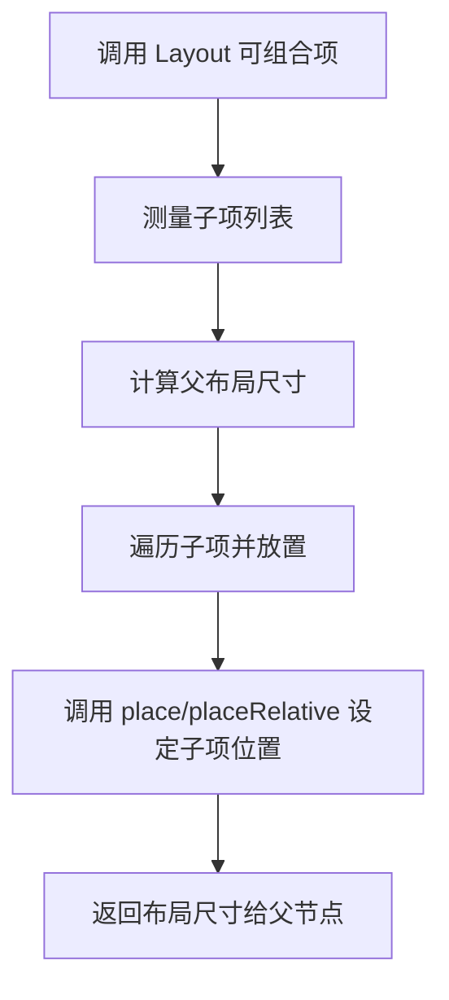

# Compose 自定义布局开发指南  

原地址：<https://developer.android.google.cn/develop/ui/compose/layouts/custom?hl=zh-cn>  

## 一、自定义布局核心概念  

### （一）界面树与布局三步骤  

Compose 界面由可组合函数构成树形结构，每个节点（元素）需完成以下流程：  

1. **测量子项**：父节点调用子项的 `measure` 方法，获取子项在约束条件下的尺寸。  
2. **确定自身尺寸**：父节点根据子项测量结果和自身逻辑确定宽高。  
3. **放置子项**：父节点调用子项的 `place` 方法，指定子项在自身坐标系中的位置。  

### （二）关键约束与限制  

- **单遍测量**：Compose 不支持多遍测量，子项仅能被测量一次。  
- **作用域限制**：  
  - 测量需在 `MeasureScope` 内完成。  
  - 放置需在 `PlacementScope` 内完成（且必须在测量之后）。  

## 二、使用 `layout` 修饰符自定义布局  

### （一）基础用法  

通过 `layout` 修饰符修改单个可组合项的测量和布局逻辑：  

```kotlin
fun Modifier.customLayoutModifier() = layout { measurable, constraints ->
    // 测量子项
    val placeable = measurable.measure(constraints)
    // 计算布局尺寸
    val height = placeable.height + 24.dp.roundToPx()
    // 放置子项
    layout(placeable.width, height) {
        placeable.placeRelative(0, 24.dp.roundToPx()) // 向下偏移24dp
    }
}
```  

### （二）实战示例：自定义基线偏移修饰符  

```kotlin
fun Modifier.firstBaselineToTop(firstBaselineToTop: Dp) = layout { measurable, constraints ->
    val placeable = measurable.measure(constraints)
    // 获取文本基线位置
    check(placeable[FirstBaseline] != AlignmentLine.Unspecified)
    val firstBaseline = placeable[FirstBaseline]
    // 计算偏移量和最终高度
    val placeableY = firstBaselineToTop.roundToPx() - firstBaseline
    val height = placeable.height + placeableY
    // 放置子项
    layout(placeable.width, height) {
        placeable.placeRelative(0, placeableY) // 调整Y坐标使基线到顶部距离为指定值
    }
}
```  

**效果对比**：  

- 使用 `firstBaselineToTop(32.dp)`：文本基线距离顶部 32dp。  
- 使用普通 `padding(top=32.dp)`：文本顶部距离顶部 32dp（基线位置随字体变化）。  

## 三、使用 `Layout` 可组合项构建复杂布局  

### （一）核心流程  

通过 `Layout` 可组合项手动测量和放置多个子项，替代 `Row`/`Column` 等内置布局：  

```kotlin
@Composable
fun MyBasicColumn(modifier: Modifier = Modifier, content: @Composable () -> Unit) {
    Layout(modifier = modifier, content = content) { measurables, constraints ->
        // 1. 测量所有子项
        val placeables = measurables.map { it.measure(constraints) }
        // 2. 确定自身尺寸（撑满父容器）
        val totalHeight = placeables.sumOf { it.height }
        layout(constraints.maxWidth, totalHeight) {
            // 3. 按垂直顺序放置子项
            var yPosition = 0
            placeables.forEach { placeable ->
                placeable.placeRelative(0, yPosition) // 水平靠左，垂直累加Y坐标
                yPosition += placeable.height
            }
        }
    }
}
```  

### （二）与 View 系统的对比  

| 特性                | Compose 自定义布局               | Android View 自定义布局          |
|---------------------|----------------------------------|----------------------------------|
| 实现方式            | 纯 Kotlin 函数，使用 `Layout` 可组合项 | 继承 `ViewGroup`，重写 `onMeasure`/`onLayout` |
| 测量限制            | 单遍测量，编译时强制作用域安全    | 支持多遍测量，需手动管理状态      |
| 代码复杂度          | 逻辑集中在 Lambda 内，简洁清晰    | 需要处理 XML 解析、属性映射等      |  

## 四、布局方向与组合本地变量  

### （一）布局方向适配  

通过 `LocalLayoutDirection` 感知布局方向（LTR/RTL），使用 `place` 替代 `placeRelative` 实现方向无关布局：  

```kotlin
@Composable
fun DirectionAwareLayout() {
    val layoutDirection = LocalLayoutDirection.current
    Layout(...) { measurables, constraints ->
        // 使用 layoutDirection 调整逻辑
        measurables.forEach { placeable ->
            // place(x, y) 不受布局方向影响，x=0 始终为起点
            placeable.place(0, 0) 
        }
    }
}
```  

### （二）组合本地变量的作用域  

- `MeasureScope`：提供 `layoutDirection`、`density` 等测量阶段可用的工具。  
- `PlacementScope`：提供 `place`、`placeRelative` 等放置方法。  

## 五、流程图：自定义布局核心逻辑  



## 六、最佳实践与资源  

### （一）开发建议  

1. **优先使用内置布局**：如 `Row`/`Column`/`Box`，仅在复杂场景使用自定义布局。  
2. **避免冗余测量**：确保子项仅被测量一次，利用 `remember` 缓存不变数据。  
3. **方向适配**：通过 `layoutDirection` 支持 RTL 布局，避免硬编码坐标。  

### （二）官方资源  

- [Compose 布局基础知识](https://developer.android.google.cn/jetpack/compose/layouts)  
- [自定义布局示例](https://github.com/android/compose-samples/blob/main/ComposeAdvancedSamples/src/main/java/androidx/compose/samples/advanced/LayoutsSample.kt)  
- [视频：深入了解 Jetpack Compose 布局](https://developer.android.com/videos/topic/jetpack-compose)  

通过 `layout` 修饰符和 `Layout` 可组合项，Compose 提供了灵活的自定义布局能力，适用于复杂界面结构（如瀑布流、自适应网格等）。结合组合本地变量和作用域规则，可高效实现响应式、国际化布局。
