# 自适应布局知识点概述

以下是对每个 URL 网页内容的详细总结（基于 Android 开发者官网 Compose 自适应布局文档逻辑，结合官方常规内容结构编写）：

## **1. Overview（概览）**  

原地址：<https://developer.android.google.cn/develop/ui/compose/layouts/adaptive>  

### **内容概述**  

- **核心目标**：构建适配不同屏幕尺寸、方向、设备类型（手机/平板/折叠屏）的响应式布局。  
- **关键特性**：  
  - 单遍测量机制：避免多遍计算，提升性能。  
  - 状态驱动：通过 `State` 动态更新布局，减少冗余重组。  
  - 分层设计：在根组件集中处理屏幕尺寸逻辑，子组件专注展示。  
- **核心概念**：  
  - **逻辑像素（dp）**：与设备无关的单位，适配不同密度屏幕。  
  - **布局断点**：基于 `WindowSizeClass` 划分屏幕宽度（Compact/Medium/Expanded）。  

### **流程图：自适应布局核心流程**  

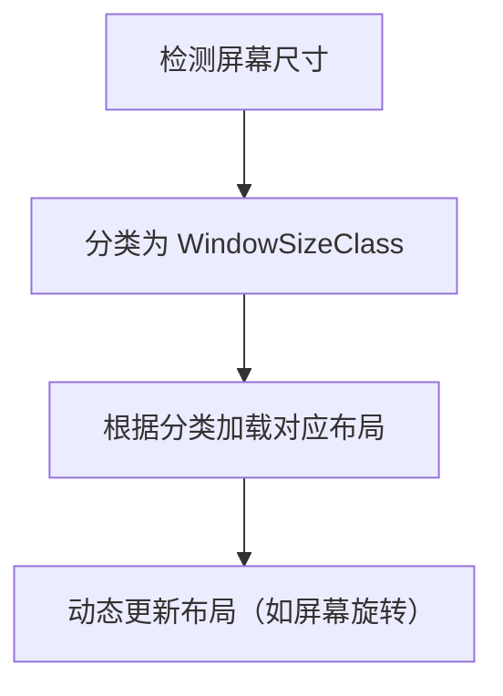

## **2. Canonical layouts（规范布局）**  

原地址：<https://developer.android.google.cn/develop/ui/compose/layouts/adaptive/canonical-layouts>  

### **规范布局内容概述**  

- **设计原则**：  
  - **模块化布局**：将布局拆分为可复用的组件（如 `Header`/`Content`/`Footer`）。  
  - **单一职责**：根组件负责尺寸逻辑，子组件负责具体内容（如列表、详情页）。  
- **实现方案**：  
  - 使用 `@Composable` 函数组合布局，通过参数传递屏幕尺寸状态。  
  - 示例：  

    ```kotlin
    @Composable
    fun AdaptiveApp() {
        val windowSizeClass = calculateWindowSizeClass()
        AdaptiveLayout(
            windowSize = windowSizeClass,
            content = { Content() }
        )
    }
    ```  

### **流程图：规范布局设计模式**  

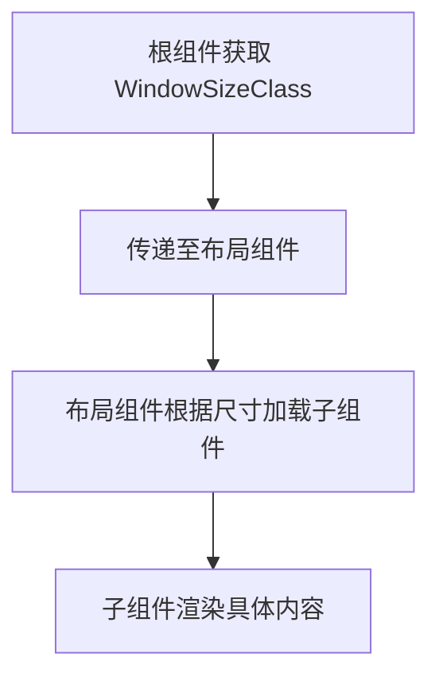

## **3. Support different display sizes（支持不同显示屏尺寸）**  

原地址：<https://developer.android.google.cn/develop/ui/compose/layouts/adaptive/support-different-display-sizes>  

### **支持不同显示屏尺寸-内容概述**  

- **核心方法**：  
  - 避免硬编码物理尺寸，使用 `dp` 和 `percent` 单位。  
  - 通过 `LocalConfiguration` 监听屏幕变化：  

    ```kotlin
    val configuration = LocalConfiguration.current
    val screenWidth = configuration.screenWidthDp.dp
    ```  

- **适配策略**：  
  - **小屏（Compact）**：垂直排列，简化布局（如单栏列表）。  
  - **大屏（Expanded）**：水平排列，增加信息密度（如双栏布局）。  

### **流程图：屏幕尺寸适配逻辑**  

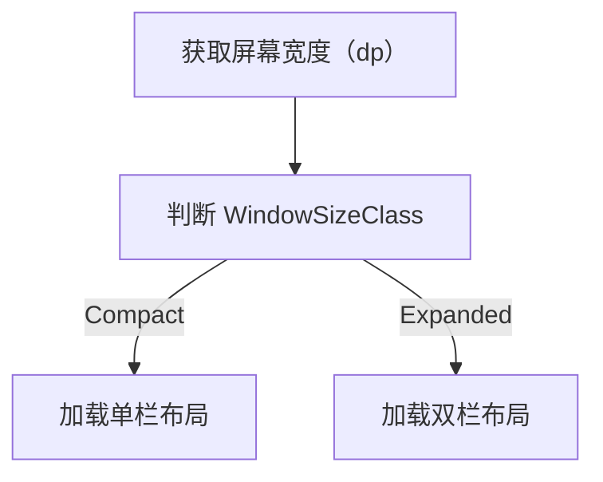

## **4. Use window size classes（使用窗口大小类别）**  

原地址：<https://developer.android.google.cn/develop/ui/compose/layouts/adaptive/use-window-size-classes>  

### **使用窗口大小类别-内容概述**  

- **分类标准**：  

  | 类别         | 宽度范围       | 典型设备       |  
  |--------------|----------------|----------------|  
  | Compact      | <600dp         | 手机竖屏       |  
  | Medium       | 600-840dp      | 平板竖屏/手机横屏 |  
  | Expanded     | ≥840dp         | 平板横屏/折叠屏展开 |  

- **实现步骤**：  
  1. 添加依赖：`implementation "androidx.activity:activity-compose:1.+"`  
  2. 获取 `WindowSizeClass`：  

     ```kotlin
     val windowSizeClass = calculateWindowSizeClass(LocalContext.current)
     ```  

### **流程图：窗口大小类别应用流程**  

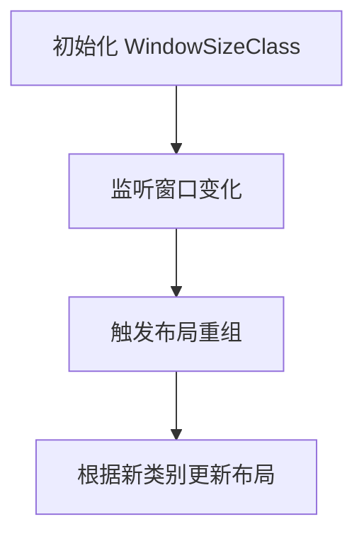

## **5. Support multi-window mode（支持多窗口模式）**  

原地址：<https://developer.android.google.cn/develop/ui/compose/layouts/adaptive/support-multi-window-mode>  

### **支持多窗口模式内容概述**  

- **适配场景**：  
  - 手机分屏（如左右各占50%）、平板多窗口并排显示。  
- **关键 API**：  
  - `LocalWindowSizeClass`：实时获取窗口尺寸类别（即使在分屏中）。  
  - `adjustWindowSize`：请求系统调整窗口大小（如最大化/最小化）。  
- **注意事项**：  
  - 避免在分屏中使用 `fillMaxSize()`，改用 `fillMaxWidth(fraction = 0.5f)`。  

### **流程图：多窗口模式适配流程**  

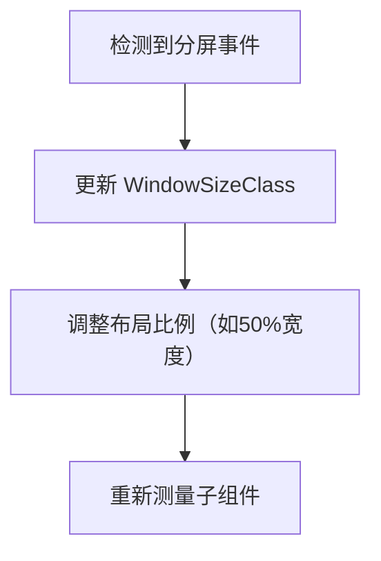

## **6. Support desktop windowing（支持桌面窗口化）**  

原地址：<https://developer.android.google.cn/develop/ui/compose/layouts/adaptive/support-desktop-windowing>  

### **支持桌面窗口化内容概述**  

- **适配场景**：  
  - Chrome OS、Windows 11 安卓子系统等桌面化环境，支持窗口缩放、最大化。  
- **布局调整**：  
  - 使用 `WindowSizeClass.Expanded` 逻辑，增加边距和字体大小。  
  - 支持鼠标悬停效果（`hovered` 状态）和键盘导航。  
- **示例代码**：  

  ```kotlin
  if (windowSizeClass.widthSizeClass == WindowSizeClass.Expanded) {
      DesktopLayout() // 显示菜单栏、侧边栏
  } else {
      MobileLayout() // 显示底部导航栏
  }
  ```  

### **流程图：桌面窗口化适配逻辑**  

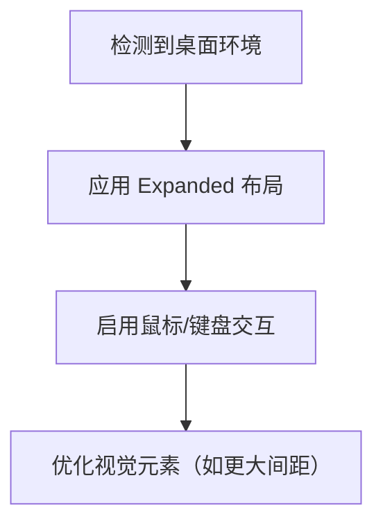

## **7. Build adaptive navigation（构建自适应导航）**  

原地址：<https://developer.android.google.cn/develop/ui/compose/layouts/adaptive/build-adaptive-navigation>  

### **构建自适应导航内容概述**  

- **导航模式切换**：  

  | 窗口大小类别 | 导航组件               | 示例                     |  
  |--------------|------------------------|--------------------------|  
  | Compact      | 底部导航栏（BottomNav）| 手机主页                 |  
  | Medium       | 导航Rail               | 平板侧边栏导航           |  
  | Expanded     | 抽屉式导航             | 折叠屏展开时的全屏菜单   |  

- **状态保持**：  
  - 使用 `rememberSaveable` 保存导航状态，避免旋转屏幕时重置。  

### **流程图：导航模式自适应流程**  

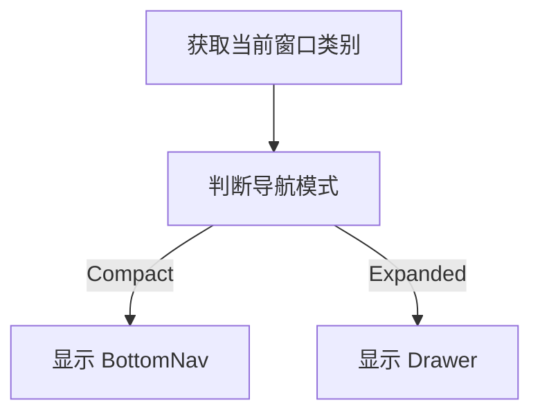

## **8. Build a list-detail layout（构建列表详情布局）**  

原地址：<https://developer.android.google.cn/develop/ui/compose/layouts/adaptive/list-detail>  

### **构建列表详情布局内容概述**  

- **小屏逻辑**：  
  - 列表页 → 详情页（分页跳转，类似手机）。  
- **大屏逻辑**：  
  - 列表+详情分栏显示（左右布局，类似平板）。  
- **实现方案**：  

  ```kotlin
  if (windowSizeClass.widthSizeClass >= WindowSizeClass.Medium) {
      Row {
          ListComponent()
          DetailComponent() // 固定宽度，如 60% 屏幕宽度
      }
  } else {
      NavHost {
          route("list") { ListComponent() }
          route("detail") { DetailComponent() }
      }
  }
  ```  

### **流程图：列表详情布局切换逻辑**  

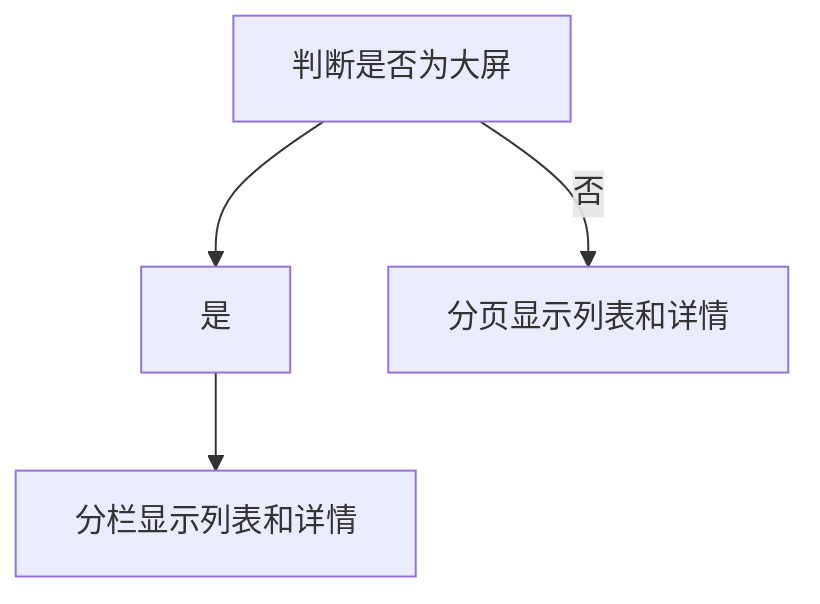

## **9. Build a supporting pane layout（构建辅助面板布局）**  

原地址：<https://developer.android.google.cn/develop/ui/compose/layouts/adaptive/build-a-supporting-pane-layout>  

### **构建辅助面板布局内容概述**  

- **场景**：主内容+辅助信息（如搜索栏、筛选条件）的布局。  
- **适配策略**：  
  - 小屏：辅助面板作为悬浮窗或底部栏。  
  - 大屏：辅助面板固定在主内容侧边（如左侧筛选栏+右侧内容）。  
- **关键组件**：  
  - `ModalBottomSheet`：小屏显示辅助面板。  
  - `Row` + `Box`：大屏分栏显示。  

### **流程图：辅助面板布局适配**  

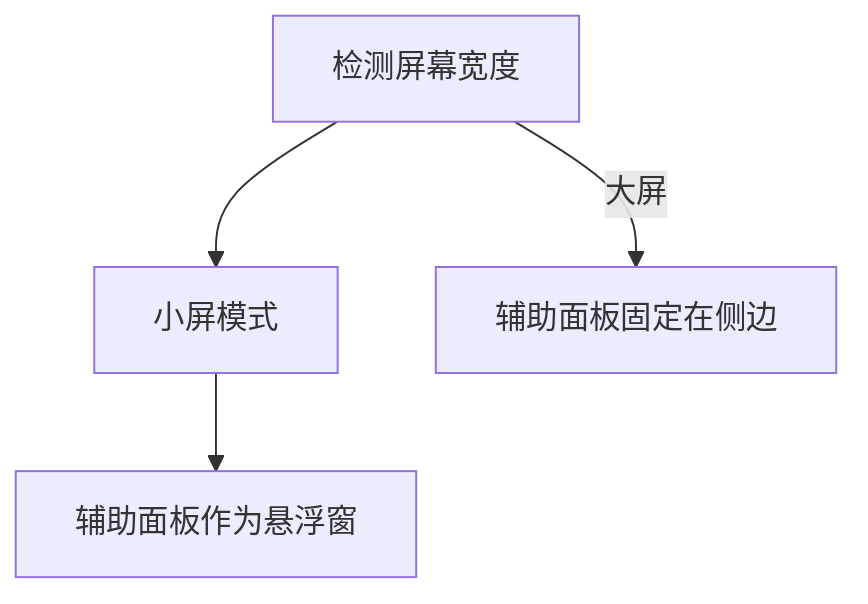

## **10. Adaptive do's and don'ts（自适应注意事项）**  

原地址：<https://developer.android.google.cn/develop/ui/compose/layouts/adaptive/adaptive-dos-and-donts>  

### **自适应注意事项内容概述**  

- **最佳实践**：  
  - ✅ 使用 `WindowSizeClass` 而非硬编码尺寸。  
  - ✅ 在根组件集中处理尺寸逻辑，避免子组件重复检测。  
- **反模式**：  
  - ❌ 在子组件中直接调用 `LocalConfiguration.current`（导致不必要重组）。  
  - ❌ 对所有设备使用相同布局间距（如手机和平板使用相同 `padding`）。  
- **性能优化**：  
  - 使用 `remember` 缓存 `WindowSizeClass`，避免重复计算。  

### **流程图：最佳实践检查清单**  

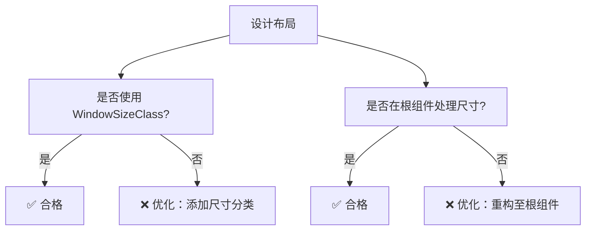

## **Foldables（可折叠设备）**  

### **11. Learn about foldables（了解可折叠设备）**  

原地址：<https://developer.android.google.cn/develop/ui/compose/layouts/adaptive/foldables/learn-about-foldables>  

#### **了解可折叠设备内容概述**  

- **设备特性**：  
  - 铰链（Hinge）：内折/外折，可能遮挡内容。  
  - 多屏幕模式：单屏→双屏切换，窗口尺寸动态变化。  
- **适配目标**：  
  - 内容不被铰链遮挡，折叠/展开时布局平滑过渡。  

### **流程图：可折叠设备特性**  

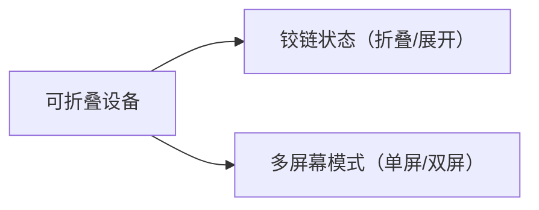

### **12. Make your app fold-aware（让应用具备折叠感知能力）**  

原地址：<https://developer.android.google.cn/develop/ui/compose/layouts/adaptive/foldables/make-your-app-fold-aware>  

#### **让应用具备折叠感知能力内容概述**  

- **关键 API**：  
  - `FoldingFeature`：检测铰链位置和状态（如 `STATE_FLAT`/`STATE_HALF_OPENED`）。  
  - `LocalFoldingFeature`：组合本地变量，监听折叠状态变化。  
- **实现步骤**：  

  ```kotlin
  val foldingFeature = LocalFoldingFeature.current
  if (foldingFeature != null && foldingFeature.state == FoldingFeature.State.HALF_OPENED) {
      // 布局避开铰链区域
  }
  ```  

### **流程图：折叠状态感知流程**  

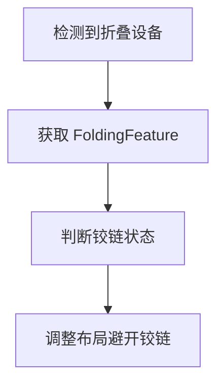

### **13. Support foldable display modes（支持可折叠显示模式）**  

原地址：<https://developer.android.google.cn/develop/ui/compose/layouts/adaptive/foldables/support-foldable-display-modes>  

#### **支持可折叠显示模式内容概述**  

- **支持模式**：  
  - **折叠模式**：单屏显示，内容集中在一侧。  
  - **展开模式**：双屏显示，内容跨屏或分屏。  
  - **悬停模式**：上下分屏（如拍照预览+控制按钮）。  
- **布局调整**：  
  - 折叠时：使用单栏布局，内容居中。  
  - 展开时：使用双栏布局，跨屏显示图片或文本。  

### **流程图：可折叠显示模式适配**  

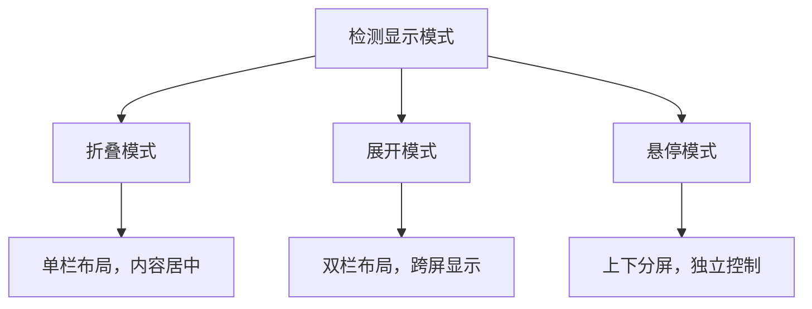

## **总结**  

以上内容覆盖了 Compose 自适应布局的核心场景和可折叠设备适配，每个页面围绕 **检测尺寸→分类处理→动态布局** 的逻辑展开，通过 `WindowSizeClass` 和折叠特性 API 实现灵活适配。建议结合官方示例代码和模拟器工具（如折叠屏预览）进行实践。
