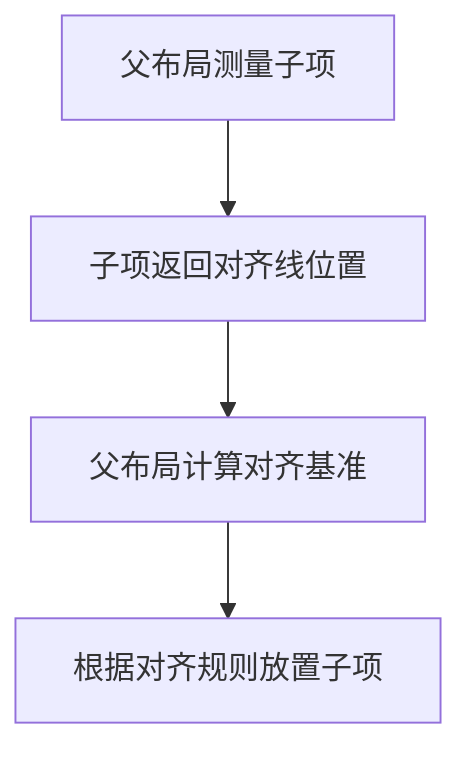
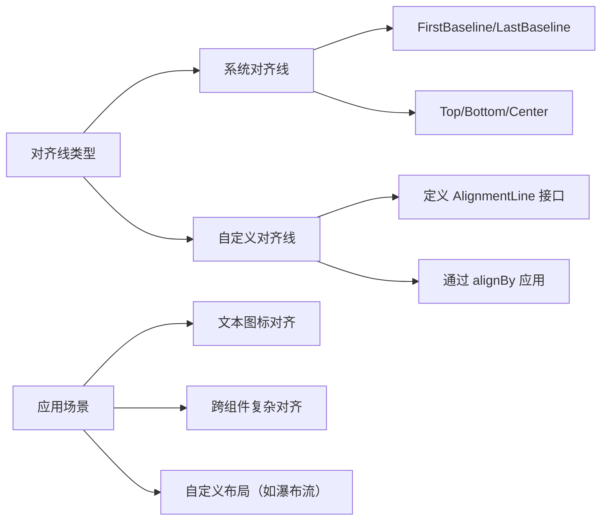

# Compose 对齐线（Alignment Lines）开发指南  

原地址：<https://developer.android.google.cn/develop/ui/compose/layouts/alignment-lines?hl=zh-cn>  

## 一、对齐线核心概念  

### （一）定义与作用  

- **对齐线**：布局中用于精确对齐子项的虚拟基准线（如文本基线、顶部边界、中心轴等）。  
- **核心场景**：  
  - 文本与图标基于基线对齐（如 `Text` + `Icon` 水平对齐）。  
  - 复杂布局中跨组件的对齐（如卡片内多元素对齐）。  
- **与传统布局的区别**：  
  - 传统布局（如 XML）依赖固定规则（如 `android:layout_alignBaseline`），Compose 通过 `AlignmentLine` 接口实现动态灵活对齐。  

## 二、内置对齐线  

### （一）常用系统对齐线  

| 对齐线名称          | 描述                                   | 适用组件               |  
|---------------------|----------------------------------------|------------------------|  
| `FirstBaseline`     | 文本的第一基线（如字母“g”的底部）      | `Text`、`TextField`    |  
| `LastBaseline`      | 文本的最后基线（如字母“h”的顶部）      | `Text`、`TextField`    |  
| `CenterHorizontally`| 水平中心对齐线                         | 所有组件               |  
| `Top`               | 顶部边界对齐线                         | 所有组件               |  
| `Bottom`            | 底部边界对齐线                         | 所有组件               |  

### （二）使用示例：文本与图标基线对齐  

```kotlin
@Composable
fun BaselineAlignedIcon() {
    Row(verticalAlignment = Alignment.Bottom) { // 默认基于底部对齐（非基线）
        Icon(Icons.Filled.Star, "star", Modifier.size(24.dp))
        Text(
            "五星好评",
            fontSize = 18.sp,
            modifier = Modifier.alignBy(FirstBaseline) // 强制基于 FirstBaseline 对齐
        )
    }
}
```  

**效果对比**：  

- 不使用 `alignBy`：图标底部与文本底部对齐（文本基线高于图标）。  
- 使用 `alignBy(FirstBaseline)`：文本基线与图标中心对齐（视觉更协调）。  

## 三、自定义对齐线  

### （一）创建自定义对齐线  

1. **定义对齐线**：  

   ```kotlin
   val MyBaseline = object : AlignmentLine {
       override val alignmentLine: AlignmentLineScope.() -> Int = {
           // 返回自定义对齐线的 Y 坐标（相对于组件顶部）
           layoutHeight - padding.bottom.roundToPx()
       }
   }
   ```  

2. **在组件中提供对齐线**：  

   ```kotlin
   @Composable
   fun CustomBaselineBox(modifier: Modifier = Modifier) {
       Box(modifier = modifier.alignmentLine(MyBaseline) { layoutHeight }) {
           // 内容
       }
   }
   ```  

### （二）在布局中使用自定义对齐线  

```kotlin
@Composable
fun CustomAlignmentExample() {
    Row {
        CustomBaselineBox(modifier = Modifier.weight(1f)) {
            Text("自定义基线组件", fontSize = 24.sp)
        }
        Text(
            "对齐到自定义基线",
            modifier = Modifier.alignBy(MyBaseline) // 基于 CustomBaselineBox 的 MyBaseline 对齐
        )
    }
}
```  

## 四、对齐线在布局中的工作流程  

### （一）测量阶段  

1. 父布局调用子项的 `measure` 方法，获取子项的尺寸和对齐线位置。  
2. 子项通过 `alignmentLine` 修饰符声明支持的对齐线（如 `FirstBaseline`）。  

### （二）放置阶段  

1. 父布局根据子项的对齐线位置，计算各子项的相对位置。  
2. 使用 `alignBy` 或布局组件的 `alignment` 参数指定对齐规则。  

#### **流程图：对齐线工作流程**  



## 五、高级用法：在自定义布局中使用对齐线  

### （一）场景：瀑布流布局中元素顶部对齐  

```kotlin
@Composable
fun WaterfallLayout(
    items: List<String>,
    modifier: Modifier = Modifier
) {
    Layout(
        modifier = modifier,
        content = { items.forEach { Text(it) } }
    ) { measurables, constraints ->
        val column1 = measurables[0].measure(constraints)
        val column2 = measurables[1].measure(constraints)
        
        // 基于 FirstBaseline 对齐两列顶部
        val maxBaseline = maxOf(
            column1[FirstBaseline],
            column2[FirstBaseline]
        )
        
        layout(constraints.maxWidth, maxBaseline + max(column1.height, column2.height)) {
            column1.place(0, maxBaseline - column1[FirstBaseline])
            column2.place(constraints.maxWidth - column2.width, maxBaseline - column2[FirstBaseline])
        }
    }
}
```  

### （二）关键 API  

- `placeable[alignmentLine]`：获取子项的对齐线位置（单位：像素）。  
- `alignBy(alignmentLine)`：强制子项基于指定对齐线对齐。  

## 六、最佳实践与注意事项  

1. **优先使用系统对齐线**：如 `FirstBaseline`/`CenterHorizontally`，避免重复造轮子。  
2. **对齐线与约束的关系**：对齐线仅影响子项位置，不改变子项尺寸（需结合 `size`/`padding` 控制尺寸）。  
3. **性能影响**：过多自定义对齐线可能增加布局计算复杂度，建议在必要时使用（如复杂界面）。  

## 七、总结：对齐线核心能力图谱  



通过对齐线，Compose 提供了比传统布局更精细的对齐控制能力，适用于需要严格视觉对齐的场景（如金融类应用的表格、社交应用的图文混排）。结合 `Layout` 可组合项和自定义对齐线，能实现灵活且高性能的复杂布局。
