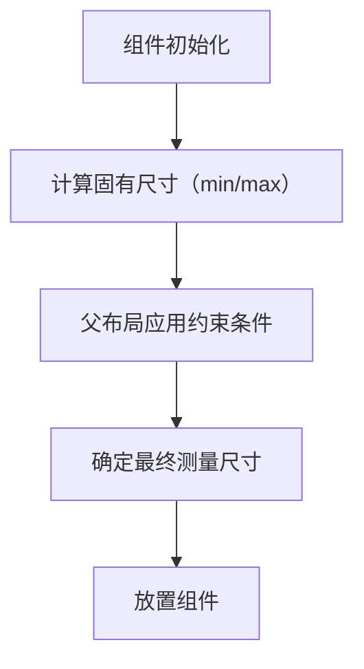
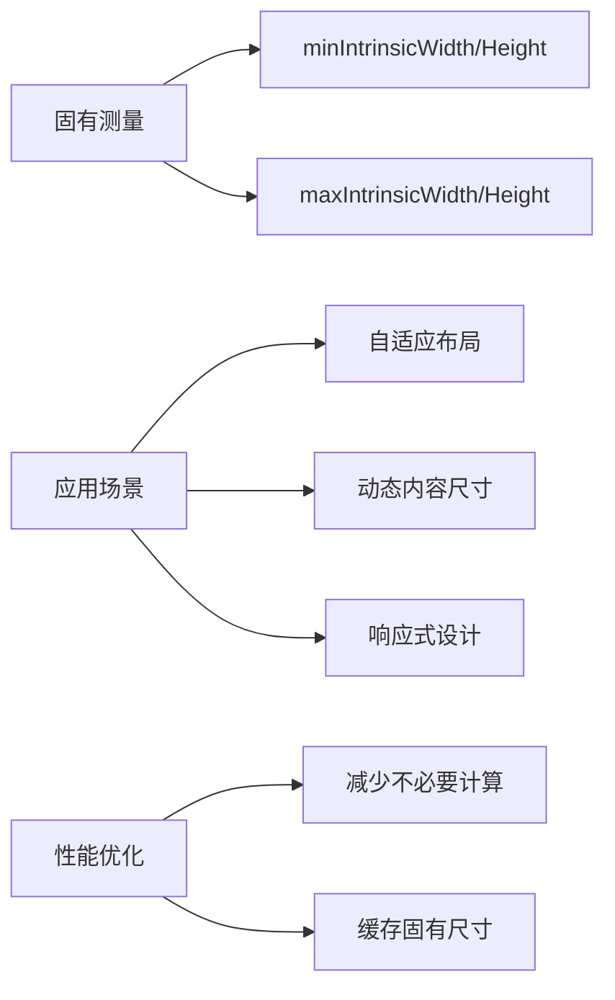

# Compose 固有测量（Intrinsic Measurements）开发指南  

原地址：<https://developer.android.google.cn/develop/ui/compose/layouts/intrinsic-measurements?hl=zh-cn>  

## 一、固有测量核心概念  

Compose 有一项规则，即，子项只能测量一次，测量两次就会引发运行时异常。但是，有时需要先收集一些关于子项的信息，然后再测量子项。

借助固有特性，您可以先查询子项，然后再进行实际测量。
>注意：请求固有特性测量不会两次测量子项。 系统在测量子项前会先查询其固有测量值，然后父项会根据这些信息计算测量其子项时使用的约束条件。

对于可组合项，您可以查询其 IntrinsicSize.Min 或 IntrinsicSize.Max：

- Modifier.width(IntrinsicSize.Min) - 需要多大的最小宽度才能正确显示内容？
- Modifier.width(IntrinsicSize.Max) - 需要多大的最大宽度才能正确显示内容？
- Modifier.height(IntrinsicSize.Min) - 需要多高的最小高度才能正确显示内容？
- Modifier.height(IntrinsicSize.Max) - 您需要多高的最大高度才能正确显示内容？

### （一）定义与作用  

- **固有尺寸**：组件基于内容自有的最小/最大尺寸（无需外部约束）。  
  - **minIntrinsicWidth**：组件显示内容所需的最小宽度（如文本的最小宽度为字符宽度总和）。  
  - **maxIntrinsicWidth**：组件显示内容的最大宽度（如无限制则为无穷大）。  
- **应用场景**：  
  - 动态调整布局（如根据文本长度自动调整按钮宽度）。  
  - 响应式设计（如不同屏幕尺寸下组件保持合理比例）。  

## 二、固有测量与布局流程  

### （一）测量阶段的优先级  

1. **固有测量**：组件先计算自身固有尺寸（`min/maxIntrinsicWidth/Height`）。  
2. **约束应用**：父布局根据固有尺寸和外部约束（如`fillMaxWidth`）确定最终尺寸。  

#### **流程图：固有测量与布局流程**  



### （二）系统组件的固有测量示例  

| 组件         | minIntrinsicWidth 逻辑                          | maxIntrinsicWidth 逻辑              |  
|--------------|-----------------------------------------------|-------------------------------------|  
| `Text("Hello")` | 文本字符宽度总和（如 "Hello" 的宽度）         | 无限制（`Infinity`）                |  
| `Image`      | 图片原始宽度（若未指定尺寸）                  | 图片原始宽度（若未指定尺寸）        |  
| `Button`     | 内容（文本+图标）的最小宽度                   | 父容器允许的最大宽度                |  

## 三、自定义组件的固有测量  

### （一）重写固有测量方法  

通过 `measurable` 参数访问组件的固有测量方法：  

```kotlin
@Composable
fun CustomBox(modifier: Modifier = Modifier, content: @Composable () -> Unit) {
    Layout(modifier = modifier, content = content) { measurables, constraints ->
        // 获取子组件的固有最小宽度
        val minWidth = measurables[0].minIntrinsicWidth(constraints.maxHeight)
        // 获取子组件的固有最大高度
        val maxHeight = measurables[0].maxIntrinsicHeight(constraints.maxWidth)
        
        // 根据固有尺寸计算布局
        val placeable = measurables[0].measure(constraints.copy(minWidth = minWidth, maxHeight = maxHeight))
        layout(placeable.width, placeable.height) { placeable.place(0, 0) }
    }
}
```  

### （二）固有测量与修饰符的关系  

- **`wrapContentSize`**：基于固有尺寸包裹内容（等价于使用 `minIntrinsic` 和 `maxIntrinsic`）。  

  ```kotlin
  Box(Modifier.wrapContentSize()) { Text("动态尺寸") } // 宽度=文本固有宽度，高度=文本固有高度
  ```  

- **冲突处理**：若修饰符（如`size(100.dp)`）与固有尺寸冲突，修饰符优先级更高。  

## 四、性能注意事项  

### （一）固有测量的成本  

- **多次计算**：每次测量阶段都会调用固有测量方法（如`minIntrinsicWidth`），复杂布局中可能影响性能。  
- **优化建议**：  
  - 避免在循环或深层嵌套布局中频繁使用固有测量。  
  - 使用 `remember` 缓存固有尺寸（若尺寸不随状态变化）：  

    ```kotlin
    val minWidth by remember { derivedStateOf { measurables[0].minIntrinsicWidth() } }
    ```  

### （二）与 `Layout` 组件结合使用  

在 `Layout` 中谨慎使用固有测量，优先通过约束条件减少计算量：  

```kotlin
@Composable
fun EfficientLayout(content: @Composable () -> Unit) {
    Layout(content = content) { measurables, constraints ->
        // 仅在必要时获取固有尺寸（如约束为 wrap_content 时）
        val width = if (constraints.minWidth == 0 && constraints.maxWidth == Int.MAX_VALUE) {
            measurables[0].minIntrinsicWidth() // 无约束时使用固有宽度
        } else {
            constraints.maxWidth // 有约束时直接使用约束宽度
        }
        // ... 后续布局逻辑
    }
}
```  

## 五、典型应用场景  

### （一）自适应按钮宽度  

```kotlin
@Composable
fun AdaptiveButton(text: String) {
    Button(
        modifier = Modifier.wrapContentWidth(), // 基于文本固有宽度调整按钮宽度
        onClick = {}
    ) {
        Text(text)
    }
}
```  

### （二）图文混排布局  

```kotlin
@Composable
fun ImageWithCaption(image: Painter, caption: String) {
    Row(Modifier.padding(16.dp)) {
        Image(
            image,
            modifier = Modifier.size(64.dp),
            contentDescription = null
        )
        Column(Modifier.padding(start = 8.dp)) {
            Text(caption, maxLines = 2) // 文本自动换行，基于固有宽度
        }
    }
}
```  

## 六、总结：固有测量能力图谱  



固有测量是Compose实现「内容驱动布局」的核心机制，通过合理使用可让组件根据内容自动调整尺寸，提升用户体验。但需注意性能开销，避免在高频更新场景中过度依赖固有测量。结合`Layout`组件和修饰符优先级规则，可在灵活性与性能之间找到平衡。
