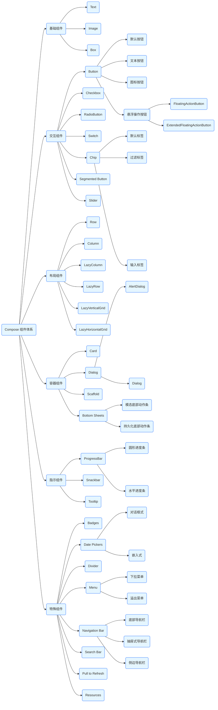

# 组件概览



## **一、Compose 组件概览**  

**原地址**：<https://developer.android.google.cn/develop/ui/compose/components?hl=zh-cn>  
**内容总结**：  

- 介绍 Jetpack Compose 的 UI 组件体系，分为以下类别：  
  - **基础组件**：Text、Image、Box 等。  
  - **交互组件**：Button、Checkbox、RadioButton 等。  
  - **布局组件**：Row、Column、LazyColumn 等。  
  - **容器组件**：Card、Dialog、Scaffold 等。  
  - **指示组件**：ProgressBar、Snackbar、Tooltip 等。  
- 强调组件的响应式设计、可组合性和 Material Design 规范支持。  

## **二、标志（Badges）**  

**原地址**：<https://developer.android.google.cn/develop/ui/compose/components/badges?hl=zh-cn>  
**内容总结**：  

- **功能**：用于显示状态或通知（如未读消息数），通常叠加在其他组件上。  
- **核心 API**：  
  - `Badge`：基础徽章组件，显示文本或图标。  
  - `BadgedBox`：包裹目标组件（如 Icon），在其右上角显示徽章。  
- **自定义**：支持颜色、形状、位置偏移、动画（如计数变化时的渐入效果）。  
- **场景**：应用图标通知、列表项状态标记。  

## **三、按钮（Button）**  

**原地址**：<https://developer.android.google.cn/develop/ui/compose/components/button?hl=zh-cn>  
**内容总结**：  

- **类型**：  
  - **默认按钮**（`Button`）：带涟漪效果的实心按钮。  
  - **文本按钮**（`TextButton`）：无背景的纯文本按钮。  
  - **图标按钮**（`IconButton`）：圆形图标按钮（如导航栏返回按钮）。  
- **关键参数**：  
  - `onClick`：点击事件回调。  
  - `enabled`：按钮是否可用（禁用时样式变灰）。  
  - `shape`：按钮形状（如圆角矩形、圆形）。  
- **交互反馈**：支持涟漪动画、按下状态透明度变化。  

## **四、卡（Card）**  

**原地址**：<https://developer.android.google.cn/develop/ui/compose/components/card?hl=zh-cn>  
**内容总结**：  

- **功能**：用于分组相关内容，提供阴影和边框视觉层次。  
- **核心属性**：  
  - `elevation`：阴影高度（默认 1dp，值越大阴影越明显）。  
  - `shape`：卡片形状（如 `RoundedCornerShape`）。  
  - `border`：可选边框（颜色、宽度）。  
- **最佳实践**：  
  - 配合 `PaddingValues` 添加内边距。  
  - 在列表项中使用卡片提升可点击区域的视觉辨识度。  

## **五、复选框（Checkbox）**  

**原地址**：<https://developer.android.google.cn/develop/ui/compose/components/checkbox?hl=zh-cn>  
**内容总结**：  

- **功能**：用于多选场景，状态为 `checked`/`unchecked`。  
- **核心组件**：  
  - `Checkbox`：基础复选框组件，搭配 `checked` 状态和 `onCheckedChange` 回调。  
  - `CheckboxDefaults`：提供默认样式参数（如颜色、大小）。  
- **组合使用**：

    ```kotlin
    Row {
        Checkbox(checked = isChecked, onCheckedChange = { ... })
        Text("Remember me")
    }
    ```  

## **六、条状标签（Chip）**  

**原地址**：<https://developer.android.google.cn/develop/ui/compose/components/chip?hl=zh-cn>  
**内容总结**：  

- **功能**：表示分类、标签或过滤条件，支持点击选中/取消。  
- **类型**：  
  - **默认标签**（`Chip`）：带文本和可选图标的可交互标签。  
  - **过滤标签**（`FilterChip`）：选中状态下显示不同背景色。  
  - **输入标签**（`InputChip`）：可删除的标签（带关闭图标）。  
- **关键属性**：  
  - `selected`：是否选中状态。  
  - `onClick`：点击事件（切换选中状态）。  

## **七、日期选择器（Date Pickers）**  

**原地址**：<https://developer.android.google.cn/develop/ui/compose/components/datepickers?hl=zh-cn>  
**内容总结**：  

- **组件类型**：  
  - **对话框式**（`DatePickerDialog`）：弹出对话框选择日期。  
  - **嵌入式**（`DatePicker`）：直接在界面中显示选择器。  
- **交互逻辑**：  
  - 通过 `onDateSelected` 回调获取选中日期。  
  - 支持最小/最大日期限制（`minDate`/`maxDate`）。  
- **本地化**：自动适配系统语言和区域（如中文显示“年/月/日”）。  

## **八、对话框（Dialog）**  

**原地址**：<https://developer.android.google.cn/develop/ui/compose/components/dialog?hl=zh-cn>  
**内容总结**：  

- **核心组件**：  
  - `AlertDialog`：标准警告对话框，包含标题、内容、确认/取消按钮。  
  - `Dialog`：通用对话框容器，可自定义内容（如加载弹窗、自定义表单）。  
- **显示控制**：  
  - 通过 `rememberDialogState()` 管理对话框显示状态（`isVisible`）。  
  - 支持点击蒙层关闭（`onDismissRequest` 参数）。  

## **九、分隔线（Divider）**  

**原地址**：<https://developer.android.google.cn/develop/ui/compose/components/divider?hl=zh-cn>  
**内容总结**：  

- **功能**：用于视觉分隔内容（如列表项之间、布局区块之间）。  
- **核心组件**：  
  - `Divider`：水平分隔线（默认高度 1dp，颜色为 `Color.Black.copy(alpha = 0.12f)`）。  
  - `VerticalDivider`：垂直分隔线（默认宽度 1dp）。  
- **自定义**：  
  - `thickness`：分隔线厚度（如 2dp）。  
  - `color`：自定义颜色（如 `Color.Gray`）。  

## **十、悬浮操作按钮（FAB）**  

**原地址**：<https://developer.android.google.cn/develop/ui/compose/components/fab?hl=zh-cn>  
**内容总结**：  

- **功能**：代表应用的主要操作（如“新建”“添加”），通常悬浮在界面右下角。  
- **核心组件**：  
  - `FloatingActionButton`：圆形按钮，包含图标和点击事件。  
  - `ExtendedFloatingActionButton`：带文本的扩展按钮（如“添加任务”+ 图标）。  
- **交互设计**：  
  - 配合 `Scaffold` 的 `floatingActionButton` 参数自动避开底部导航栏。  
  - 支持缩放动画（如列表滑动时隐藏/显示）。  

## **十一、列表和网格（Lists & Grids）**  

**原地址**：<https://developer.android.google.cn/develop/ui/compose/lists?hl=zh-cn>  
**内容总结**：  

- **核心组件**：  
  - **垂直列表**：`LazyColumn`（按需加载，性能优化）。  
  - **水平列表**：`LazyRow`（横向滚动列表）。  
  - **网格**：`LazyVerticalGrid`/`LazyHorizontalGrid`（瀑布流布局）。  
- **关键概念**：  
  - **列表项**：通过 `items()` 或 `item()` 声明列表项内容。  
  - **状态管理**：`rememberLazyListState()` 控制滚动位置。  
  - **分隔线**：`Divider` 配合 `itemsIndexed()` 添加列表项分隔。  
- **流程图（列表渲染流程）**：  

  ```mermaid
  graph LR
  A[数据源] --> B[LazyList]
  B --> C[计算可见区域]
  C --> D[仅渲染可见项]
  D --> E[滑动时动态回收/创建项]
  ```  

## **十二、菜单（Menu）**  

**原地址**：<https://developer.android.google.cn/develop/ui/compose/components/menu?hl=zh-cn>  
**内容总结**：  

- **类型**：  
  - **下拉菜单**（`DropdownMenu`）：点击按钮后向下弹出的菜单。  
  - **溢出菜单**（`OverflowMenu`）：顶部应用栏右侧的三点菜单。  
- **交互逻辑**：  
  - 通过 `expanded` 状态控制菜单显示/隐藏。  
  - `MenuItem` 组件定义菜单项（带图标和文本，支持点击回调）。  
- **示例代码**：  

  ```kotlin
  var expanded by remember { mutableStateOf(false) }
  IconButton(onClick = { expanded = true }) { Icon(Icons.Default.MoreVert) }
  DropdownMenu(
      expanded = expanded,
      onDismissRequest = { expanded = false }
  ) {
      DropdownMenuItem(text = "Settings", onClick = { ... })
  }
  ```  

## **十三、导航栏（Bottom Navigation Bar）**  

**原地址**：<https://developer.android.google.cn/develop/ui/compose/components/navigation-bar?hl=zh-cn>  
**内容总结**：  

- **功能**：底部导航栏，用于在不同主界面之间切换（如“首页”“消息”“我的”）。  
- **核心组件**：  
  - `BottomNavigation`：导航栏容器。  
  - `BottomNavigationItem`：单个导航项（图标 + 标签，选中/未选中状态）。  
- **状态管理**：  
  - 通过 `selectedItemId` 和 `onItemSelected` 实现页面切换逻辑。  
  - 配合 `Scaffold` 的 `bottomBar` 参数快速集成。  

## **十四、抽屉式导航栏（Drawer）**  

**原地址**：<https://developer.android.google.cn/develop/ui/compose/components/drawer?hl=zh-cn>  
**内容总结**：  

- **类型**：  
  - **左侧抽屉**（`DrawerValue.Left`）：从屏幕左侧滑出的导航菜单。  
  - **右侧抽屉**（`DrawerValue.Right`）：较少用，适用于次要功能。  
- **核心组件**：  
  - `ModalNavigationDrawer`：模态抽屉，滑动时遮罩背景。  
  - `DrawerContent`：抽屉内容（通常包含 `List` 或 `Column` 布局）。  
- **交互逻辑**：  
  - 通过 `rememberDrawerState()` 管理抽屉状态（打开/关闭）。  
  - 顶部应用栏的“汉堡菜单”图标触发抽屉打开。  

## **十五、侧边导航栏（Navigation Rail）**  

**原地址**：<https://developer.android.google.cn/develop/ui/compose/components/navigation-rail?hl=zh-cn>  
**内容总结**：  

- **功能**：竖屏场景下的导航栏（如平板或大屏设备），显示图标和标签。  
- **核心组件**：  
  - `NavigationRail`：侧边导航栏容器。  
  - `NavigationRailItem`：单个导航项（选中时显示强调色）。  
- **使用场景**：  
  - 多任务界面，需要同时显示导航和内容区域。  
  - 替代底部导航栏，节省屏幕垂直空间。  

## **十六、进度指示器（Progress Indicators）**  

**原地址**：<https://developer.android.google.cn/develop/ui/compose/components/progress?hl=zh-cn>  
**内容总结**：  

- **类型**：  
  - **圆形进度条**（`CircularProgressIndicator`）：不确定状态（旋转）或确定进度（百分比）。  
  - **水平进度条**（`LinearProgressIndicator`）：显示任务完成进度（如文件下载）。  
- **关键参数**：  
  - `progress`：确定进度时的百分比（0-1，圆形可选 `indeterminate` 模式）。  
  - `color`：进度条颜色（默认使用主题色）。  

## **十七、下拉即可刷新（Pull to Refresh）**  

**原地址**：<https://developer.android.google.cn/develop/ui/compose/components/pull-to-refresh?hl=zh-cn>  
**内容总结**：  

- **功能**：通过下拉手势触发刷新操作（如刷新列表数据）。  
- **核心组件**：  
  - `PullToRefresh`：包裹可滚动组件（如 `LazyColumn`）。  
  - `rememberPullToRefreshState`：管理刷新状态（`isRefreshing`）。  
- **交互流程**：  

  ```mermaid
  graph TD
  A[下拉手势] --> B[触发刷新状态]
  B --> C[显示进度指示器]
  C --> D[执行刷新逻辑（如网络请求）]
  D --> E[完成后隐藏指示器]
  ```  

## **十八、单选按钮（Radio Button）**  

**原地址**：<https://developer.android.google.cn/develop/ui/compose/components/radio-button?hl=zh-cn>  
**内容总结**：  

- **功能**：用于单选场景，一组选项中只能选中一个。  
- **核心组件**：  
  - `RadioButton`：单选按钮组件，搭配 `selected` 状态和 `onClick` 回调。  
  - `RadioGroup`：单选组容器，管理互斥状态（通过 `rememberSelectedState` 维护选中项）。  
- **示例代码**：  

  ```kotlin
  var selectedOption by remember { mutableStateOf(0) }
  Row {
      (0..2).forEach { index ->
          RadioButton(
              selected = (index == selectedOption),
              onClick = { selectedOption = index }
          )
          Text("Option ${index + 1}")
      }
  }
  ```  

## **十九、资源（Resources）**  

**原地址**：<https://developer.android.google.cn/develop/ui/compose/resources?hl=zh-cn>  
**内容总结**：  

- **功能**：管理应用中的字符串、颜色、尺寸、图标等资源，支持本地化和动态配置。  
- **核心 API**：  
  - `stringResource`：获取字符串资源（支持参数替换）。  
  - `colorResource`：获取颜色资源（自动适配浅色/深色主题）。  
  - `dimensionResource`：获取尺寸资源（如 `R.dimen.padding_medium`）。  
- **最佳实践**：  
  - 使用 `LocalContext.current` 获取上下文以访问资源。  
  - 通过 `remember` 缓存资源引用，避免重组时重复加载。  

## **二十、Scaffold**  

**原地址**：<https://developer.android.google.cn/develop/ui/compose/components/scaffold?hl=zh-cn>  
**内容总结**：  

- **功能**：应用主界面的基础架构，包含顶部应用栏、底部导航栏、悬浮按钮、抽屉等组件。  
- **核心参数**：  
  - `topBar`：顶部应用栏（如 `TopAppBar`）。  
  - `bottomBar`：底部导航栏（如 `BottomNavigation`）。  
  - `floatingActionButton`：悬浮操作按钮（FAB）。  
  - `drawerContent`：抽屉式导航栏内容。  
- **布局结构**：  

  ```mermaid
  graph TD
  A[Scaffold] --> B[TopAppBar]
  A --> C[Content]
  A --> D[BottomBar]
  A --> E[FAB]
  A --> F[Drawer]
  ```  

## **二十一、搜索栏（Search Bar）**  

**原地址**：<https://developer.android.google.cn/develop/ui/compose/components/search-bar?hl=zh-cn>  
**内容总结**：  

- **功能**：提供搜索输入框，支持清除文本、语音输入、搜索建议等功能。  
- **核心组件**：  
  - `SearchBar`：搜索栏容器，包含输入框和操作按钮。  
  - `rememberSearchState`：管理搜索状态（查询文本、是否展开）。  
- **交互逻辑**：  
  - 用户输入时触发 `onQueryChange` 实时搜索。  
  - 点击“搜索”按钮触发 `onSearch` 执行搜索逻辑。  

## **二十二、分段按钮（Segmented Button）**  

**原地址**：<https://developer.android.google.cn/develop/ui/compose/components/segmented-button?hl=zh-cn>  
**内容总结**：  

- **功能**：一组互斥的按钮，用于切换不同选项（如筛选条件、视图模式）。  
- **核心组件**：  
  - `SegmentedButton`：分段按钮容器。  
  - `SegmentedButtonItem`：单个按钮项，通过 `selected` 状态控制样式。  
- **示例代码**：  

  ```kotlin
  var selectedIndex by remember { mutableStateOf(0) }
  SegmentedButton(
      selectedIndex = selectedIndex,
      onSelectedIndexChange = { selectedIndex = it }
  ) {
      listOf("All", "Active", "Completed").forEachIndexed { index, text ->
          SegmentedButtonItem(
              selected = (index == selectedIndex),
              onClick = { selectedIndex = index }
          ) {
              Text(text)
          }
      }
  }
  ```  

## **二十三、滑块（Slider）**  

**原地址**：<https://developer.android.google.cn/develop/ui/compose/components/slider?hl=zh-cn>  
**内容总结**：  

- **功能**：通过滑动拇指选择范围内的数值（如音量调节、进度控制）。  
- **核心组件**：  
  - `Slider`：水平滑块，支持单拇指或双拇指（范围选择）。  
  - `rememberSliderState`：管理滑块状态（当前值、范围值）。  
- **关键参数**：  
  - `value`：当前数值（单拇指模式，默认范围 `0f-1f`）。  
  - `values`：范围数值（双拇指模式，如 `FloatRange(0.2f, 0.8f)`）。  
  - `onValueChange`：数值变化时的回调（实时响应滑动）。  
- **自定义**：  
  - `activeColor`/`inactiveColor`：滑块轨道颜色。  
  - `thumb`：自定义拇指形状（如圆形、方形图标）。  

## **二十四、快捷信息栏（Snackbar）**  

**原地址**：<https://developer.android.google.cn/develop/ui/compose/components/snackbar?hl=zh-cn>  
**内容总结**：  

- **功能**：显示短暂的通知信息（如操作结果反馈），支持可选操作按钮。  
- **核心组件**：  
  - `SnackbarHost`：信息栏容器（需在 `Scaffold` 中声明）。  
  - `SnackbarHostState`：管理信息栏状态（显示/隐藏、消息队列）。  
- **使用流程**：  

  ```kotlin
  // 1. 声明状态
  val snackbarHostState = rememberSnackbarHostState()
  // 2. 触发显示
  LaunchedEffect(Unit) {
      snackbarHostState.showSnackbar(
          message = "数据已保存",
          actionLabel = "撤销",
          duration = SnackbarDuration.Long
      )
  }
  ```  

- **特性**：  
  - 自动适配屏幕底部，避开导航栏。  
  - 滑动可关闭信息栏。  

## **二十五、切换（Switch）**  

**原地址**：<https://developer.android.google.cn/develop/ui/compose/components/switch?hl=zh-cn>  
**内容总结**：  

- **功能**：用于切换两种状态（如“开启/关闭”“启用/禁用”）。  
- **核心组件**：  
  - `Switch`：开关组件，搭配 `checked` 状态和 `onCheckedChange` 回调。  
  - `SwitchDefaults`：提供默认样式（如轨道颜色、拇指大小）。  
- **示例代码**：  

  ```kotlin
  var isDarkMode by remember { mutableStateOf(false) }
  Switch(
      checked = isDarkMode,
      onCheckedChange = { isDarkMode = it },
      modifier = Modifier.padding(8.dp)
  )
  ```  

## **二十六、工具提示（Tooltip）**  

**原地址**：<https://developer.android.google.cn/develop/ui/compose/components/tooltip?hl=zh-cn>  
**内容总结**：  

- **功能**：长按组件时显示提示文本（如图标功能说明），支持触控和无障碍适配。  
- **核心组件**：  
  - `Tooltip`：提示内容容器。  
  - `TooltipProvider`：为子组件提供提示逻辑（通过 `LocalTooltipProvider` 上下文）。  
- **使用方式**：  

  ```kotlin
  TooltipProvider {
      Icon(
          imageVector = Icons.Default.Help,
          contentDescription = "帮助",
          modifier = Modifier.tooltip("长按查看操作说明")
      )
  }
  ```  

- **特性**：  
  - 自动定位（根据组件位置显示在上方或下方）。  
  - 支持自定义提示样式（背景色、圆角、阴影）。  

## **二十七、应用栏（App Bars）**  

### 1. **应用栏概览**  

**原地址**：<https://developer.android.google.cn/develop/ui/compose/components/app-bars?hl=zh-cn>  
**内容总结**：  

- **功能**：顶部应用栏（`TopAppBar`）是应用的主要导航入口，显示标题、导航按钮（如返回箭头）、溢出菜单等。  
- **核心组件**：  
  - `TopAppBar`：标准顶部应用栏，包含 `title`、`navigationIcon`、`actions`（右侧操作图标）。  
  - `CenterAlignedTopAppBar`：标题居中的应用栏（适用于无导航按钮的场景）。  
- **交互模式**：  
  - 左侧导航图标通常用于打开抽屉式导航栏或返回上一级。  
  - 右侧 `IconButton` 用于触发次要操作（如搜索、设置）。  

### 2. **从顶部应用栏导航**  

**原地址**：<https://developer.android.google.cn/develop/ui/compose/components/app-bars-navigate?hl=zh-cn>  
**内容总结**：  

- **场景**：通过顶部应用栏的导航按钮实现页面跳转（如使用 `NavController`）。  
- **关键代码**：  

  ```kotlin
  TopAppBar(
      navigationIcon = {
          IconButton(onClick = { navController.popBackStack() }) {
              Icon(Icons.Default.ArrowBack, contentDescription = "返回")
          }
      },
      title = { Text("详情页") }
  )
  ```  

- **最佳实践**：  
  - 配合 Jetpack Navigation 组件管理页面栈。  
  - 导航图标点击逻辑统一处理返回或打开抽屉。  

### 3. **创建动态顶部应用栏**  

**原地址**：<https://developer.android.google.cn/develop/ui/compose/components/app-bars-dynamic?hl=zh-cn>  
**内容总结**：  

- **动态特性**：  
  - 根据滚动位置隐藏/显示应用栏（如列表滑动时渐变消失）。  
  - 切换标题或操作按钮（如编辑状态下显示“保存”按钮）。  
- **实现方式**：  
  - 使用 `rememberLazyListState()` 监听列表滚动位置。  
  - 通过 `AnimatedVisibility` 或 `Modifier.alpha` 实现动画效果。  

## **二十八、底部动作条（Bottom Sheets）**  

### 1. **底部动作条概览**  

**原地址**：<https://developer.android.google.cn/develop/ui/compose/components/bottom-sheets?hl=zh-cn>  
**内容总结**：  

- **功能**：从屏幕底部滑出的面板，用于显示补充信息或操作（如图片选择、表单输入）。  
- **类型**：  
  - **模态底部动作条**：覆盖整个屏幕，需手动关闭。  
  - **持久化底部动作条**：固定在底部（如音乐播放控制条）。  
- **核心组件**：  
  - `ModalBottomSheetLayout`：模态底部动作条容器。  
  - `rememberModalBottomSheetState`：管理动作条状态（展开/折叠/隐藏）。  

### 2. **部分底部动作条**  

**原地址**：<https://developer.android.google.cn/develop/ui/compose/components/bottom-sheets-partial?hl=zh-cn>  
**内容总结**：  

- **特性**：  
  - 展开时显示部分内容（如半屏高度），支持拖动调整高度。  
  - 常见于地图应用的地点详情、社交应用的评论输入。  
- **关键参数**：  
  - `initialValue`：初始展开状态（如 `ModalBottomSheetValue.HalfExpanded`）。  
  - `confirmValueChange`：阻止非法状态切换（如限制最小展开高度）。  
- **交互流程**：  

  ```mermaid
  graph TD
  A[点击触发] --> B[底部动作条从底部滑出]
  B --> C[拖动调整高度或点击蒙层关闭]
  ```  

## **总结**  

以上内容覆盖了 Jetpack Compose 主要组件的功能、API 用法和典型场景，所有信息均基于 [Android 官方文档](https://developer.android.google.cn/) 整理，适用于 Compose 1.8+ 版本。建议结合官方示例和实际项目进一步实践。
