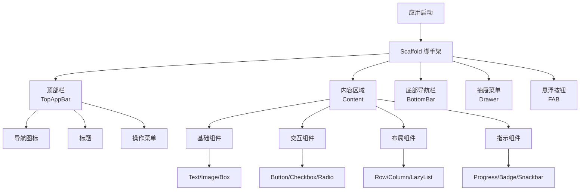
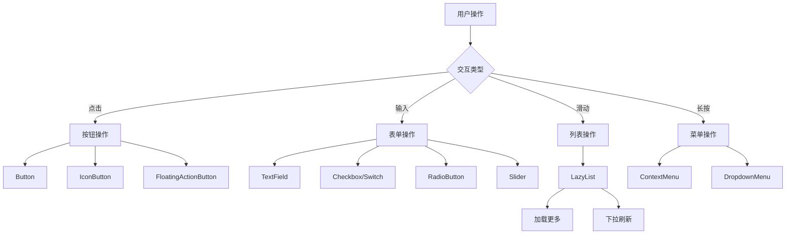
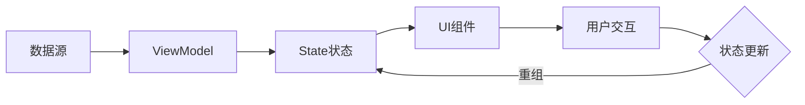
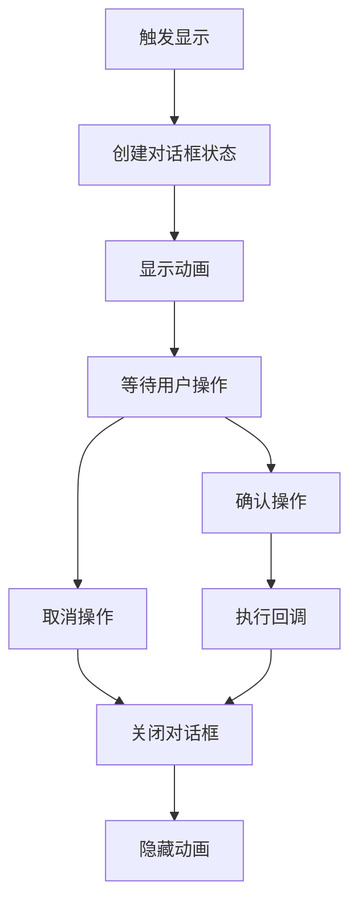
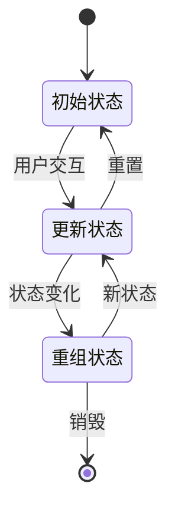
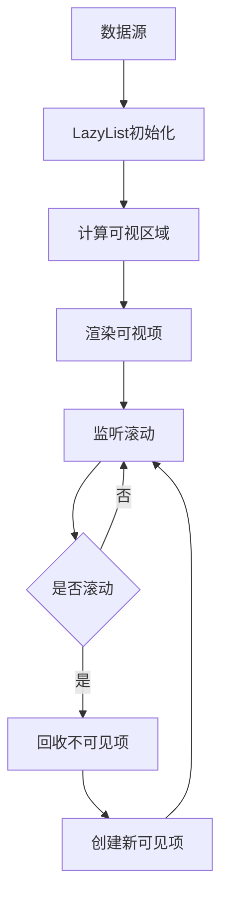
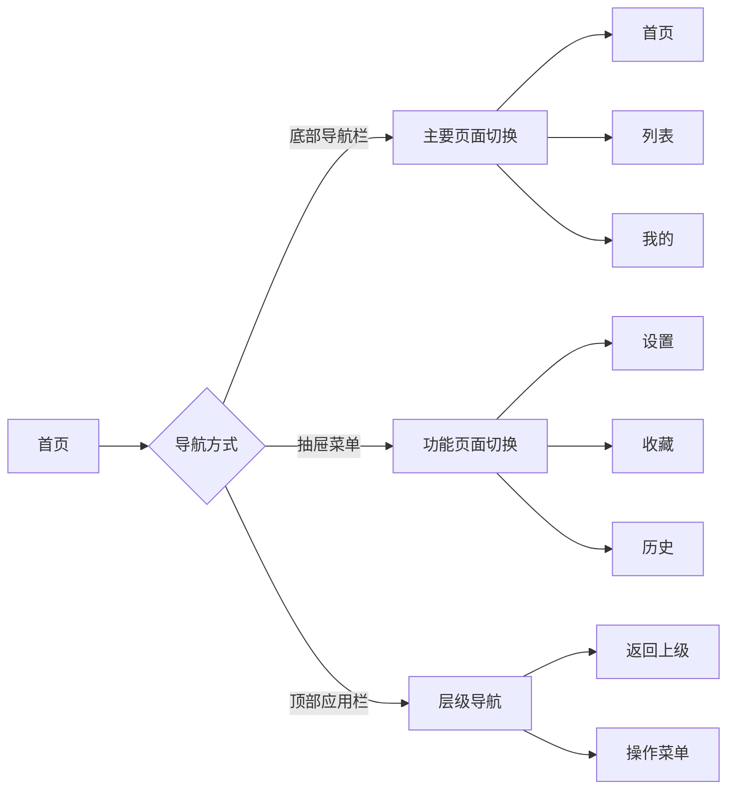
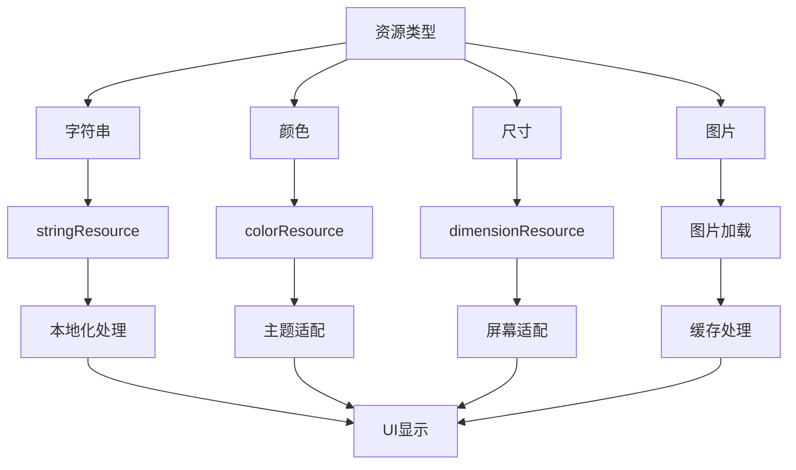
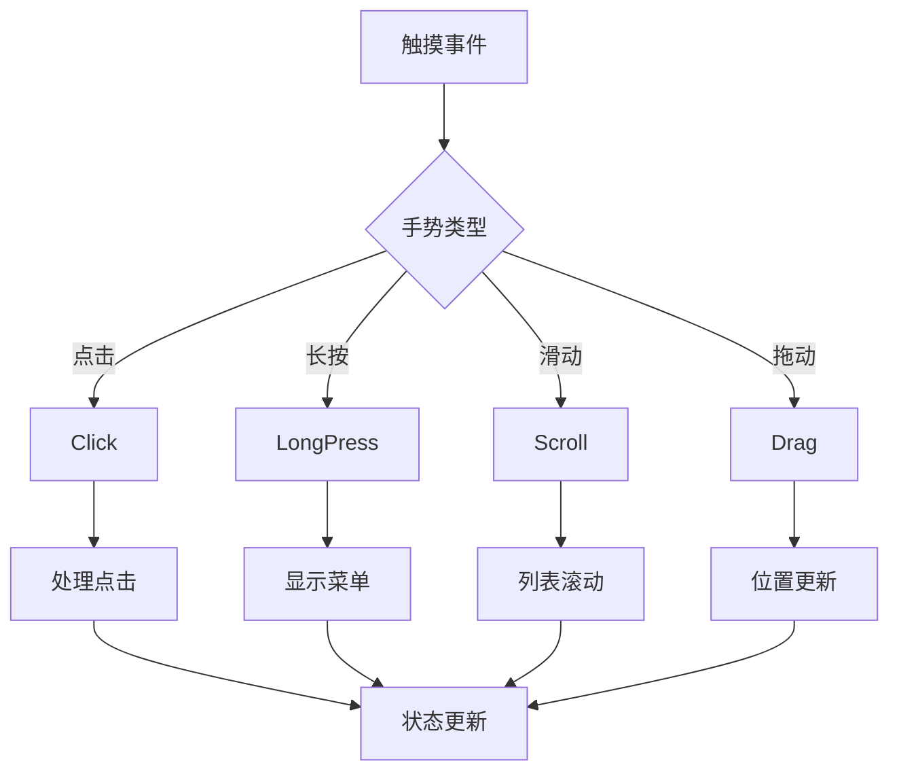

# Jetpack Compose 组件流程图

## 1. 页面构建流程

## 2. 用户交互流程

## 3. 数据流转流程

## 4. 对话框展示流程

## 5. 组件状态管理

## 6. 列表渲染优化流程

## 7. 导航交互流程

## 8. 资源加载流程

## 9. 手势处理流程

这些流程图涵盖了 Jetpack Compose 的主要组件交互、状态管理、渲染优化等关键流程。通过这些图表，可以更直观地理解各个组件之间的关系以及它们在应用中的作用。每个流程图都重点展示了不同方面的特性：

1. 页面构建流程：展示了应用的基本架构和组件层次
2. 用户交互流程：展示了各种用户操作的处理方式
3. 数据流转流程：展示了数据如何在各层之间传递
4. 对话框展示流程：展示了模态组件的生命周期
5. 组件状态管理：展示了状态管理的基本原理
6. 列表渲染优化：展示了性能优化的关键流程
7. 导航交互流程：展示了应用内导航的实现方式
8. 资源加载流程：展示了资源管理和优化策略
9. 手势处理流程：展示了触摸事件的处理机制
