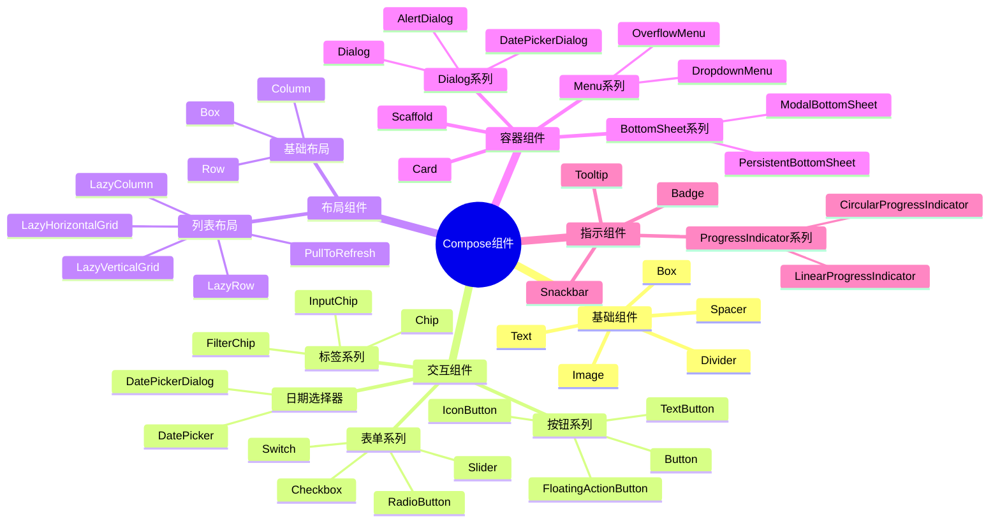
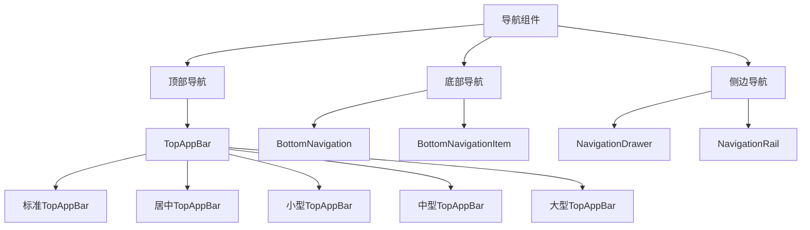
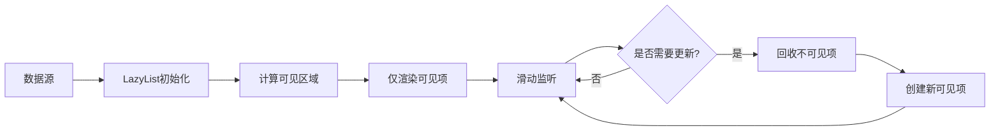
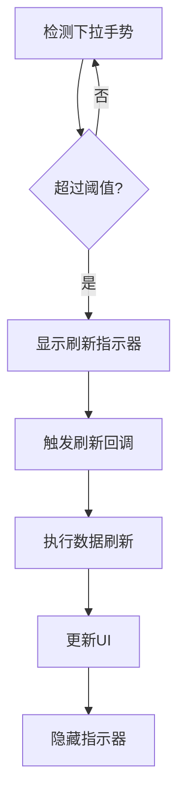
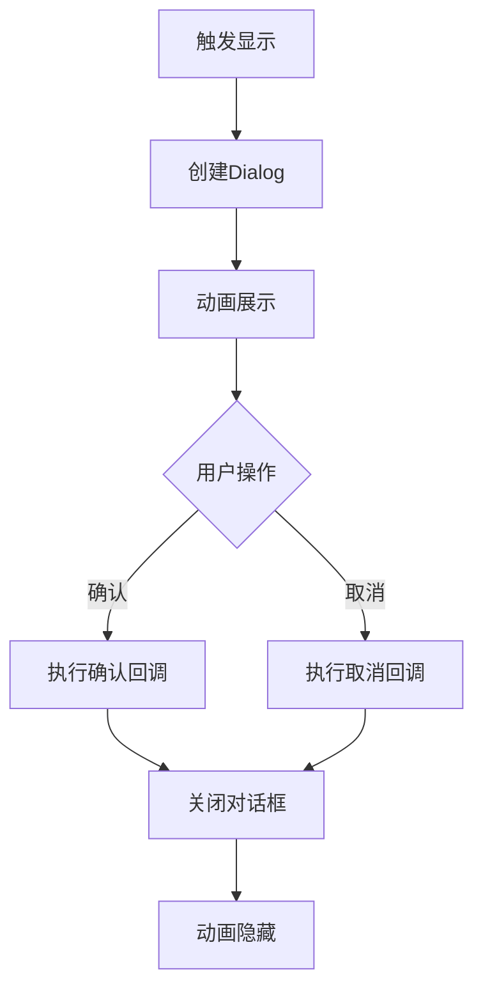
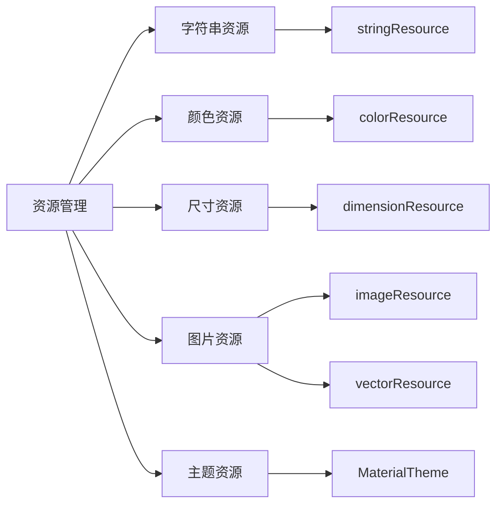
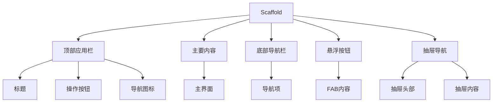

# Jetpack Compose 组件架构图

## 1. 整体组件结构

## 2. 导航组件结构

## 3. 交互流程图

### 3.1 列表渲染流程

### 3.2 下拉刷新流程

### 3.3 对话框显示流程

## 4. 资源管理

## 5. Scaffold 布局结构

以上架构图使用了思维导图和流程图的方式展示了 Jetpack Compose 组件的层次结构、交互流程和关系。每个图都突出显示了不同角度的组件关系，便于理解整个组件体系。
