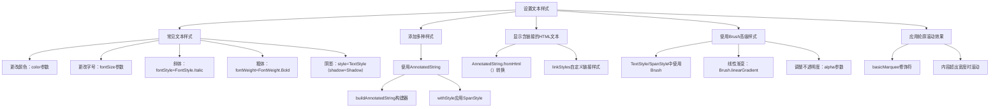

# 设置文本样式

原地址：<https://developer.android.google.cn/develop/ui/compose/text/style-text?hl=zh-cn>

该网页主要介绍了Android Compose中Text可组合项的文本样式设置方法，涵盖常见样式、多种样式混合、HTML链接处理及高级样式等内容，以下是详细总结：



## 一、常见文本样式

1. **更改文本颜色**  
   使用`color`参数，示例：  

   ```kotlin
   @Composable
   fun BlueText() {
       Text("Hello World", color = Color.Blue)
   }
   ```

2. **更改文字大小**  
   使用`fontSize`参数（单位`sp`），示例：  

   ```kotlin
   @Composable
   fun BigText() {
       Text("Hello World", fontSize = 30.sp)
   }
   ```

3. **斜体**  
   通过`fontStyle = FontStyle.Italic`设置，示例：  

   ```kotlin
   @Composable
   fun ItalicText() {
       Text("Hello World", fontStyle = FontStyle.Italic)
   }
   ```

4. **粗体**  
   通过`fontWeight = FontWeight.Bold`设置，示例：  

   ```kotlin
   @Composable
   fun BoldText() {
       Text("Hello World", fontWeight = FontWeight.Bold)
   }
   ```

5. **添加阴影**  
   通过`style`参数配置`TextStyle`的`Shadow`对象，示例：  

   ```kotlin
   @Composable
   fun TextShadow() {
       val offset = Offset(5.0f, 10.0f)
       Text(
           text = "Hello world!",
           style = TextStyle(
               fontSize = 24.sp,
               shadow = Shadow(color = Color.Blue, offset = offset, blurRadius = 3f)
           )
       )
   }
   ```

## 二、添加多种样式

- **使用`AnnotatedString`**  
  通过`buildAnnotatedString`构建器和`withStyle`方法为不同文本段应用`SpanStyle`，示例：  

  ```kotlin
  @Composable
  fun MultipleStylesInText() {
      Text(
          buildAnnotatedString {
              withStyle(style = SpanStyle(color = Color.Blue)) { append("H") }
              append("ello ")
              withStyle(style = SpanStyle(fontWeight = FontWeight.Bold, color = Color.Red)) { append("W") }
              append("orld")
          }
      )
  }
  ```

## 三、显示含链接的HTML文本

- **使用`AnnotatedString.fromHtml()`**  
  将HTML转换为`AnnotatedString`，通过`linkStyles`自定义链接样式，示例：  

  ```kotlin
  @Composable
  fun AnnotatedHtmlStringWithLink() {
      Text(
          AnnotatedString.fromHtml(
              htmlText = "<a href='https://www.android.com'>Jetpack Compose</a>",
              linkStyles = TextLinkStyles(style = SpanStyle(textDecoration = TextDecoration.Underline, fontStyle = FontStyle.Italic, color = Color.Blue))
          )
      )
  }
  ```

## 四、使用Brush高级样式（实验性）

1. **为整体文本设置渐变**  
   在`TextStyle`中使用`brush`参数，示例：  

   ```kotlin
   val gradientColors = listOf(Cyan, LightBlue, Purple)
   Text(text = "Gradient Text", style = TextStyle(brush = Brush.linearGradient(colors = gradientColors)))
   ```

2. **为部分文本设置渐变**  
   通过`SpanStyle`和`buildAnnotatedString`实现，示例：  

   ```kotlin
   Text(
       text = buildAnnotatedString {
           append("Do not allow ")
           withStyle(style = SpanStyle(brush = Brush.linearGradient(colors = rainbowColors))) { append("dim your shine") }
       }
   )
   ```

3. **调整不透明度**  
   通过`SpanStyle`的`alpha`参数，示例：  

   ```kotlin
   withStyle(style = SpanStyle(brush = brush, alpha = 0.5f)) { append("半透明文本") }
   ```

## 五、应用轮廓滚动效果

- **使用`basicMarquee`修饰符**  
  当文本超出容器宽度时触发滚动动画，示例：  

  ```kotlin
  @Composable
  fun BasicMarqueeSample() {
      Text(
          "长文本内容...",
          modifier = Modifier.basicMarquee(),
          fontSize = 50.sp,
          maxWidth = 400.dp // 触发滚动的宽度约束
      )
  }
  ```

## 注意事项

- **实验性API**：`TextStyle`中使用`Brush`的功能目前为实验性，可能随版本更新调整。  
- **样式作用范围**：直接在`Text`中设置参数（如`color`）会作用于整个文本，混合样式需通过`AnnotatedString`实现。
