# 设置段落

原地址：<https://developer.android.google.cn/develop/ui/compose/text/style-paragraph?hl=zh-cn>

本文介绍了在Android Jetpack Compose中设置段落样式的方法，涵盖文本对齐、多种样式添加、行高调整、换行规则配置及断词支持等内容。

## 流程图

```mermaid
flowchart TD
    A[设置段落样式] --> B[文本对齐方式]
    A --> C[添加多种样式]
    A --> D[调整行高与内边距]
    A --> E[插入换行符]
    A --> F[中日韩语言适配]
    A --> G[断词支持]
    B --> B1[参数:textAlign]
    B --> B2[推荐使用:Start/End（适配文字方向）]
    B --> B3[避免使用:Left/Right（固定方向）]
    C --> C1[工具:AnnotatedString]
    C --> C2[构建器:buildAnnotatedString]
    C --> C3[样式:ParagraphStyle（段落级）、SpanStyle（字符级）]
    D --> D1[参数:lineHeight（行高）]
    D --> D2[属性:includeFontPadding（默认false）]
    D --> D3[API:LineHeightStyle（对齐/去空格）]
    E --> E1[预设策略:Simple/Heading/Paragraph]
    E --> E2[自定义策略:Balanced/HighQuality]
    F --> F1[参数:Strictness（宽松/严格）]
    F --> F2[参数:WordBreak（词组/默认）]
    G --> G1[参数:hyphens（None/Auto）]
    G --> G2[生效条件:字词超行宽+正确语言区域]
```



## 详细说明

1. **文本对齐方式**  
   - 通过`textAlign`设置水平对齐，推荐使用`TextAlign.Start/End`（适配语言文字方向，如阿拉伯语右→左），避免使用`Left/Right`（固定方向）。  
   - 示例：  

     ```kotlin
     Text("Hello World", textAlign = TextAlign.Center, modifier = Modifier.width(150.dp))
     ```

2. **添加多种样式**  
   - 使用`AnnotatedString`配合`ParagraphStyle`（段落级样式，如行高）和`SpanStyle`（字符级样式，如颜色、粗细）。  
   - 通过`buildAnnotatedString`构建器分层设置样式，不同样式块会自动分隔（类似换行）。  
   - 示例：  

     ```kotlin
     Text(
         buildAnnotatedString {
             withStyle(ParagraphStyle(lineHeight = 30.sp)) {
                 withStyle(SpanStyle(color = Color.Blue)) { append("Hello\n") }
                 withStyle(SpanStyle(fontWeight = Bold, color = Color.Red)) { append("World\n") }
                 append("Compose") // 无样式段落
             }
         }
     )
     ```

3. **调整行高与内边距**  
   - `includeFontPadding`默认值从Compose BoM 2024.01.01起设为`false`，移除字体上下内边距。  
   - `lineHeight`支持`em`（相对字体大小）和`sp`单位，配合`LineHeightStyle`调整对齐（顶部/中心/底部）和去空格（`Trim.None/Both/FirstLineTop/LastLineBottom`）。  
   - 注意：`Trim`需配合`includeFontPadding = false`生效。  

4. **插入换行符**  
   - **预设策略**：  
     - `Simple`：快速换行，适用于输入框。  
     - `Heading`：宽松规则，适用于标题。  
     - `Paragraph`：高质量换行，适用于长文本。  
   - **自定义策略**：  
     - `Balanced`：平衡行长，适合小屏幕（如手表）。  
     - `HighQuality`：优化可读性，默认用于非简单场景。  

5. **中日韩语言适配**  
   - 通过`Strictness`（宽松/严格）和`WordBreak`（词组/默认）自定义换行规则，需配合设备语言区域（如日语）测试。  

6. **断词支持**  
   - 启用`hyphens = Hyphens.Auto`，系统会在字词超行宽时自动添加断字符（需正确语言区域和字典支持）。  
   - 示例对比：  
     - 未启用：字词完整换行，可能溢出。  
     - 启用：`"simplifies"`断为`"simpli-\nfies"`。
