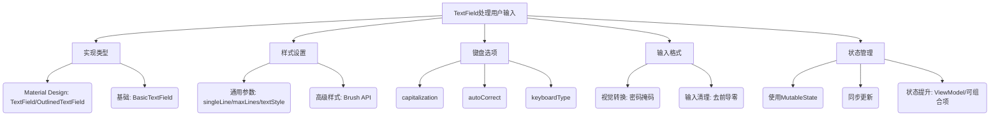

# 处理用户输入

原地址：<https://developer.android.google.cn/develop/ui/compose/text/user-input?hl=zh-cn>

## 总结  

网页主要介绍 Jetpack Compose 中 `TextField` 的使用，涵盖实现类型、样式设置、键盘配置、输入格式处理及状态管理最佳实践。  

## **一、TextField 实现类型**  

### 1. **Material Design 实现**  

- **`TextField`**：默认填充样式，带提示和装饰（如标签、边框）。  

  ```kotlin
  @Composable
  fun SimpleFilledTextFieldSample() {
      var text by remember { mutableStateOf("Hello") }
      TextField(
          value = text,
          onValueChange = { text = it },
          label = { Text("Label") }
      )
  }
  ```  

- **`OutlinedTextField`**：轮廓样式，边框仅在聚焦时显示。  

  ```kotlin
  @Composable
  fun SimpleOutlinedTextFieldSample() {
      var text by remember { mutableStateOf("") }
      OutlinedTextField(
          value = text,
          onValueChange = { text = it },
          label = { Text("Label") }
      )
  }
  ```  

### 2. **基础实现**  

- **`BasicTextField`**：无装饰，仅支持文本编辑，适合自定义设计。  

## **二、样式设置**  

### 1. **通用参数**  

- **`singleLine`**：是否单行显示（默认 `false`）。  
- **`maxLines`**：最大行数（多行输入时使用）。  
- **`textStyle`**：文本样式（颜色、字体粗细等）。  

  ```kotlin
  @Composable
  fun StyledTextField() {
      var value by remember { mutableStateOf("Hello\nWorld\nInvisible") }
      TextField(
          value = value,
          onValueChange = { value = it },
          label = { Text("Enter text") },
          maxLines = 2,
          textStyle = TextStyle(color = Color.Blue, fontWeight = FontWeight.Bold)
      )
  }
  ```  

### 2. **高级样式（Brush API）**  

- 实验性支持渐变、阴影等效果，需用 `remember` 缓存画笔状态。  

  ```kotlin
  var text by remember { mutableStateOf("") }
  val brush = remember { Brush.linearGradient(colors = rainbowColors) }
  TextField(
      value = text,
      onValueChange = { text = it },
      textStyle = TextStyle(brush = brush)
  )
  ```  

## **三、键盘选项配置**  

### 控制键盘行为  

- **`capitalization`**：首字母大写规则（如 `Capitalization.Sentences`）。  
- **`autoCorrect`**：是否启用自动更正（默认 `true`）。  
- **`keyboardType`**：键盘类型（如 `KeyboardType.Password`、`KeyboardType.Number`）。  
- **`imeAction`**：键盘操作按钮（如 `ImeAction.Done`）。  

## **四、输入格式处理**  

### 1. **视觉转换（`VisualTransformation`）**  

- **密码掩码**：使用 `PasswordVisualTransformation` 隐藏输入内容。  

  ```kotlin
  @Composable
  fun PasswordTextField() {
      var password by rememberSaveable { mutableStateOf("") }
      TextField(
          value = password,
          onValueChange = { password = it },
          label = { Text("Enter password") },
          visualTransformation = PasswordVisualTransformation(),
          keyboardOptions = KeyboardOptions(keyboardType = KeyboardType.Password)
      )
  }
  ```  

### 2. **输入清理**  

- 去除前导零等自定义逻辑：  

  ```kotlin
  @Composable
  fun NoLeadingZeroes() {
      var input by rememberSaveable { mutableStateOf("") }
      TextField(
          value = input,
          onValueChange = { newText -> input = newText.trimStart { it == '0' } }
      )
  }
  ```  

## **五、状态管理最佳实践**  

1. **使用 `MutableState`**：  
   避免使用 `StateFlow` 等异步流，确保实时更新。  

   ```kotlin
   class SignUpViewModel : ViewModel() {
       var username by mutableStateOf("") private set
   }
   ```  

2. **同步更新状态**：  
   在 `onValueChange` 中立即更新状态，避免延迟。  

   ```kotlin
   OutlinedTextField(
       value = viewModel.username,
       onValueChange = { viewModel.updateUsername(it) }
   )
   ```  

3. **状态提升**：  
   - 需业务逻辑验证：提升至 `ViewModel`。  
   - 简单场景：可组合项内直接管理。  

## **流程图**  


