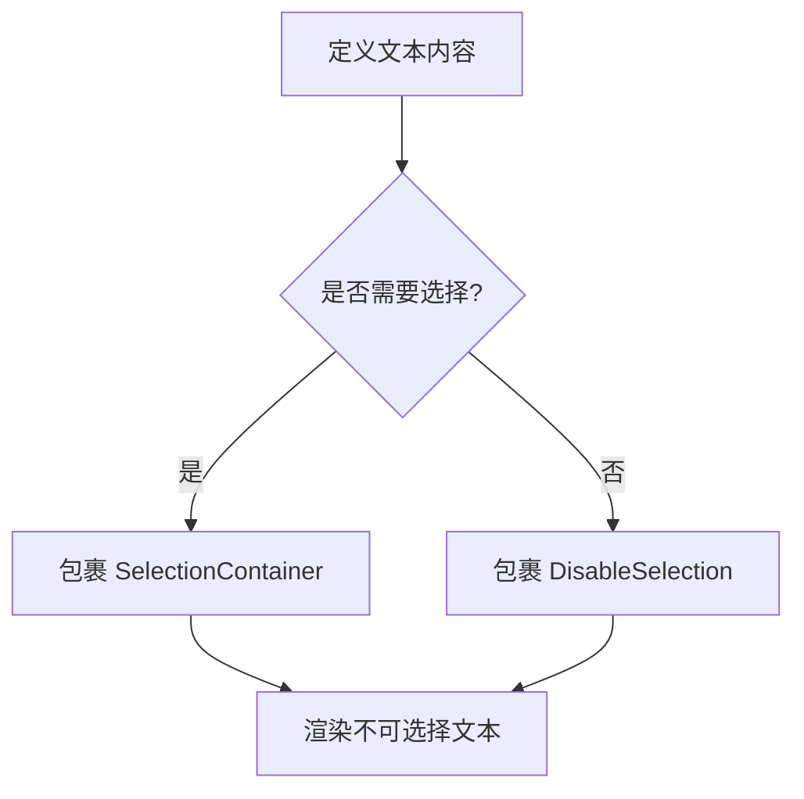
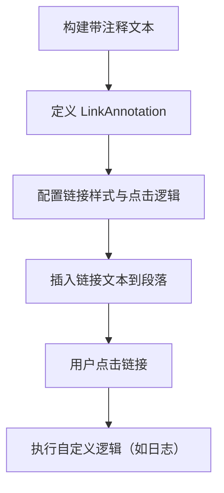

# Compose 文本用户互动开发指南  

原地址：<https://developer.android.google.cn/develop/ui/compose/text/user-interactions?hl=zh-cn>  

## 一、文本选择功能  

### （一）核心功能与场景  

- **启用文本选择**：通过 `SelectionContainer` 包裹文本，允许用户长按选择文字并复制。  
- **排除部分文本**：使用 `DisableSelection` 包裹无需选择的文本区域。  

### （二）关键组件与参数  

| 组件              | 作用                                   | 参数说明                          |  
|-------------------|----------------------------------------|-----------------------------------|  
| `SelectionContainer` | 启用文本选择的容器                     | 无特殊参数，直接包裹可选择文本    |  
| `DisableSelection`  | 禁用文本选择的容器                     | 无特殊参数，包裹不可选择的文本    |  

### （三）示例代码  

#### 1. 全选文本  

```kotlin
@Composable fun SelectableTextExample() {
    SelectionContainer {
        Text("此文本可长按选择") // 整段文本可选择
    }
}
```  

#### 2. 部分选择文本  

```kotlin
@Composable fun PartialSelectableTextExample() {
    SelectionContainer {
        Column {
            Text("可选择的文本段落")
            DisableSelection {
                Text("这段文字不可选择") // 被包裹的文本不可选择
            }
            Text("另一段可选择的文本")
        }
    }
}
```  

### （四）流程图  



## 二、可点击文本链接（LinkAnnotation）  

### （一）可点击文本链接-核心功能与场景  

- 在文本中添加可点击的链接区域，支持打开 URL、自定义事件（如日志记录、跳转页面）。  
- 适用于需要局部交互的文本场景，如条款链接、功能引导词、动态内容跳转。  

### （二）可点击文本链接-关键组件与参数  

| 组件/方法              | 作用                                   | 参数说明                          |  
|------------------------|----------------------------------------|-----------------------------------|  
| `buildAnnotatedString` | 构建带注释的文本，支持混合普通文本和链接 | 无直接参数，通过 lambda 内方法组合内容 |  
| `withLink(annotation)` | 向文本段落中添加链接注释                | `annotation`：链接类型（如 `LinkAnnotation.Url`）<br>`content`：链接显示的文本内容 |  
| `LocalUriHandler`      | 系统 URI 处理工具，用于打开外部链接     | `openUri(url)`：调用系统应用打开指定 URL |  
| `TextLinkStyles`        | 自定义链接样式                         | `style`：`SpanStyle` 对象，设置颜色、字体等 |  

### （三）可点击文本链接-示例代码  

#### 2. 带自定义逻辑的链接（点击统计+URL 打开）  

```kotlin
@Composable fun AnnotatedStringWithListenerSample() {
    // 获取系统 URI 处理器
    val uriHandler = LocalUriHandler.current
    
    Text(
        buildAnnotatedString {
            append("立即体验 ")
            // 定义链接注释（包含 URL 和自定义点击逻辑）
            val link = LinkAnnotation.Url(
                "https://developer.android.com/jetpack/compose",
                // 自定义链接样式（绿色文本）
                TextLinkStyles(style = SpanStyle(color = Color.Green))
            ) {
                // 点击时执行自定义逻辑（如记录日志）
                Log.d("LinkClick", "用户点击了 Jetpack Compose 链接")
                // 打开 URL
                uriHandler.openUri(link.url)
            }
            // 将链接文本插入到段落中
            withLink(link) {
                append("Jetpack Compose 开发指南")
            }
            append("，快速构建高质量界面。")
        }
    )
}
```  

**代码要点**：  

- 通过 `LocalUriHandler.current` 获取系统 URI 处理器，用于打开外部链接。  
- 在 `LinkAnnotation` 的 lambda 中添加自定义逻辑（如日志记录），再调用 `uriHandler.openUri(url)` 打开 URL。  
- `TextLinkStyles` 自定义链接颜色为绿色，区别于普通文本。  

### （四）可点击文本链接-流程图  


