# 使用字体  

原地址：<https://developer.android.google.cn/develop/ui/compose/text/fonts?hl=zh-cn>  

## 一、设置字体  

### 1.1 默认字体  

- **核心组件**：`Text` 组件通过 `fontFamily` 参数设置字体，系统默认支持以下 4 种基础字体系列：  
  - `FontFamily.Serif`（衬线字体）  
  - `FontFamily.SansSerif`（无衬线字体）  
  - `FontFamily.Monospace`（等宽字体）  
  - `FontFamily.Cursive`（手写体）  
- **代码示例**：  

  ```kotlin  
  @Composable  
  fun DifferentFonts() {  
      Column {  
          Text("Hello World", fontFamily = FontFamily.Serif)  
          Text("Hello World", fontFamily = FontFamily.SansSerif)  
      }  
  }  
  ```  

### 1.2 自定义本地字体  

- **字体文件准备**：  
  - 将字体文件（如 `.ttf`）放入 `res/font` 文件夹，支持多个字重（如 `bold`、`italic`）和样式。  
  - 示例文件结构：  

    ```txt
    res/  
      font/  
        firasans_bold.ttf  
        firasans_italic.ttf  
        firasans_regular.ttf  
    ```  

- **定义字体系列**：  
  使用 `FontFamily` 组合多个 `Font` 对象，指定字重（`FontWeight`）和样式（`FontStyle`）：  

  ```kotlin  
  val firaSansFamily = FontFamily(  
      Font(R.font.firasans_light, FontWeight.Light),  
      Font(R.font.firasans_regular, FontWeight.Normal),  
      Font(R.font.firasans_italic, FontWeight.Normal, FontStyle.Italic),  
      Font(R.font.firasans_bold, FontWeight.Bold)  
  )  
  ```  

- **应用到文本**：  

  ```kotlin  
  Column {  
      Text("text", fontFamily = firaSansFamily, fontWeight = FontWeight.Light)  
      Text("text", fontFamily = firaSansFamily, fontWeight = FontWeight.Bold)  
  }  
  ```  

## 二、可下载字体（Google Fonts）  

### 2.1 支持范围  

- **版本要求**：Compose 1.2.0+  
- **限制**：仅支持 Google Fonts，暂不支持自定义字体提供方。  

### 2.2 操作步骤  

#### 2.2.1 添加依赖  

```gradle  
dependencies {  
    implementation "androidx.compose.ui:ui-text-google-fonts:1.8.1"  
}  
```  

#### 2.2.2 初始化字体提供方  

```kotlin  
val provider = GoogleFont.Provider(  
    providerAuthority = "com.google.android.gms.fonts", // 授权标识  
    providerPackage = "com.google.android.gms", // 验证包名  
    certificates = R.array.com_google_android_gms_fonts_certs // 证书哈希（可从示例应用获取）  
)  
```  

#### 2.2.3 定义可下载字体系列  

```kotlin  
// 基础用法（默认字重和样式）  
val fontFamily = FontFamily(  
    Font(googleFont = GoogleFont("Lobster Two"), fontProvider = provider)  
)  

// 自定义字重和样式  
val fontFamilyWithStyle = FontFamily(  
    Font(  
        googleFont = GoogleFont("Lobster Two"),  
        fontProvider = provider,  
        weight = FontWeight.Bold,  
        style = FontStyle.Italic  
    )  
)  
```  

#### 2.2.4 应用于文本或主题  

```kotlin  
// 直接应用于 Text  
Text("Hello World!", fontFamily = fontFamily)  

// 配置全局排版（Typography）  
val MyTypography = Typography(  
    bodyMedium = TextStyle(fontFamily = fontFamily, fontSize = 16.sp),  
    headlineLarge = TextStyle(fontFamily = fontFamily, fontWeight = FontWeight.Bold)  
)  

// 在主题中使用  
MyAppTheme(typography = MyTypography) { ... }  
```  

### 2.3 回退字体机制  

- **场景**：当可下载字体加载失败时，使用本地字体作为回退。  
- **实现**：在 `FontFamily` 中按优先级定义字体链（先在线后本地）：  

  ```kotlin  
  val fontFamily = FontFamily(  
      // 优先尝试在线字体（常规字重）  
      Font(googleFont = GoogleFont("Lobster Two"), fontProvider = provider),  
      // 回退到本地常规字体  
      Font(resId = R.font.my_font_regular),  
      // 优先尝试在线粗体字体  
      Font(googleFont = GoogleFont("Lobster Two"), fontProvider = provider, weight = FontWeight.Bold),  
      // 回退到本地粗体字体  
      Font(resId = R.font.my_font_bold, weight = FontWeight.Bold)  
  )  
  ```  

### 2.4 调试与验证  

#### 2.4.1 异常处理  

```kotlin  
// 创建协程异常处理器  
val handler = CoroutineExceptionHandler { _, throwable ->  
    Log.e("FONT_DEBUG", "字体加载失败：", throwable)  
}  

// 在组合中使用处理器  
CompositionLocalProvider(  
    LocalFontFamilyResolver provides createFontFamilyResolver(LocalContext.current, handler)  
) {  
    Text("Hello World!")  
}  
```  

#### 2.4.2 可用性检查  

```kotlin  
LaunchedEffect(Unit) {  
    val isAvailable = provider.isAvailableOnDevice(LocalContext.current)  
    Log.d("FONT_DEBUG", "提供方可用：$isAvailable")  
}  
```  

### 2.5 注意事项  

- **新字体延迟**：Google Fonts 新字体需数月才能在 Android 端可用，加载失败可能抛出 `IllegalStateException`，可通过异常消息识别。  
- **证书配置**：确保 `certificates` 参数正确，否则会导致字体无法下载。  

## 三、可变字体（Variable Fonts）  

### 3.1 基本概念  

- **优势**：一个字体文件包含多种样式（如粗细、宽度、斜度），减少文件体积。  
- **支持版本**：Android O（API 26）及以上。  

### 3.2 加载步骤  

#### 3.2.1 准备字体文件  

- 将可变字体文件（如 `robotoflex_variable.ttf`）放入 `res/font`，文件名需小写且无特殊字符。  

#### 3.2.2 定义字体系列并配置轴参数  

```kotlin  
@OptIn(ExperimentalTextApi::class)  
val displayLargeFontFamily = FontFamily(  
    Font(  
        R.font.robotoflex_variable,  
        variationSettings = FontVariation.Settings(  
            FontVariation.weight(950),       // 粗细轴（950为特粗）  
            FontVariation.width(30f),         // 宽度轴（30%为窄宽度）  
            FontVariation.slant(-6f)          // 斜度轴（-6°为左斜）  
        )  
    )  
)  
```  

#### 3.2.3 版本兼容与回退  

```kotlin  
@OptIn(ExperimentalTextApi::class)  
val displayLargeFontFamily = if (Build.VERSION.SDK_INT >= Build.VERSION_CODES.O) {  
    FontFamily(  
        Font(  
            R.font.robotoflex_variable,  
            variationSettings = FontVariation.Settings(/* 轴参数 */)  
        )  
    )  
} else {  
    // 低版本回退到静态字体  
    FontFamily(Font(R.font.robotoflex_static_regular))  
}  
```  

#### 3.2.4 提取配置常量  

```kotlin  
// VariableFontConfig.kt  
object VariableFontConfig {  
    const val WEIGHT = 950  
    const val WIDTH = 30f  
    const val SLANT = -6f  
}  

// 使用常量  
val displayLargeFontFamily = FontFamily(  
    Font(  
        R.font.robotoflex_variable,  
        variationSettings = FontVariation.Settings(  
            FontVariation.weight(VariableFontConfig.WEIGHT),  
            FontVariation.width(VariableFontConfig.WIDTH),  
            FontVariation.slant(VariableFontConfig.SLANT)  
        )  
    )  
)  
```  

#### 3.2.5 应用于 Material Design 3 主题  

```kotlin  
// 定义排版  
val Typography = MaterialTheme.typography.copy(  
    displayLarge = TextStyle(  
        fontFamily = displayLargeFontFamily,  
        fontSize = 50.sp,  
        lineHeight = 64.sp  
    )  
)  

// 在主题中应用  
MaterialTheme(typography = Typography) {  
    Text("Compose", style = MaterialTheme.typography.displayLarge)  
}  
```  

### 3.3 使用自定义轴  

- **场景**：字体自带的非标准轴（如 Roboto Flex 的上衬线高度 `YTAS`、衬线宽度 `XTRA`）。  
- **实现步骤**：  
  1. 定义轴设置函数并添加值校验：  

     ```kotlin  
     fun ascenderHeight(value: Float): FontVariation.Setting {  
         require(649f <= value <= 854f) { "值必须在 649f~854f 之间" }  
         return FontVariation.Setting("YTAS", value)  
     }  

     fun counterWidth(value: Int): FontVariation.Setting {  
         require(323 <= value <= 603) { "值必须在 323~603 之间" }  
         return FontVariation.Setting("XTRA", value.toFloat())  
     }  
     ```  

  2. 在字体配置中使用自定义轴：  

     ```kotlin  
     val displayLargeFontFamily = FontFamily(  
         Font(  
             R.font.robotoflex_variable,  
             variationSettings = FontVariation.Settings(  
                 ascenderHeight(800f),    // 上衬线高度  
                 counterWidth(500)        // 衬线宽度  
             )  
         )  
     )  
     ```  

## 四、流程图  

```mermaid  
flowchart TD  
    A[Compose字体使用指南] --> B[本地字体配置]  
    A --> C[可下载字体（Google Fonts）]  
    A --> D[可变字体（Android O+）]  

    B --> B1[准备字体文件到 res/font]  
    B --> B2[通过 FontFamily + Font 定义字体系列]  
    B --> B3[Text 组件应用 fontFamily]  

    C --> C1[添加依赖 androidx.compose.ui:ui-text-google-fonts]  
    C --> C2[初始化 GoogleFont.Provider（授权/包名/证书）]  
    C --> C3[定义 FontFamily（GoogleFont + provider）]  
    C --> C4[应用于 Text 或全局 Typography]  
    C --> C5[可选：添加回退字体链（在线→本地）]  
    C --> C6[可选：调试（异常处理/可用性检查）]  

    D --> D1[准备可变字体文件到 res/font（小写无特殊字符）]  
    D --> D2[通过 FontVariation.Settings 配置轴参数]  
    D --> D3[版本检查（API ≥ 26）并设置回退字体]  
    D --> D4[提取配置常量提升复用性]  
    D --> D5[应用于 Material Design 3 Typography]  
    D --> D6[可选：使用自定义轴（FontVariation.Setting）]  
```


