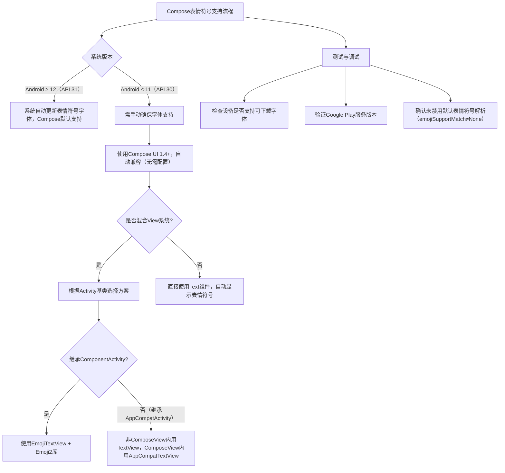

# 显示表情符号  

原地址：<https://developer.android.google.cn/develop/ui/compose/text/emoji?hl=zh-cn>  

## 一、表情符号支持背景  

### 1.1 Unicode 标准更新  

- **频率**：Unicode 每年更新表情符号集（如 2024 年发布 16.0 版本，包含 🫩、🪉 等新符号）。  
- **显示问题**：旧版 Android 系统（如 Android 11 及以下）无法自动更新表情符号字体，可能导致新表情符号显示为“豆腐块”（□）或乱码。  

### 1.2 Compose 支持范围  

- **版本要求**：Compose UI 1.4（2023 年 3 月 BOM）及以上版本。  
- **兼容范围**：自动支持最新表情符号（截至 Unicode 16.0），并向后兼容 Android 5.0（API 21）及以上版本。  
- **默认支持**：使用 `Text`、`TextField`（Material 2/3）、`BasicText` 等组件时，无需额外配置即可正确显示表情符号。  

## 二、自动支持与测试方法  

### 2.1 零配置支持  

- **适用场景**：直接使用 Compose 文本组件显示表情符号时，框架会自动处理字体解析。  

  ```kotlin  
  Text("Hello 👋🏼 World!") // 自动正确显示表情符号  
  ```  

### 2.2 测试建议  

- **测试设备**：优先使用 API 30 或更低版本的真实设备（如 Android 11），避免模拟器或新刷写设备可能存在的字体缺失问题。  
- **验证内容**：输入或显示 Unicode 最新版本的表情符号（如 16.0 中的 🇨🇶、🫩），确认无“豆腐块”显示。  

## 三、停用默认表情符号解析  

- **场景**：需使用自定义表情符号方案（如图片替代字符）时，可关闭自动解析。  
- **实现方法**：通过 `PlatformTextStyle` 的 `emojiSupportMatch` 参数设置为 `None`。  

  ```kotlin  
  Text(  
      text = "Hello 🌍",  
      style = TextStyle(  
          platformStyle = PlatformTextStyle(  
              emojiSupportMatch = EmojiSupportMatch.None  
          )  
      )  
  )  
  ```  

## 四、Compose 与 View 系统的互操作性  

### 4.1 继承 ComponentActivity 的场景  

- **依赖添加**：引入 Emoji2 库以支持旧版 Android 表情符号。  

  ```gradle  
  dependencies {  
      implementation "androidx.emoji2:emoji2:1.0.0"  
  }  
  ```  

- **视图替换**：使用 `EmojiTextView` 替代原生 `TextView` 以正确渲染表情符号。  

  ```kotlin  
  // Activity 代码  
  class MainActivity : ComponentActivity() {  
      override fun onCreate(savedInstanceState: Bundle?) {  
          super.onCreate(savedInstanceState)  
          setContentView(R.layout.activity_main)  
          val emojiTextView: EmojiTextView = findViewById(R.id.emoji_text_view)  
          emojiTextView.text = "带有表情符号的文本 👨🏿‍❤️‍🧑🏾"  
      }  
  }  
  ```  

  ```xml  
  <!-- XML 布局 -->  
  <androidx.emoji2.widget.EmojiTextView  
      android:id="@+id/emoji_text_view"  
      android:layout_width="match_parent"  
      android:layout_height="wrap_content" />  
  ```  

### 4.2 继承 AppCompatActivity 的场景  

#### 4.2.1 直接使用 TextView（非 ComposeView 内）  

- **兼容性**：AppCompat 自动处理表情符号渲染，无需额外配置。  

  ```kotlin  
  class MyActivity : AppCompatActivity() {  
      override fun onCreate(savedInstanceState: Bundle?) {  
          super.onCreate(savedInstanceState)  
          setContentView(R.layout.activity_main)  
          val textView: TextView = findViewById(R.id.text_view)  
          textView.text = "表情符号测试 🥲" // 直接使用 TextView 即可正确显示  
      }  
  }  
  ```  

#### 4.2.2 在 ComposeView 内混合使用 View  

- **使用 AndroidViewBinding**：通过视图绑定在 Compose 中操作原生 View。  

  ```kotlin  
  AndroidViewBinding(ExampleViewBinding::inflate) { binding ->  
      binding.emojiTextView.text = "混合场景 👩🏼‍🤝‍👩🏻" // 自动支持表情符号  
  }  
  ```  

- **直接膨胀 AndroidView**：需指定 `AppCompatTextView` 以确保表情符号渲染。  

  ```kotlin  
  AndroidView(  
      factory = { context -> AppCompatTextView(context) },  
      update = { it.text = "通过 AndroidView 显示 🐦‍🔥" }  
  )  
  ```  

## 五、问题排查与解决方案  

### 5.1 表情符号显示为“豆腐块”  

1. **检查设备状态**：  
   - 新刷写的设备或模拟器可能未安装最新字体，建议使用常用真实设备（已登录 Google 账号）测试。  
   - 确保设备支持可下载字体（通常需 Google Play 服务支持）。  
2. **验证 Google Play 服务版本**：  
   - 低版本 Google Play 服务可能不支持最新表情符号字体，需升级至最新版本。  
3. **确认 Compose 版本**：  
   - 确保项目使用 Compose UI 1.4 及以上版本，可通过 `build.gradle` 检查依赖：  

     ```gradle  
     implementation platform('androidx.compose:compose-bom:2023.10.01')  
     ```  

### 5.2 混合开发场景渲染异常  

- **检查 Activity 基类**：  
  - 若继承 `ComponentActivity`，需确保使用 `EmojiTextView` 而非原生 `TextView`。  
  - 若继承 `AppCompatActivity`，在 ComposeView 外的 `TextView` 可直接使用，无需特殊处理。  

## 六、流程图  


