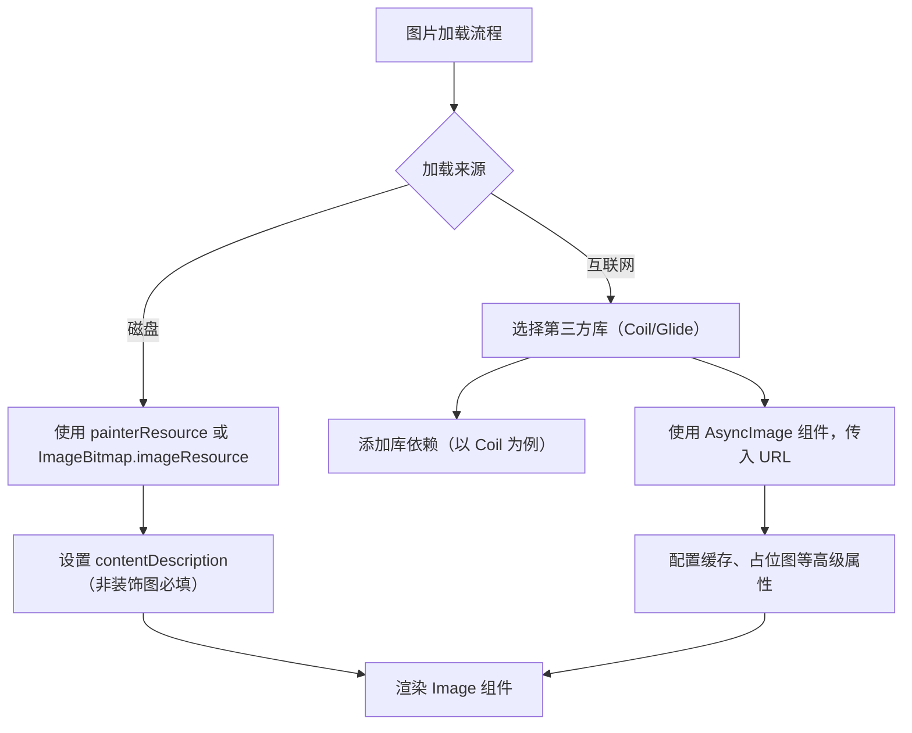

# 加载图片  

原地址：<https://developer.android.google.cn/develop/ui/compose/graphics/images/loading?hl=zh-cn>  

## 一、从磁盘加载图片  

### 1.1 核心组件与 API  

- **组件**：使用 `Image` 可组合项显示图片。  
- **加载工具**：  
  - `painterResource`：通用图片加载 API，自动识别资源类型（位图/矢量图）。  

    ```kotlin  
    Image(  
        painter = painterResource(id = R.drawable.dog),  
        contentDescription = stringResource(id = R.string.dog_content_description)  
    )  
    ```  

  - `ImageBitmap.imageResource()`：针对位图（`ImageBitmap`）的低级加载 API，用于需要位图专有功能的场景。  

### 1.2 无障碍设计要点  

- **必填项**：为非装饰性图片提供 `contentDescription`，供屏幕阅读器（如 TalkBack）朗读。  
  - 示例：从 `strings.xml` 加载翻译后的描述：  

    ```kotlin  
    contentDescription = stringResource(id = R.string.dog_content_description)  
    ```  

  - 装饰性图片：设为 `null` 以避免屏幕阅读器干扰。  

    ```kotlin  
    contentDescription = null  
    ```  

### 1.3 支持的资源类型  

`painterResource` 支持以下可绘制对象：  

- **矢量图**：`AnimatedVectorDrawable`（动画矢量图）、`VectorDrawable`（静态矢量图）。  
- **位图**：`BitmapDrawable`（PNG、JPG、WEBP 等格式）。  
- **纯色图**：`ColorDrawable`。  

## 二、从互联网加载图片  

### 2.1 第三方库方案  

- **必要性**：处理网络请求、缓存管理、异步加载等复杂逻辑，避免重复造轮子。  
- **主流库**：  
  - **Coil**：由 Instacart 开发，轻量级且集成简单。  
  - **Glide**：Google 推荐的图片加载库，功能全面（文档未详细示例，需自行配置）。  

### 2.2 Coil 库集成示例  

#### 2.2.1 添加依赖  

```gradle  
dependencies {  
    implementation "io.coil-kt:coil-compose:2.4.0"  
}  
```  

#### 2.2.2 使用 `AsyncImage` 加载网络图片  

```kotlin  
import androidx.compose.foundation.Image  
import androidx.compose.ui.Modifier  
import coil.compose.AsyncImage  

AsyncImage(  
    model = "https://example.com/image.jpg", // 图片 URL  
    contentDescription = "图片内容的翻译描述", // 无障碍描述  
    modifier = Modifier.size(200.dp) // 自定义尺寸  
)  
```  

#### 2.2.3 核心特性  

- **异步加载**：避免阻塞主线程，适用于列表等动态场景。  
- **自动缓存**：内置内存和磁盘缓存，减少重复下载。  
- **占位图与错误图**：通过 `placeholder` 和 `error` 参数提供加载状态反馈。  

## 三、流程图  



## 四、关键对比与最佳实践  

| **场景**         | **推荐方案**                | **核心代码**                                  | **注意事项**                          |  
|------------------|-----------------------------|---------------------------------------------|---------------------------------------|  
| 本地位图/矢量图  | `painterResource`           | `Image(painter = painterResource(id = ...))` | 确保 `contentDescription` 语义正确    |  
| 本地纯位图操作   | `ImageBitmap.imageResource()`| `val bitmap = ImageBitmap.imageResource(...)`| 适用于需要像素级操作的场景            |  
| 网络图片加载     | Coil 的 `AsyncImage`         | `AsyncImage(model = "URL", ...)`             | 优先处理加载失败、网络延迟等异常情况  |  

### 最佳实践  

- **性能优化**：对大尺寸网络图片进行分辨率压缩，避免内存溢出。  
- **无障碍**：永远为功能性图片提供有意义的 `contentDescription`，装饰性图片设为 `null`。  
- **缓存策略**：依赖第三方库的默认缓存机制，避免手动管理缓存导致的复杂性。
