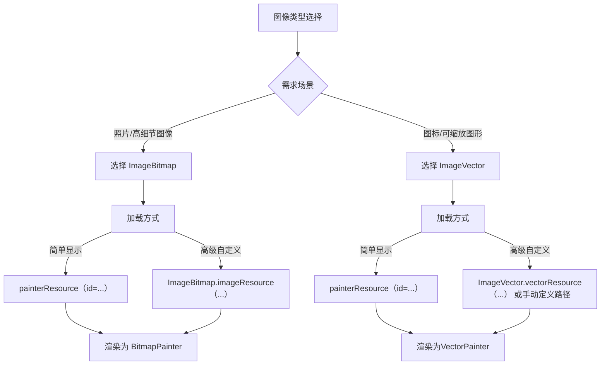

# Image Bitmap 与 Image Vector  

原地址：<https://developer.android.google.cn/develop/ui/compose/graphics/images/compare?hl=zh-cn>  

## 一、核心概念对比  

### 1.1 光栅图像（ImageBitmap）  

- **本质**：由像素矩阵组成，每个像素包含 RGBA 颜色值。  
- **特点**：  
  - **分辨率固定**：放大后像素化（画质下降）。  
  - **文件类型**：JPEG、PNG、WEBP 等位图格式。  
  - **典型场景**：照片、复杂纹理图像（如背景图）。  

### 1.2 矢量图像（ImageVector）  

- **本质**：通过数学路径（如直线、曲线、贝塞尔曲线）描述图形。  
- **特点**：  
  - **无限缩放**：放大或缩小不影响画质，保持清晰度。  
  - **文件类型**：XML 格式的矢量可绘制对象（如 VectorDrawable）或通过代码定义。  
  - **典型场景**：图标（如 Material Design 图标）、LOGO、几何图形。  

## 二、Compose 中的实现与用法  

### 2.1 ImageBitmap 的使用  

#### 2.1.1 简单加载（自动识别类型）  

- **API**：`painterResource` 自动识别位图资源并返回 `BitmapPainter`。  

  ```kotlin  
  Image(  
      painter = painterResource(id = R.drawable.dog),  
      contentDescription = stringResource(id = R.string.dog_desc)  
  )  
  ```  

#### 2.1.2 高级自定义（直接操作像素）  

- **API**：`ImageBitmap.imageResource` 获取原始位图对象，用于像素级操作（如滤镜、裁剪）。  

  ```kotlin  
  val imageBitmap = ImageBitmap.imageResource(R.drawable.dog)  
  // 示例：创建自定义 Painter 渲染位图  
  ```  

### 2.2 ImageVector 的使用  

#### 2.2.1 简单加载（矢量图专用）  

- **API**：`painterResource` 加载矢量资源（如 VectorDrawable）并返回 `VectorPainter`。  

  ```kotlin  
  Image(  
      painter = painterResource(id = R.drawable.baseline_shopping_cart_24),  
      contentDescription = stringResource(id = R.string.cart_desc)  
  )  
  ```  

#### 2.2.2 高级自定义（手动定义路径）  

- **导入方式**：通过 Android Studio 导入 SVG 文件生成 XML 矢量图。  
- **代码定义**：手动实现 `ImageVector`，通过路径命令（如 `moveTo`、`lineTo`）描述图形。  

  ```kotlin  
  val customIcon = ImageVector.vectorResource(id = R.drawable.custom_vector)  
  ```  

#### 2.2.3 支持的 SVG 功能  

- 基础路径命令（直线、曲线、闭合路径）。  
- 填充颜色、描边宽度等样式属性。  
- **不支持**：复杂滤镜、渐变（需通过其他方式实现）。  

## 三、关键特性对比表  

| **特性**               | **ImageBitmap**                | **ImageVector**                |  
|------------------------|--------------------------------|--------------------------------|  
| **内存占用**           | 取决于像素尺寸（分辨率越高越大）| 取决于路径复杂度（通常较小）   |  
| **缩放效果**           | 放大模糊（像素化）             | 无限缩放不失真                 |  
| **适用场景优先级**     | 照片、位图背景、复杂图像       | 图标、LOGO、几何图形、动画图标 |  
| **Compose 渲染引擎**   | `BitmapPainter`                | `VectorPainter`                |  
| **自定义深度**         | 像素级操作（需处理位图数据）   | 路径级操作（需掌握图形学知识） |  

## 四、流程图  



## 五、最佳实践建议  

1. **性能优化**：  
   - 位图：避免加载过大尺寸，使用 `ImageBitmap.imageResource` 压缩分辨率。  
   - 矢量图：复杂路径可能影响渲染性能，尽量简化图形结构。  
2. **资源管理**：  
   - 位图资源放入 `drawable` 目录，矢量图使用 `vector` 目录（自动生成适配不同密度的资源）。  
3. **动态场景**：  
   - 列表中的图标优先使用 `ImageVector`，避免内存抖动；列表中的照片使用异步加载库（如 Coil）配合 `ImageBitmap`。  

**示例：混合使用场景**  

```kotlin  
// 头像（位图）+ 图标（矢量）  
Row {  
    Image(  
        painter = painterResource(id = R.drawable.user_avatar),  
        contentDescription = "用户头像",  
        modifier = Modifier.size(48.dp)  
    )  
    Image(  
        painter = painterResource(id = R.drawable.baseline_star_24),  
        contentDescription = "收藏图标",  
        tint = Color.Yellow, // 矢量图支持颜色过滤  
        modifier = Modifier.size(24.dp)  
    )  
}  
```
