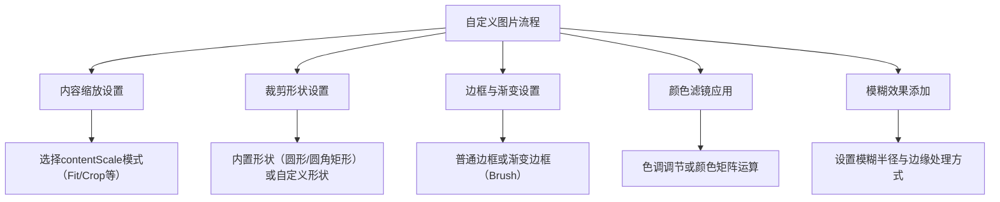

# 自定义图片  

原地址：<https://developer.android.google.cn/develop/ui/compose/graphics/images/customize?hl=zh-cn>  

## 一、内容缩放（contentScale）  

### 1.1 核心作用  

控制图片在容器内的缩放和裁剪方式，确保图片适应不同尺寸的布局。  

### 1.2 可用模式  

| **模式**               | **说明**                                                                 | **适用场景**                     |  
|------------------------|--------------------------------------------------------------------------|----------------------------------|  
| `Fit`（默认）          | 均匀缩放并保持宽高比，可能留黑边或白边。                                 | 保持图片完整，不希望变形。       |  
| `Crop`                 | 居中裁剪图片以填满容器，可能裁剪掉部分内容。                             | 需完全填充容器，允许内容被裁剪。 |  
| `FillHeight`           | 缩放至容器高度，宽度按比例调整。                                         | 固定高度，宽度自适应。           |  
| `FillWidth`            | 缩放至容器宽度，高度按比例调整。                                         | 固定宽度，高度自适应。           |  
| `FillBounds`           | 非均匀缩放，强制填满容器（可能失真）。                                   | 不考虑宽高比，完全填充。         |  
| `Inside`               | 缩放至不超过容器大小，若图片较小则不缩放。                               | 保持原图大小，不拉伸。           |  
| `None`                 | 不缩放，按原图尺寸显示（超出容器部分被裁剪）。                           | 精确控制图片尺寸。               |  

### 1.3 代码示例  

```kotlin  
Image(  
    painter = painterResource(id = R.drawable.dog),  
    contentDescription = "狗",  
    contentScale = ContentScale.Crop, // 居中裁剪  
    modifier = Modifier  
        .size(150.dp)  
        .border(1.dp, Color.Black)  
        .background(Color.Yellow)  
)  
```  

## 二、裁剪为自定义形状  

### 2.1 内置形状裁剪  

- **圆形**：使用 `CircleShape`。  

  ```kotlin  
  Image(  
      modifier = Modifier.size(200.dp).clip(CircleShape),  
      // ...  
  )  
  ```  

- **圆角矩形**：使用 `RoundedCornerShape` 并指定圆角半径。  

  ```kotlin  
  Image(  
      modifier = Modifier.size(200.dp).clip(RoundedCornerShape(16.dp)),  
      // ...  
  )  
  ```  

### 2.2 自定义形状  

继承 `Shape` 类并实现 `createOutline` 方法定义路径。  

```kotlin  
class SquashedOval : Shape {  
    override fun createOutline(size: Size, layoutDirection: LayoutDirection, density: Density): Outline {  
        val path = Path().apply {  
            addOval(Rect(left = size.width/4f, top = 0f, right = size.width*3/4f, bottom = size.height))  
        }  
        return Outline.Generic(path = path)  
    }  
}  
// 使用自定义形状裁剪  
Image(modifier = Modifier.clip(SquashedOval()), // ...)  
```  

## 三、添加边框与渐变效果  

### 3.1 普通边框  

结合 `border` 修饰符和 `clip` 修饰符创建带边框的裁剪效果。  

```kotlin  
Image(  
    modifier = Modifier  
        .size(150.dp)  
        .border(4.dp, Color.Yellow, CircleShape) // 边框颜色、宽度、形状  
        .padding(4.dp) // 边框与图片间距  
        .clip(CircleShape),  
    // ...  
)  
```  

### 3.2 渐变边框  

使用 `Brush` 创建渐变效果（如彩虹渐变）。  

```kotlin  
val rainbowBrush = remember {  
    Brush.sweepGradient(colors = listOf(/* 渐变色列表 */))  
}  
Image(  
    modifier = Modifier  
        .size(150.dp)  
        .border(4.dp, rainbowBrush, CircleShape)  
        .padding(4.dp)  
        .clip(CircleShape),  
    // ...  
)  
```  

## 四、颜色滤镜（colorFilter）  

### 4.1 色调调节（Tint）  

通过 `ColorFilter.tint` 应用单色滤镜，支持混合模式（`BlendMode`）。  

```kotlin  
// 黄色滤镜（默认混合模式 SrcIn）  
Image(colorFilter = ColorFilter.tint(Color.Yellow), // ...)  
// 绿色滤镜 + 变暗混合模式  
Image(colorFilter = ColorFilter.tint(Color.Green, blendMode = BlendMode.Darken), // ...)  
```  

### 4.2 颜色矩阵（ColorMatrix）  

通过矩阵运算实现高级颜色转换。  

- **黑白滤镜**：设置饱和度为 0。  

  ```kotlin  
  Image(colorFilter = ColorFilter.colorMatrix(ColorMatrix().apply { setToSaturation(0f) }), // ...)  
  ```  

- **调整对比度和亮度**：  

  ```kotlin  
  val colorMatrix = floatArrayOf(  
      2f, 0f, 0f, 0f, -180f, // 红色通道（对比度、亮度）  
      0f, 2f, 0f, 0f, -180f, // 绿色通道  
      0f, 0f, 2f, 0f, -180f, // 蓝色通道  
      0f, 0f, 0f, 1f, 0f     // 透明度  
  )  
  Image(colorFilter = ColorFilter.colorMatrix(ColorMatrix(colorMatrix)), // ...)  
  ```  

- **颜色反转**：  

  ```kotlin  
  val colorMatrix = floatArrayOf(-1f, 0f, 0f, 0f, 255f, /* 其他通道同理 */)  
  Image(colorFilter = ColorFilter.colorMatrix(ColorMatrix(colorMatrix)), // ...)  
  ```  

## 五、模糊效果（Blur）  

使用 `Modifier.blur` 添加高斯模糊，支持水平/垂直半径和边缘处理。  

```kotlin  
Image(  
    modifier = Modifier  
        .size(150.dp)  
        .blur(  
            radiusX = 10.dp,  
            radiusY = 10.dp,  
            edgeTreatment = BlurredEdgeTreatment.RoundedCornerShape(8.dp) // 圆角边缘处理  
        ),  
    // ...  
)  
```  

### 边缘处理对比  

| **边缘处理**          | **效果**                                                                 |  
|-----------------------|--------------------------------------------------------------------------|  
| `RoundedCornerShape`  | 模糊边缘与裁剪形状（如圆角矩形）对齐，边缘清晰。                         |  
| `Unbounded`           | 模糊范围超出容器边界，可能导致边缘模糊不清。                             |  

## 六、流程图  



## 七、关键属性与示例汇总  

| **功能**               | **核心属性/修饰符**        | **示例代码**                                                                 |  
|------------------------|---------------------------|-----------------------------------------------------------------------------|  
| 内容缩放               | `contentScale`            | `ContentScale.Crop`                                                         |  
| 裁剪形状               | `Modifier.clip(shape)`     | `Modifier.clip(CircleShape)`                                                |  
| 边框                   | `Modifier.border()`        | `Modifier.border(4.dp, Color.Red, RoundedCornerShape(8.dp))`                |  
| 渐变边框               | `Brush` + `border`         | `Modifier.border(4.dp, Brush.linearGradient(...), CircleShape)`             |  
| 色调调节               | `colorFilter = ColorFilter.tint()` | `colorFilter = ColorFilter.tint(Color.Blue, blendMode = BlendMode.Multiply)` |  
| 颜色矩阵               | `ColorFilter.colorMatrix()` | `colorFilter = ColorFilter.colorMatrix(ColorMatrix().apply { setToSaturation(0f) })` |  
| 模糊效果               | `Modifier.blur()`          | `Modifier.blur(radiusX = 8.dp, edgeTreatment = BlurredEdgeTreatment.Unbounded)` |
