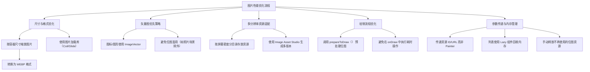

# 优化图片的性能  

原地址：<https://developer.android.google.cn/develop/ui/compose/graphics/images/optimization?hl=zh-cn>  

## 一、核心性能问题与优化目标  

### 1.1 常见问题  

- **内存溢出（OutOfMemoryError）**：加载过大位图或未及时释放内存导致。  
- **渲染卡顿**：GPU 处理高分辨率图片耗时，影响帧率。  
- **安装包膨胀**：打包未优化的图片导致 APK/AAB 体积过大。  

### 1.2 优化目标  

- 减少内存占用，避免 OOM。  
- 提升图片加载和渲染速度，保证流畅度。  
- 缩小应用体积，优化用户下载和安装体验。  

## 二、关键优化策略与实践  

### 2.1 仅加载所需尺寸的位图  

#### 2.1.1 尺寸适配原则  

- **按容器缩放**：根据图片显示区域的实际尺寸加载对应分辨率的图片，避免加载超出显示范围的大尺寸图片。  
- **分辨率匹配**：图片分辨率与显示区域分辨率（如屏幕密度）匹配，例如：  
  - 显示区域为 100x100dp，加载 200x200px（@2x 密度）的图片，而非 1000x1000px 的原图。  

#### 2.1.2 实现方法  

- **图片压缩**：  
  - 使用图片编辑工具（如 Adobe Photoshop）提前压缩图片尺寸。  
  - 通过代码动态缩放（如使用 Coil 库的 `size` 参数）：  

    ```kotlin  
    AsyncImage(  
        model = "https://example.com/large_image.jpg",  
        contentDescription = "图片",  
        modifier = Modifier.size(200.dp),  
        // Coil 自动按 200dp 缩放图片  
    )  
    ```  

- **格式转换**：  
  - 优先使用 **WEBP** 格式（比 JPEG/PNG 体积小 20-50%）。  
  - 对于透明度需求，使用 **WebP Alpha** 或 **PNG**（避免 GIF 的性能问题）。  

#### 2.1.3 工具推荐  

- **图片加载库**：Coil、Glide（自动处理缩放、缓存和格式转换）。  
- **性能监控**：Android Profiler 查看内存占用和 GPU 渲染耗时。  

### 2.2 优先使用矢量图（ImageVector）  

#### 2.2.1 适用场景  

- **图标与图形**：如应用 Logo、导航栏图标、按钮图标等。  
- **动态缩放场景**：需要适配不同屏幕尺寸或支持放大交互的图形。  

#### 2.2.2 优势对比  

| **场景**         | **矢量图（ImageVector）**          | **位图（ImageBitmap）**            |  
|------------------|------------------------------------|------------------------------------|  
| **内存占用**     | 小（仅存储路径数据）               | 大（存储像素矩阵）                 |  
| **缩放效果**     | 无限缩放不失真                     | 放大后像素化                       |  
| **渲染性能**     | 高（数学计算绘制）                 | 中（依赖 GPU 纹理处理）             |  
| **典型用途**     | 图标、几何图形、动画路径           | 照片、复杂纹理、实时渲染图像       |  

#### 2.2.3 实现建议  

- 使用 Android Studio 导入 SVG 文件生成矢量图资源。  
- 通过 `Icons` 库直接引用 Material 矢量图标（如 `Icons.Filled.Home`）。  

### 2.3 提供多分辨率备用资源  

#### 2.3.1 资源目录结构  

- 根据屏幕密度（dpi）分目录存放图片：  

  ```txt
  res/  
    drawable-mdpi/    // 160dpi，基准密度  
    drawable-hdpi/    // 240dpi，1.5倍  
    drawable-xhdpi/   // 320dpi，2倍  
    drawable-xxhdpi/  // 480dpi，3倍  
  ```  

- 系统会根据设备密度自动选择合适目录的图片，避免拉伸或压缩。  

#### 2.3.2 工具支持  

- **Image Asset Studio**：Android Studio 内置工具，可生成不同密度的图标和启动图。  
- **Vector Asset Studio**：将 SVG 转换为矢量图，自动适配所有密度。  

### 2.4 优化位图绘制流程  

#### 2.4.1 `prepareToDraw()` 方法  

- **作用**：提前将位图纹理上传至 GPU，减少首次绘制时的延迟。  
- **调用时机**：在绘制位图前（如 `onDraw` 或 `LaunchedEffect` 中）。  

  ```kotlin  
  val imageBitmap = ImageBitmap.imageResource(R.drawable.large_image)  
  LaunchedEffect(imageBitmap) {  
      imageBitmap.prepareToDraw() // 提前准备纹理  
  }  
  ```  

- **注意**：大多数图片加载库（如 Coil）已自动处理此步骤，手动加载位图时需显式调用。  

### 2.5 避免传递 `Painter` 作为参数  

#### 2.5.1 问题根源  

- `Painter` 未标记为稳定（Stable），其 `equals` 方法可能触发不必要的重组。  
- 位图的 `equals` 操作需逐像素比较，计算开销大。  

#### 2.5.2 替代方案  

- **传递资源 ID 或 URL**：  

  ```kotlin  
  // 推荐：传递资源 ID  
  @Composable  
  fun AppIcon(resId: Int) {  
      Image(painter = painterResource(resId), contentDescription = "图标")  
  }  
  // 调用时传入 R.drawable.ic_app_icon  
  ```  

- **使用记忆化（Remember）**：  

  ```kotlin  
  @Composable  
  fun RememberedPainter(url: String) {  
      val painter = remember(url) { painterResource(url) }  
      Image(painter = painter, contentDescription = "图片")  
  }  
  ```  

### 2.6 内存管理最佳实践  

#### 2.6.1 列表组件优化  

- 使用 `LazyColumn`/`LazyRow` 加载长列表图片，确保不可见项的位图被及时回收。  

  ```kotlin  
  LazyColumn {  
      items(images) { imageUrl ->  
          AsyncImage(model = imageUrl, contentDescription = "列表图片")  
      }  
  }  
  ```  

#### 2.6.2 手动释放资源  

- 对不再使用的 `ImageBitmap` 调用 `close()` 释放内存：  

  ```kotlin  
  val imageBitmap = remember {  
      ImageBitmap.imageResource(R.drawable.temp_image).also { it.prepareToDraw() }  
  }  
  // 清理时  
  DisposableEffect(Unit) {  
      onDispose { imageBitmap.close() }  
  }  
  ```  

#### 2.6.3 缓存策略  

- 利用图片库的内置缓存（如 Coil 的内存+磁盘缓存），避免重复下载和解码：  

  ```kotlin  
  AsyncImage(  
      model = "https://example.com/image.jpg",  
      contentDescription = "缓存图片",  
      placeholder = imageResource(R.drawable.loading),  
      error = imageResource(R.drawable.error)  
  )  
  ```  

### 2.7 避免打包大图片至 APK/AAB  

#### 2.7.1 分析工具  

- **APK Analyzer**：Android Studio 内置工具，查看图片在安装包中的占用大小。  
- **Lint 检查**：启用 `LargeBitmaps` 检查，提示未优化的大位图。  

#### 2.7.2 优化方法  

- **云端存储**：将不常用或高分辨率图片存储在服务器，按需下载（如用户头像、商品详情图）。  
- **动态资源**：通过 Play Asset Delivery 或 App Bundle 动态分发图片资源，减少初始包体积。  

## 三、流程图  



## 四、关键总结  

| **优化点**               | **核心方法**                                                                 | **工具/库**               |  
|--------------------------|-----------------------------------------------------------------------------|--------------------------|  
| 尺寸与格式优化           | 按显示区域缩放、转换为 WEBP、使用图片库自动处理                               | Coil、Glide、Photoshop   |  
| 矢量图优先               | 图标使用 ImageVector，导入 SVG 生成矢量资源                                   | Android Studio 矢量工具  |  
| 多分辨率适配             | 按密度分目录存放图片，使用 Image Asset Studio 生成变体                         | Android Studio           |  
| 绘制优化                 | 调用 prepareToDraw() 预加载纹理，避免在绘制时解码                             | 无（位图手动处理）        |  
| 参数与内存管理           | 传递资源 ID/URL，列表使用 Lazy 组件，手动释放位图                              | LazyColumn、remember      |  
| 安装包优化               | 分析工具检查图片大小，云端存储大图片，动态分发资源                             | APK Analyzer、Play Console|  

**终极目标**：在保证视觉效果的前提下，最小化内存占用、提升渲染效率、缩减应用体积，为用户提供流畅的使用体验。
