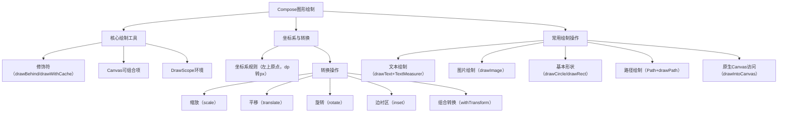

# Compose 中的图形  

原地址：<https://developer.android.google.cn/develop/ui/compose/graphics/draw/overview?hl=zh-cn>  

## 一、核心绘制方法与修饰符  

### 1.1 修饰符驱动的绘制  

Compose 通过 **修饰符（Modifier）** 和 `DrawScope` 实现自定义图形绘制，核心修饰符包括：  

- **`drawBehind`**：在可组合项背后绘制（不影响布局）。  

  ```kotlin  
  Spacer(  
      modifier = Modifier  
          .fillMaxSize()  
          .drawBehind { drawRect(Color.Gray) } // 在背后绘制灰色矩形  
  )  
  ```  

- **`drawWithContent`**：在内容前后添加绘制逻辑（可包裹原有内容）。  
- **`drawWithCache`**：缓存绘制结果，避免重复渲染（适合高频更新场景）。  

### 1.2 `Canvas` 可组合项  

- **本质**：对 `drawBehind` 的封装，更便捷地创建独立绘制区域。  
- **用法**：  

  ```kotlin  
  Canvas(modifier = Modifier.fillMaxSize()) {  
      drawRect(Color.Magenta, size = size / 2) // 绘制半屏洋红色矩形  
  }  
  ```  

- **优势**：直接操作 `DrawScope`，支持精确控制绘制位置和样式。  

## 二、坐标系与单位转换  

### 2.1 坐标系规则  

- **原点**：`[0, 0]` 位于绘制区域左上角，**x 轴向右递增，y 轴向下递增**。  
- **单位**：  
  - 输入参数使用 **逻辑像素（dp）**，需通过 `.toPx()` 转换为物理像素。  
  - 例如：`20.dp.toPx()` 会根据设备密度自动转换（如 @2x 屏幕为 40 像素）。  

### 2.2 坐标应用示例  

- **对角线绘制**：  

  ```kotlin  
  Canvas(modifier = Modifier.fillMaxSize()) {  
      drawLine(  
          start = Offset(size.width, 0f), // 右上角  
          end = Offset(0f, size.height), // 左下角  
          color = Color.Blue,  
          strokeWidth = 4.dp.toPx()  
      )  
  }  
  ```  

## 三、图形转换操作  

### 3.1 缩放（`scale`）  

- **作用**：按比例放大/缩小绘制内容。  
- **示例**：  

  ```kotlin  
  Canvas(modifier = Modifier.fillMaxSize()) {  
      scale(scaleX = 2f, scaleY = 1.5f) { // 水平2倍，垂直1.5倍  
          drawCircle(Color.Red, radius = 50.dp.toPx())  
      }  
  }  
  ```  

### 3.2 平移（`translate`）  

- **作用**：移动绘制位置（偏移量为负则向反方向移动）。  
- **示例**：  

  ```kotlin  
  Canvas(modifier = Modifier.fillMaxSize()) {  
      translate(left = 100.dp.toPx(), top = -50.dp.toPx()) { // 右移100dp，上移50dp  
          drawRect(Color.Green, size = size / 3)  
      }  
  }  
  ```  

### 3.3 旋转（`rotate`）  

- **作用**：围绕原点旋转绘制内容（默认轴心为 `[0, 0]`，可通过 `pivot` 参数修改）。  
- **示例**：  

  ```kotlin  
  Canvas(modifier = Modifier.fillMaxSize()) {  
      rotate(degrees = 45f, pivot = Offset(size.width/2, size.height/2)) { // 中心旋转45度  
          drawRect(Color.Yellow, size = size / 2)  
      }  
  }  
  ```  

### 3.4 边衬区（`inset`）  

- **作用**：为绘制区域添加内边距，相当于平移绘制内容并缩小可用区域。  
- **示例**：  

  ```kotlin  
  Canvas(modifier = Modifier.fillMaxSize()) {  
      inset(horizontal = 20.dp.toPx(), vertical = 10.dp.toPx()) {  
          drawRect(Color.Blue) // 绘制区域四周内缩20dp（水平）和10dp（垂直）  
      }  
  }  
  ```  

### 3.5 组合转换（`withTransform`）  

- **作用**：合并多个转换为单个操作，提升性能（避免嵌套转换的额外计算）。  
- **示例**：  

  ```kotlin  
  Canvas(modifier = Modifier.fillMaxSize()) {  
      withTransform({  
          translate(left = size.width/4)  
          scale(scaleX = 0.8f)  
          rotate(degrees = -30f)  
      }) {  
          drawCircle(Color.Cyan, radius = 80.dp.toPx())  
      }  
  }  
  ```  

## 四、常用绘制操作  

### 4.1 文本绘制  

- **基础用法**：通过 `drawText` 绘制，需先获取 `TextMeasurer` 测量文本尺寸。  

  ```kotlin  
  val textMeasurer = rememberTextMeasurer()  
  Canvas(modifier = Modifier.fillMaxSize()) {  
      drawText(  
          textMeasurer = textMeasurer,  
          text = "Hello Compose",  
          color = Color.Black,  
          topLeft = Offset(20.dp.toPx(), 20.dp.toPx()),  
          style = TextStyle(fontSize = 24.sp)  
      )  
  }  
  ```  

- **文本测量与背景绘制**：  

  ```kotlin  
  Spacer(modifier = Modifier  
      .drawWithCache {  
          val text = "Long Text Sample"  
          val measuredText = textMeasurer.measure(AnnotatedString(text), style = TextStyle(fontSize = 16.sp))  
          onDrawBehind {  
              drawRect(Color.LightGray, size = measuredText.size.toSize()) // 绘制背景  
              drawText(measuredText, color = Color.Black) // 绘制文本  
          }  
      }  
  )  
  ```  

### 4.2 图片绘制  

- **加载与绘制位图**：  

  ```kotlin  
  val imageBitmap = ImageBitmap.imageResource(R.drawable.dog)  
  Canvas(modifier = Modifier.fillMaxSize()) {  
      drawImage(imageBitmap, alpha = 0.8f) // 绘制带透明度的位图  
  }  
  ```  

### 4.3 基本形状绘制  

| **API**           | **示例代码**                                  | **效果**               |  
|-------------------|-----------------------------------------------|------------------------|  
| `drawCircle`      | `drawCircle(Color.Red, radius = 50.dp.toPx())` | 红色圆形               |  
| `drawRect`        | `drawRect(Color.Blue, topLeft = Offset(10.dp.toPx(), 10.dp.toPx()), size = size/4)` | 蓝色矩形               |  
| `drawRoundedRect` | `drawRoundedRect(Color.Green, cornerRadius = CornerRadius(8.dp.toPx()))` | 绿色圆角矩形           |  
| `drawLine`        | `drawLine(Color.Black, start = Offset.Zero, end = Offset(size.width, size.height), strokeWidth = 2.dp.toPx())` | 对角线                 |  

### 4.4 路径绘制（Path）  

- **自定义图形**：通过 `Path` 定义复杂路径（如三角形、多边形）。  

  ```kotlin  
  Spacer(modifier = Modifier  
      .drawWithCache {  
          val path = Path().apply {  
              moveTo(0f, 0f) // 起点  
              lineTo(size.width, size.height/2) // 到右下角中点  
              lineTo(size.width/2, size.height) // 到下半部分中点  
              close() // 闭合路径  
          }  
          onDrawBehind {  
              drawPath(path, Color.Magenta, style = Stroke(width = 5.dp.toPx())) // 绘制描边路径  
          }  
      }  
  )  
  ```  

## 五、访问原生 Canvas 对象  

- **场景**：需要兼容传统 `Drawable` 或执行底层绘制时，通过 `drawIntoCanvas` 访问原生 `Canvas`。  
- **示例**：  

  ```kotlin  
  val drawable = VectorDrawableCompat.create(resources, R.drawable.ic_star, null)  
  Spacer(modifier = Modifier  
      .fillMaxSize()  
      .drawWithContent {  
          drawIntoCanvas { canvas ->  
              drawable?.setBounds(0, 0, size.width.toInt(), size.height.toInt())  
              drawable?.draw(canvas.nativeCanvas) // 在原生 Canvas 上绘制  
          }  
      }  
  )  
  ```  

## 六、流程图  



## 七、关键总结  

- **绘制核心**：通过修饰符或 `Canvas` 组件进入 `DrawScope`，利用坐标系统和转换操作实现精确绘制。  
- **性能优化**：使用 `drawWithCache` 缓存绘制结果，避免重复计算；组合转换操作（`withTransform`）减少渲染开销。  
- **混合开发**：通过 `drawIntoCanvas` 兼容传统 `Drawable`，保持与 View 系统的互操作性。
