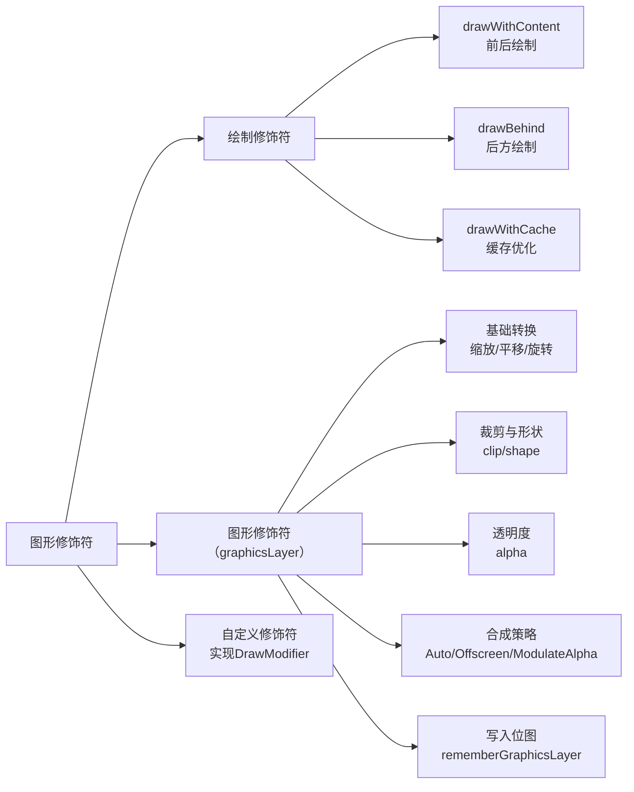

# 图形修饰符

原地址：<https://developer.android.google.cn/develop/ui/compose/graphics/draw/modifiers?hl=zh-cn>  
  
## 一、绘制修饰符  

Compose 提供三种核心绘制修饰符，用于在可组合项的不同位置执行自定义绘制操作：  

### 1. `drawWithContent`：控制绘制顺序  

- **功能**：在可组合项内容的前后添加自定义绘制逻辑，需显式调用 `drawContent()` 渲染原内容。  
- **场景**：实现叠加效果（如遮罩、渐变覆盖）。  
- **示例**：  

  ```kotlin  
  Column(
      modifier = Modifier
          .fillMaxSize()
          .drawWithContent {
              drawContent() // 先绘制原内容
              // 在内容上方绘制径向渐变（手电筒效果）
              drawRect(
                  Brush.radialGradient(
                      listOf(Color.Transparent, Color.Black),
                      center = pointerOffset,
                      radius = 100.dp.toPx()
                  )
              )
          }
  )  
  ```  

### 2. `drawBehind`：在内容后方绘制  

- **功能**：便捷封装 `drawWithContent`，确保自定义绘制位于内容后方（等价于 `drawWithContent` 中先执行自定义绘制再调用 `drawContent`）。  
- **场景**：绘制背景、阴影等底层元素。  
- **示例**：  

  ```kotlin  
  Text(
      "Hello Compose!",
      modifier = Modifier
          .drawBehind {
              // 在文本后方绘制圆角矩形背景
              drawRoundRect(Color(0xFFBBAAEE), cornerRadius = CornerRadius(10.dp.toPx()))
          }
          .padding(4.dp)
  )  
  ```  

### 3. `drawWithCache`：绘制缓存优化  

- **功能**：缓存绘制过程中创建的对象（如 `Brush`、`Path`），避免重复分配以提升性能。  
- **场景**：频繁绘制且对象不变的场景（如固定渐变背景）。  
- **注意**：仅在需要缓存时使用，避免不必要的 lambda 分配。  
- **示例**：  

  ```kotlin  
  Text(
      "Hello Compose!",
      modifier = Modifier.drawWithCache {
          // 缓存渐变 Brush，仅在尺寸变化时重新创建
          val brush = Brush.linearGradient(listOf(Color(0xFF9E82F0), Color(0xFF42A5F5)))
          onDrawBehind { drawRoundRect(brush, cornerRadius = 10.dp.toPx()) }
      }
  )  
  ```  

## 二、图形修饰符 `graphicsLayer`  

通过 `graphicsLayer` 将可组合项内容绘制到独立图层，支持多种转换和渲染优化：  

### 1. **基础转换**  

- **缩放（`scaleX/scaleY`）**：  

  ```kotlin  
  Image(
      modifier = Modifier.graphicsLayer { scaleX = 1.2f; scaleY = 0.8f },
      // 其他参数
  )  
  ```  

- **平移（`translationX/translationY`）**：  

  ```kotlin  
  Image(
      modifier = Modifier.graphicsLayer { translationX = 100.dp.toPx(); translationY = 10.dp.toPx() },
      // 其他参数
  )  
  ```  

- **旋转（`rotationX/rotationY/rotationZ`）**：  

  ```kotlin  
  Image(
      modifier = Modifier.graphicsLayer { rotationZ = 180f }, // 绕 Z 轴旋转 180 度
      // 其他参数
  )  
  ```  

- **原点（`transformOrigin`）**：指定转换中心点（默认 `(0.5f, 0.5f)`，即中心）：  

  ```kotlin  
  Image(
      modifier = Modifier.graphicsLayer { transformOrigin = TransformOrigin(0f, 0f) }, // 以左上角为原点
      // 其他参数
  )  
  ```  

### 2. **裁剪与形状（`clip/shape`）**  

- 启用 `clip = true` 并指定 `shape` 裁剪内容：  

  ```kotlin  
  Box(
      modifier = Modifier
          .size(200.dp)
          .graphicsLayer { clip = true; shape = CircleShape } // 裁剪为圆形
          .background(Color.Red)
  )  
  ```  

- **与 `Modifier.clip` 对比**：`graphicsLayer` 的裁剪仅影响绘制阶段，不改变布局边界；如需严格限制边界，需结合 `Modifier.clip`。  

### 3. **透明度（`alpha`）**  

设置图层整体透明度（`1.0f` 完全不透明，`0.0f` 不可见）：  

```kotlin  
Image(modifier = Modifier.graphicsLayer { alpha = 0.5f }, "其他参数")
```

### 4. **合成策略（`CompositingStrategy`）**  

控制图层与其他内容的合成方式，影响性能和渲染效果：  

- **`Auto`（默认）**：根据参数自动决定是否使用屏幕外缓冲区（如 `alpha < 1` 或有 `RenderEffect` 时启用）。  
- **`Offscreen`**：强制将内容渲染到屏幕外缓冲区，适用于混合模式（`BlendMode`）或复杂绘制（避免影响底层内容）：  

  ```kotlin  
  Image(
      modifier = Modifier.graphicsLayer { compositingStrategy = CompositingStrategy.Offscreen },
      // 其他参数
  )  
  ```  

- **`ModulateAlpha`**：调整每条绘制指令的 alpha 值，不创建缓冲区，适用于内容不重叠的高性能场景。  

## 三、将可组合项内容写入位图  

使用 `rememberGraphicsLayer()` 和 `drawWithContent` 将绘制内容捕获为位图：  

```kotlin  
val graphicsLayer = rememberGraphicsLayer()
Box(
    modifier = Modifier
        .drawWithContent {
            graphicsLayer.record { drawContent() } // 捕获内容到图层
            drawLayer(graphicsLayer) // 绘制图层到画布
        }
        .clickable {
            // 保存位图到磁盘
            val bitmap = graphicsLayer.toImageBitmap()
        }
) { Text("Hello Android") }  
```  

## 四、自定义绘制修饰符  

实现 `DrawModifier` 接口创建自定义修饰符，封装重复绘制逻辑：  

```kotlin  
// 垂直翻转修饰符  
class FlippedModifier : DrawModifier {
    override fun ContentDrawScope.draw() {
        scale(1f, -1f) { drawContent() } // 垂直翻转
    }
}  
fun Modifier.flipped() = then(FlippedModifier())  

// 使用示例  
Text("Hello Compose!", modifier = Modifier.flipped())  
```  

## 五、流程图（mermaid格式）  


