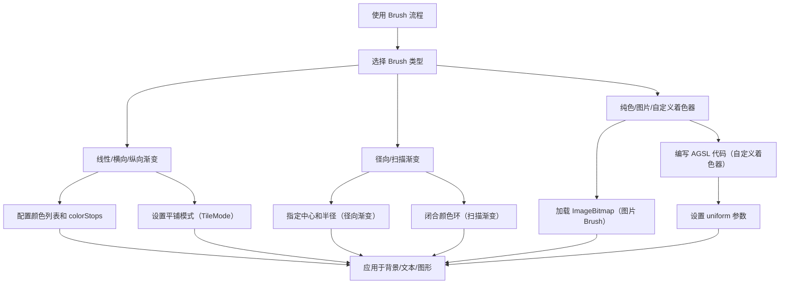

# Brush:渐变和着色器  

原地址：<https://developer.android.google.cn/develop/ui/compose/graphics/draw/brush?hl=zh-cn>  

## 一、Brush 基础概念  

### 1.1 核心作用  

- **定义**：`Brush` 用于描述图形的颜色填充方式，支持渐变、纯色、图片纹理甚至自定义着色器。  
- **应用场景**：  
  - 背景填充（`Modifier.background(brush)`）。  
  - 文本着色（`TextStyle(brush = ...)`）。  
  - 图形绘制（`drawCircle(brush)`、`drawRect(brush)`）。  

### 1.2 内置 Brush 类型  

| **类型**               | **构造方法**                          | **效果描述**                                                                 |  
|------------------------|---------------------------------------|-----------------------------------------------------------------------------|  
| **线性渐变**           | `Brush.linearGradient(colors)`         | 颜色沿直线方向渐变（需指定起点和终点，默认从左上到右下）。                     |  
| **横向渐变**           | `Brush.horizontalGradient(colors)`     | 颜色沿水平方向（x轴）渐变（起点左，终点右）。                                |  
| **纵向渐变**           | `Brush.verticalGradient(colors)`       | 颜色沿垂直方向（y轴）渐变（起点上，终点下）。                                |  
| **径向渐变**           | `Brush.radialGradient(colors)`         | 颜色从中心向四周辐射渐变（默认中心为区域中心）。                              |  
| **扫描渐变**           | `Brush.sweepGradient(colors)`          | 颜色沿环形扫描方向渐变（类似钟表刻度，需闭合颜色环以避免断层）。              |  
| **纯色**               | `Brush.solidColor(Color)`              | 单一颜色填充。                                                              |  

## 二、渐变 Brush 高级配置  

### 2.1 颜色分布控制（`colorStops`）  

- **作用**：自定义颜色在渐变中的位置（取值范围 `0f~1f`）。  
- **示例**：  

  ```kotlin  
  val colorStops = arrayOf(  
      0.0f to Color.Yellow,   // 0% 位置为黄色  
      0.5f to Color.Red,      // 50% 位置为红色  
      1.0f to Color.Blue      // 100% 位置为蓝色  
  )  
  Box(modifier = Modifier.background(  
      Brush.horizontalGradient(colors = listOf(Color.Yellow, Color.Red, Color.Blue), colorStops = colorStops)  
  ))  
  ```  

### 2.2 平铺模式（`TileMode`）  

- **作用**：控制渐变在超出绘制区域时的重复方式。  
- **类型**：  

  | **模式**       | **效果**                                                                 |  
  |----------------|--------------------------------------------------------------------------|  
  | `Repeated`     | 循环重复渐变图案（首尾颜色衔接）。                                        |  
  | `Mirror`       | 镜像重复渐变图案（正序+逆序交替）。                                        |  
  | `Clamp`        | 边缘颜色延伸填充剩余区域（默认模式）。                                    |  
  | `Decal`        | 仅渲染一次渐变，超出部分透明（API 31+ 支持）。                             |  

- **示例**：  

  ```kotlin  
  Brush.horizontalGradient(  
      colors = listOf(Color.Yellow, Color.Red),  
      endX = 50.dp.toPx(), // 渐变宽度为50dp  
      tileMode = TileMode.Repeated  
  )  
  ```  

### 2.3 动态大小适配  

- **场景**：当绘制区域大小不确定时，通过 `ShaderBrush` 动态计算渐变范围。  
- **示例**：  

  ```kotlin  
  val dynamicBrush = remember {  
      object : ShaderBrush() {  
          override fun createShader(size: Size): Shader {  
              return LinearGradientShader(  
                  colors = listOf(Color.Green, Color.Blue),  
                  from = Offset.Zero,  
                  to = Offset(size.width, 0f), // 铺满水平方向  
                  tileMode = TileMode.Mirror  
              )  
          }  
      }  
  }  
  Box(modifier = Modifier.background(dynamicBrush))  
  ```  

## 三、图片与自定义 Brush  

### 3.1 图片纹理 Brush  

- **实现方式**：通过 `ImageShader` 将位图作为填充纹理。  
- **应用场景**：  
  - 背景：`Modifier.background(ShaderBrush(ImageShader(imageBitmap)))`。  
  - 文本：`TextStyle(brush = ShaderBrush(ImageShader(imageBitmap)))`。  
  - 图形：`drawCircle(ShaderBrush(ImageShader(imageBitmap)))`。  
- **示例**：  

  ```kotlin  
  val dogImage = ImageBitmap.imageResource(R.drawable.dog)  
  Text(  
      text = "Hello",  
      style = TextStyle(  
          fontSize = 48.sp,  
          brush = ShaderBrush(ImageShader(dogImage))  
      )  
  )  
  ```  

### 3.2 自定义着色器（AGSL RuntimeShader）  

- **作用**：使用 GLSL 风格的着色器语言（AGSL）编写自定义渲染逻辑。  
- **步骤**：  
  1. 定义 AGSL 着色器代码（通过 `@Language("AGSL")` 声明）。  
  2. 创建 `RuntimeShader` 并设置 `uniform` 参数（如颜色、分辨率）。  
  3. 通过 `ShaderBrush` 应用着色器。  
- **示例**：  

  ```kotlin  
  @Language("AGSL")  
  val CUSTOM_SHADER = """  
      uniform float2 resolution;  
      uniform half4 color1;  
      uniform half4 color2;  
      half4 main(in float2 fragCoord) {  
          float ratio = fragCoord.x / resolution.x;  
          return mix(color1, color2, ratio); // 水平线性渐变  
      }  
  """.trimIndent()  

  @Composable  
  fun CustomShaderExample() {  
      Box(modifier = Modifier.fillMaxSize()) {  
          val shader = remember { RuntimeShader(CUSTOM_SHADER) }  
          shader.setFloatUniform("resolution", size.width, size.height)  
          shader.setColorUniform("color1", Color.Red.toArgb())  
          shader.setColorUniform("color2", Color.Blue.toArgb())  
          drawBehind { drawRect(ShaderBrush(shader)) }  
      }  
  }  
  ```  

## 四、流程图  



## 五、关键总结  

| **功能**               | **核心 API**                                  | **示例代码**                                                                 | **注意事项**                              |  
|------------------------|---------------------------------------------|-----------------------------------------------------------------------------|-----------------------------------------|  
| 横向渐变               | `Brush.horizontalGradient(colors)`          | `Modifier.background(Brush.horizontalGradient(listOf(Color.Red, Color.Blue)))` | 可通过 `endX` 控制渐变宽度               |  
| 径向渐变               | `Brush.radialGradient(colors, center, radius)`| `drawCircle(Brush.radialGradient(colors, center = Offset.Zero, radius = 100.dp.toPx()))` | `radius` 需根据区域大小动态计算          |  
| 图片纹理填充           | `ShaderBrush(ImageShader(imageBitmap))`       | `Text(style = TextStyle(brush = ShaderBrush(ImageShader(imageBitmap))))`       | 位图尺寸影响渲染性能，建议预处理         |  
| 自定义着色器           | `RuntimeShader(agslCode)`                    | 见 [3.2 节示例](#32-自定义着色器agsl-runtimeshader)                          | 仅支持 Android 13+，需添加版本检查       |  
| 颜色分布控制           | `colorStops = arrayOf(0f to Color.Red, 1f to Color.Blue)` | `Brush.linearGradient(colors, colorStops = colorStops)`                     | 值必须在 0f~1f 之间，否则无效           |  
| 平铺模式               | `tileMode = TileMode.Repeated`                | `Brush.verticalGradient(colors, tileMode = TileMode.Mirror)`                 | `Decal` 模式需 API 31+，需调用 `isSupported()` |  

**性能建议**：  

- 缓存 `ShaderBrush` 和 `RuntimeShader` 对象（通过 `remember`），避免重复创建。  
- 复杂渐变或图片纹理时，优先使用 `drawWithCache` 修饰符缓存绘制结果。  
- 自定义着色器时，尽量减少 `uniform` 参数数量，避免频繁触发重绘。
