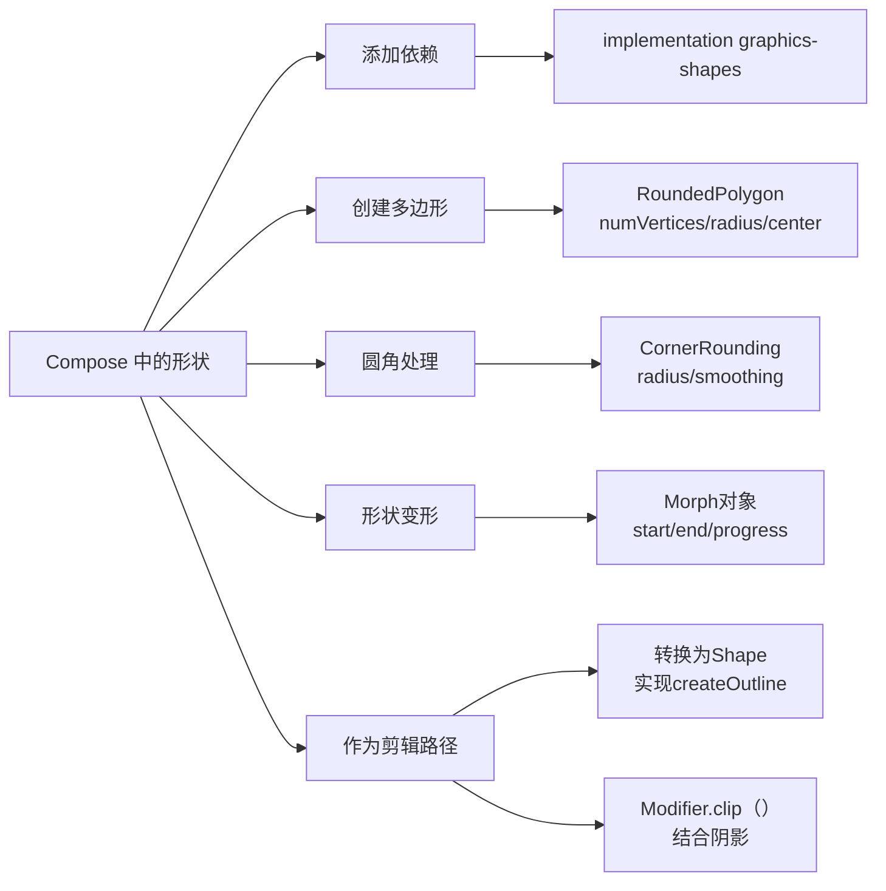

# Compose 中的形状  

原地址：<https://developer.android.google.cn/develop/ui/compose/graphics/draw/shapes?hl=zh-cn>  

## 一、图形形状库 `graphics-shapes`  

### 1. 依赖添加  

在 `app/build.gradle` 中引入依赖：  

```gradle  
implementation "androidx.graphics:graphics-shapes:1.0.1"  
```  

**作用**：用于创建由多边形组成的自定义形状，支持圆角处理和形状变形。  
**与内置形状区别**：独立于 Compose 内置形状（如 `RoundedCornerShape`），需手动转换为 `Path` 后用于 Compose。  

## 二、创建多边形形状（`RoundedPolygon`）  

### 1. 基础用法  

通过 `RoundedPolygon` 类定义多边形，参数包括：  

- `numVertices`：顶点数（如 3 为三角形，6 为六边形）。  
- `radius`：多边形中心到顶点的距离（决定大小）。  
- `centerX/centerY`：多边形中心位置（默认 `0, 0`）。  

**示例：绘制蓝色六边形**  

```kotlin  
Box(
    modifier = Modifier
        .drawWithCache {
            // 创建六边形（6 个顶点）
            val roundedPolygon = RoundedPolygon(
                numVertices = 6,
                radius = size.minDimension / 2, // 半径为容器最小边长的一半
                centerX = size.width / 2,
                centerY = size.height / 2
            )
            // 转换为 Compose 可绘制的 Path
            val path = roundedPolygon.toPath().asComposePath()
            onDrawBehind { drawPath(path, color = Color.Blue) }
        }
        .fillMaxSize()
)  
```  

## 三、圆角处理（`CornerRounding`）  

通过 `CornerRounding` 参数为多边形顶点添加圆角，包含两个属性：  

### 1. `radius`（半径）  

- **作用**：圆角的圆形半径，值越大圆角越明显。  
- **示例：圆角三角形**  

  ```kotlin  
  RoundedPolygon(
      numVertices = 3,
      radius = size.minDimension / 2,
      rounding = CornerRounding(radius = size.minDimension / 10f) // 半径为容器边长的 1/10
  )  
  ```  

### 2. `smoothing`（平滑度）  

- **范围**：`0f`（默认）~ `1f`。  
- **效果**：  
  - `0f`：纯圆形圆角（单条立方曲线）。  
  - `>0f`：通过三条立方曲线过渡，平滑连接圆角与边缘。  
- **示例：调整平滑度**  

  ```kotlin  
  RoundedPolygon(
      numVertices = 3,
      rounding = CornerRounding(radius = 20f, smoothing = 0.5f) // 平滑度 0.5  
  )  
  ```  

## 四、尺寸与位置调整  

### 1. 直接参数调整  

- **`radius`**：增大半径可放大多边形（圆角会使实际尺寸略小于半径值）。  
- **`centerX/centerY`**：修改中心点坐标以移动位置。  

### 2. 转换函数（`DrawScope`）  

通过 `translate()`、`scale()` 等函数动态调整：  

```kotlin  
onDrawBehind {
    translate(xy = Offset(size.width/2, size.height/2)) { // 平移至中心
        scale(scaleX = 0.8f, scaleY = 1.2f) { // 缩放
            drawPath(roundedPolygon.toPath().asComposePath())
        }
    }
}  
```  

## 五、形状变形（`Morph`）  

### 1. 基本原理  

使用 `Morph` 对象在两个 `RoundedPolygon` 之间创建动画过渡，通过 `progress` 值（`0` 到 `1`）控制变形进度。  

### 2. 示例：三角形与正方形变形  

```kotlin  
// 定义起始形状（圆角三角形）和结束形状（正方形）
val triangle = RoundedPolygon(numVertices = 3, rounding = CornerRounding(5f))
val square = RoundedPolygon(numVertices = 4)
val morph = Morph(start = triangle, end = square)

// 渲染中间状态（progress = 0.5）
val path = morph.toPath(progress = 0.5f).asComposePath()
drawPath(path, color = Color.Black)  
```  

### 3. 动画实现  

结合 Compose 动画 API（如 `rememberInfiniteTransition`）创建无限循环动画：  

```kotlin  
val infiniteTransition = rememberInfiniteTransition()
val progress by infiniteTransition.animateFloat(
    initialValue = 0f,
    targetValue = 1f,
    animationSpec = infiniteRepeatable(tween(500), RepeatMode.Reverse)
)

// 在 drawWithCache 中使用 progress 值
val path = morph.toPath(progress = progress).asComposePath()  
```  

## 六、作为剪辑路径使用  

### 1. 转换为 `Shape`  

通过实现 `Shape` 接口将 `RoundedPolygon` 转换为 Compose 剪裁形状：  

```kotlin  
class RoundedPolygonShape(private val polygon: RoundedPolygon) : Shape {
    override fun createOutline(
        size: Size, layoutDirection: LayoutDirection, density: Density
    ): Outline {
        val path = polygon.toPath().asComposePath()
        // 适配容器尺寸
        val bounds = polygon.calculateBounds()
        path.transform(Matrix().apply {
            scale(size.width / bounds.width, size.height / bounds.height)
            translate(-bounds.left, -bounds.top)
        })
        return Outline.Generic(path)
    }
}  
```  

### 2. 应用剪裁  

使用 `Modifier.clip()` 结合自定义形状：  

```kotlin  
val hexagonShape = remember { RoundedPolygonShape(RoundedPolygon(numVertices = 6)) }

Box(
    modifier = Modifier
        .clip(hexagonShape) // 剪裁为六边形
        .background(Color.Red)
        .size(200.dp)
) {
    Text("Hello Compose", modifier = Modifier.align(Alignment.Center))
}  
```  

### 3. 结合阴影效果  

通过 `graphicsLayer` 添加阴影：  

```kotlin  
Image(
    painter = painterResource(id = R.drawable.dog),
    modifier = Modifier
        .size(200.dp)
        .graphicsLayer {
            shape = hexagonShape // 剪裁形状
            clip = true
            shadowElevation = 6.dp.toPx() // 阴影高度
        }
)  
```  

## 七、注意事项  

- **适用场景**：仅支持多边形形状之间的变形，不适用任意路径（如图标变形需用 `AnimatedVectorDrawables`）。  
- **性能**：复杂形状或高频率动画可能影响性能，建议简化顶点数或使用缓存。  

## 八、流程图（mermaid格式）  


