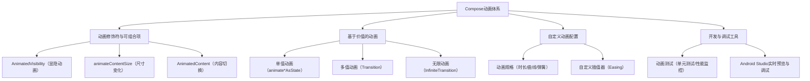

# Compose 中的动画  

原地址：<https://developer.android.google.cn/develop/ui/compose/animation/introduction?hl=zh-cn>  

## 一、动画核心分类与工具  

Compose 动画体系分为 **界面状态动画** 和 **值驱动动画**，提供模块化工具实现流畅过渡效果。  

### 1.1 动画修饰符与可组合项  

通过内置组件直接实现常见动画场景，无需手动处理状态变化。  

#### 1.1.1 显隐动画：`AnimatedVisibility`  

- **作用**：控制组件的显示与隐藏，并自动添加过渡动画（如渐入渐出、缩放等）。  
- **核心参数**：  
  - `visible`：布尔值控制显示状态。  
  - `enter/exit`：自定义进入/退出动画（如 `fadeIn()`、`slideInHorizontally()`）。  

#### 1.1.2 尺寸变化动画：`animateContentSize()`  

- **作用**：自动为组件大小变化（如展开/折叠）添加动画，无需手动计算尺寸差值。  
- **应用场景**：列表项展开、对话框弹出等内容尺寸动态变化的场景。  

#### 1.1.3 内容切换动画：`AnimatedContent`  

- **作用**：在不同内容（如文本、图标）切换时添加过渡效果（如渐变、位移、缩放）。  
- **核心逻辑**：检测内容变化（通过 `key` 参数），自动应用指定动画（如 `sizeIn()`、`fade()`）。  

### 1.2 基于价值的动画  

通过数值驱动实现细粒度动画控制，适用于自定义交互或复杂过渡。  

#### 1.2.1 单值动画：`animate*AsState`  

- **作用**：为单个属性（如透明度、偏移量、颜色）创建动画状态。  
- **常用函数**：  
  - `animateFloatAsState`：浮动值动画（如 `alpha`、`scale`）。  
  - `animateColorAsState`：颜色过渡动画。  
  - `animateDpAsState`：尺寸值动画（如 `width`、`height`）。  
- **示例**：  

  ```kotlin  
  val alpha by animateFloatAsState(targetValue = if (isHovered) 1f else 0.5f)  
  Box(modifier = Modifier.alpha(alpha))  
  ```  

#### 1.2.2 多值联动动画：`Transition`  

- **作用**：同步控制多个属性的动画（如同时改变位置、缩放和颜色）。  
- **实现步骤**：  
  1. 定义状态枚举（如 `State.Active`、`State.Inactive`）。  
  2. 为每个状态配置目标值（如 `transition[State.Active].value = 1f`）。  
  3. 通过 `animateValue` 关联属性与状态过渡。  

#### 1.2.3 无限循环动画：`InfiniteTransition`  

- **作用**：创建持续循环的动画（如加载进度、呼吸效果）。  
- **核心方法**：  
  - `animateFloat`：定义循环的浮点值（如从 0 到 1 重复）。  
  - `repeatable`：配置循环模式（次数、反向等）。  

  ```kotlin  
  val infiniteTransition = rememberInfiniteTransition()  
  val progress by infiniteTransition.animateFloat(  
      initialValue = 0f,  
      targetValue = 1f,  
      animationSpec = infiniteRepeatable(animation = tween(1000))  
  )  
  ```  

### 1.3 自定义动画配置  

#### 1.3.1 动画规格（`AnimationSpec`）  

- **时长与曲线**：  
  - `tween(durationMs = 300, easing = LinearEasing)`：线性动画。  
  - `spring(stiffness = Spring.Stiffness.High)`：弹簧效果（需导入 `androidx.compose.animation.spring`）。  
- **延迟与重复**：  
  - `delayMillis`：动画延迟启动时间。  
  - `repeatCount`：重复次数（配合 `InfiniteTransition` 实现无限循环）。  

#### 1.3.2 自定义插值器  

- **作用**：通过 `Easing` 接口自定义动画曲线（如弹性、抛物线效果）。  

  ```kotlin  
  val bounceEasing = object : Easing {  
      override fun transform(fraction: Float): Float {  
          // 自定义弹性曲线逻辑  
      }  
  }  
  ```  

## 二、开发与调试工具  

### 2.1 动画测试  

- **单元测试**：使用 `ComposeTestRule` 检测动画状态变化，验证过渡逻辑是否正确。  
- **性能测试**：通过 Android Profiler 监控动画帧速率（FPS），优化卡顿问题。  

### 2.2 Android Studio 支持  

- **实时预览**：在 Android Studio 的 Canvas 面板中实时查看动画效果，无需运行应用。  
- **动画调试器**：暂停动画帧，逐帧检查组件状态和属性变化。  

## 三、流程图  



## 四、关键总结  

| **场景**               | **推荐工具**                | **核心特性**                                                                 |  
|------------------------|-----------------------------|-----------------------------------------------------------------------------|  
| 组件显隐               | `AnimatedVisibility`        | 自动处理显示/隐藏状态，支持自定义进入/退出动画。                            |  
| 内容尺寸变化           | `animateContentSize()`      | 无需手动计算尺寸，自动为布局变化添加过渡动画。                              |  
| 多状态过渡             | `Transition`                | 同步控制多个属性，支持状态枚举与值映射。                                    |  
| 无限循环动画           | `InfiniteTransition`        | 支持重复动画与自定义循环逻辑，适用于加载指示器等场景。                      |  
| 弹性/物理效果          | `spring()` 动画规格         | 通过弹簧参数（`stiffness`、`dampingRatio`）模拟真实物理运动。               |  
| 开发调试               | Android Studio 实时预览     | 在设计阶段快速验证动画效果，减少运行调试成本。                              |  

**最佳实践**：  

- 优先使用内置组件（如 `AnimatedVisibility`）实现基础动画，减少自定义代码量。  
- 复杂动画场景通过 `Transition` 解耦状态与动画逻辑，提升可维护性。  
- 避免过度使用无限循环动画，以免影响电池续航和性能。
