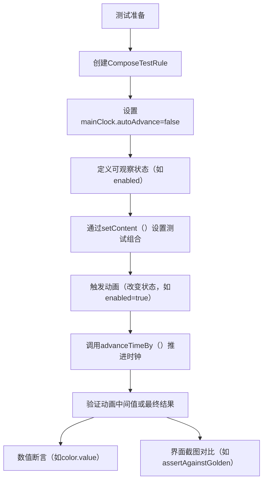

# 测试动画

原地址：<https://developer.android.google.cn/develop/ui/compose/animation/testing?hl=zh-cn>

## 一、核心知识点总结

### （一）测试工具：ComposeTestRule

- **作用**：提供确定性方式编写动画测试，完全控制测试时钟，可验证中间动画值，加速测试运行。
- **关键组件**：
  - **`mainClock`**：暴露测试时钟，用于控制动画时间推进。
  - **`autoAdvance`**：属性默认值为`true`，设为`false`时可手动控制时钟推进。

### （二）时钟控制流程

1. **暂停自动推进**：将`mainClock.autoAdvance`设为`false`，阻止动画自动运行。
2. **触发动画**：通过改变状态（如`mutableStateOf`）触发动画逻辑。
3. **手动推进时间**：使用`advanceTimeBy(milliseconds)`按指定时长推进时钟，验证动画中间状态。
   - **注意**：`advanceTimeBy`会将时间向上舍入为最接近的帧时长倍数（非精确值）。

### （三）测试步骤示例

```kotlin
@get:Rule 
val rule = createComposeRule() // 创建测试规则

@Test
fun testAnimationWithClock() {
    // 1. 暂停动画自动推进
    rule.mainClock.autoAdvance = false 
    var enabled by mutableStateOf(false) // 定义状态变量

    // 2. 设置测试组合内容
    rule.setContent {
        val color by animateColorAsState(
            targetValue = if (enabled) Color.Red else Color.Green,
            animationSpec = tween(durationMillis = 250) // 动画规范：250ms渐变
        )
        Box(Modifier.size(64.dp).background(color)) // 渲染带颜色的Box
    }

    // 3. 触发动画（改变状态）
    enabled = true 

    // 4. 手动推进时间（例如：50ms）
    rule.mainClock.advanceTimeBy(50L) 

    // 5. 验证中间状态（示例：对比截图与预期结果）
    rule.onRoot().captureToImage().assertAgainstGolden() 
    // 需自定义assertAgainstGolden()方法进行图片断言
}
```

### （四）关键注意事项

1. **时间精度**：`advanceTimeBy`不保证精确时长，依赖系统帧时长（如60fps时约16ms/帧）。
2. **状态驱动**：动画需通过可观察状态（如`mutableStateOf`）触发，确保测试可复现。
3. **断言方式**：除图片对比外，还可直接获取动画中间值（如`color.value`）进行数值断言。

## 二、流程图


