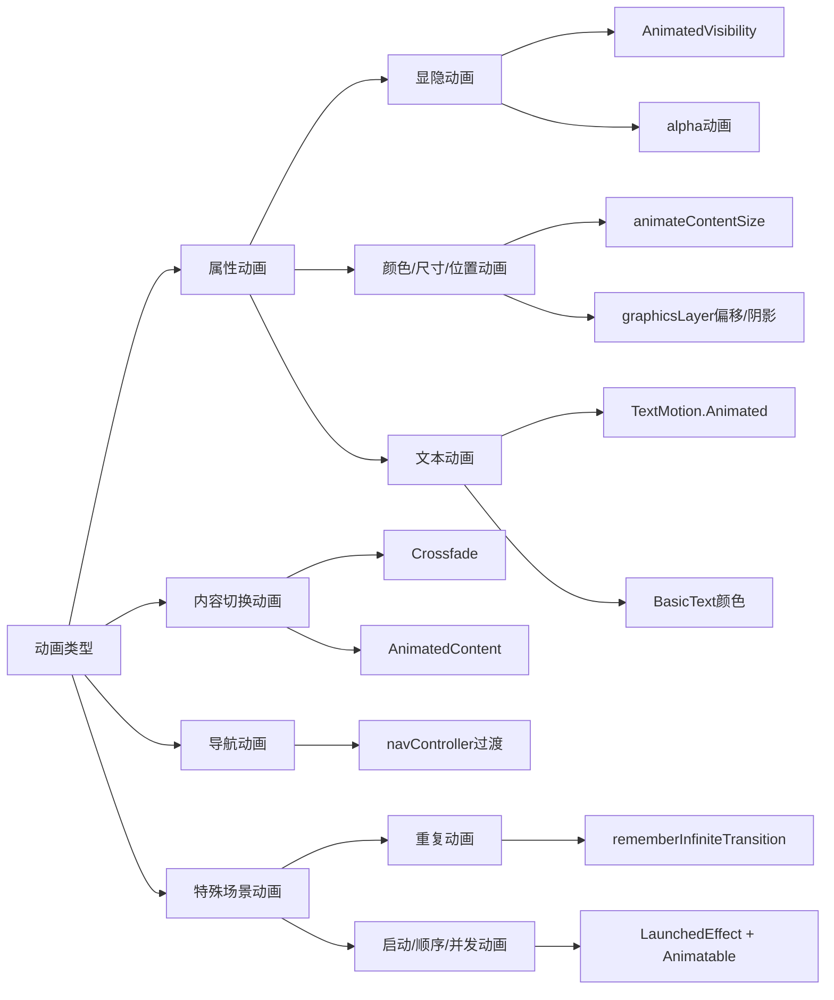

# Compose 中的动画快速指南  

原地址：<https://developer.android.google.cn/develop/ui/compose/animation/quick-guide?hl=zh-cn>  

## 一、常见属性动画  

### 1. 出现/消失动画  

- **方案1：`AnimatedVisibility`**  
  - 自动处理组件从组合中添加/移除，支持进入/退出过渡。  
  - **示例**：  

    ```kotlin  
    var visible by remember { mutableStateOf(true) }  
    AnimatedVisibility(visible) { Text("Hello") }  
    ```  

- **方案2：`animateFloatAsState` + `alpha`**  
  - 仅改变透明度，组件保留在布局中（需手动管理显示状态）。  
  - **示例**：  

    ```kotlin  
    val alpha by animateFloatAsState(if (visible) 1f else 0f)  
    Box(modifier = Modifier.graphicsLayer { alpha = alpha })  
    ```  

### 2. 背景颜色动画  

- 使用 `animateColorAsState` 直接驱动颜色变化，避免 `Modifier.background` 导致的不必要重组。  

  ```kotlin  
  val color by animateColorAsState(targetColor)  
  Box(modifier = Modifier.drawBehind { drawRect(color) })  
  ```  

### 3. 大小动画  

- **简单尺寸变化**：`Modifier.animateContentSize()`（自动处理布局变化）。  

  ```kotlin  
  Box(modifier = Modifier.animateContentSize().height(if (expanded) 400.dp else 200.dp))  
  ```  

- **复杂尺寸变换**：`AnimatedContent` + `SizeTransform`。  

### 4. 位置动画  

- **局部偏移**：`Modifier.offset` + `animateIntOffsetAsState`（不影响父布局）。  

  ```kotlin  
  val offset by animateIntOffsetAsState(targetOffset)  
  Box(modifier = Modifier.offset(offset))  
  ```  

- **全局布局影响**：`Modifier.layout`（通知父布局重新计算位置）。  

### 5. 内边距/高度动画  

- **内边距**：`animateDpAsState` + `Modifier.padding`。  
- **高度/阴影**：`graphicsLayer.shadowElevation` + `animateDpAsState`。  

### 6. 文本动画  

- **缩放/旋转/平移**：`Modifier.graphicsLayer` + `TextMotion.Animated`（优化文本过渡）。  

  ```kotlin  
  Text(  
      text = "Hello",  
      style = LocalTextStyle.current.copy(textMotion = TextMotion.Animated),  
      modifier = Modifier.graphicsLayer { scaleX = scale; scaleY = scale }  
  )  
  ```  

- **颜色动画**：`BasicText` + 动态 `color` lambda。  

## 二、内容切换与导航动画  

### 1. 内容切换动画  

- **简单淡入淡出**：`Crossfade`。  
- **自定义过渡**：`AnimatedContent`（支持进入/退出动画组合）。  

  ```kotlin  
  AnimatedContent(state) { targetState ->  
      when (targetState) { /* 不同状态的组件 */ }  
  }  
  ```  

### 2. 导航动画（`navigation-compose`）  

- 在 `NavHost` 或 `composable` 中设置 `enterTransition`/`exitTransition`。  

  ```kotlin  
  NavHost(  
      enterTransition = { fadeIn() + slideIntoContainer(Start) },  
      exitTransition = { fadeOut() + slideOutOfContainer(End) }  
  )  
  ```  

## 三、特殊场景动画  

### 1. 重复动画  

- **无限循环**：`rememberInfiniteTransition` + `infiniteRepeatable`。  

  ```kotlin  
  val color by infiniteTransition.animateColor(  
      initialValue = Color.Green,  
      targetValue = Color.Blue,  
      animationSpec = infiniteRepeatable(tween(1000), RepeatMode.Reverse)  
  )  
  ```  

- **有限次数**：`finiteRepeatable`。  

### 2. 启动动画  

- 使用 `LaunchedEffect` 在组件进入组合时触发动画（配合 `Animatable`）。  

  ```kotlin  
  val alphaAnim = remember { Animatable(0f) }  
  LaunchedEffect(Unit) { alphaAnim.animateTo(1f) }  
  ```  

### 3. 顺序与并发动画  

- **顺序动画**：依次调用 `animateTo`（挂起函数，前一个完成后执行下一个）。  
- **并发动画**：使用协程 `launch` 同时启动多个动画。  

  ```kotlin  
  LaunchedEffect {  
      launch { alphaAnim.animateTo(1f) }  
      launch { yAnim.animateTo(100f) }  
  }  
  ```
  
  您可以使用 `updateTransition` API使用相同的状态同时驱动许多不同的属性动画。以下示例为由状态更改控制的两个属性（rect 和 borderWidth）添加了动画效果：

    ```kotlin
    var currentState by remember { mutableStateOf(BoxState.Collapsed) }
    val transition = updateTransition(currentState, label = "transition")

    val rect by transition.animateRect(label = "rect") { state ->
        when (state) {
            BoxState.Collapsed -> Rect(0f, 0f, 100f, 100f)
            BoxState.Expanded -> Rect(100f, 100f, 300f, 300f)
        }
    }
    val borderWidth by transition.animateDp(label = "borderWidth") { state ->
        when (state) {
            BoxState.Collapsed -> 1.dp
            BoxState.Expanded -> 0.dp
        }
    }
    ```

## 四、性能优化建议  

1. **优先绘制阶段动画**：使用 `Modifier.graphicsLayer` 或修饰符的 lambda 版本，避免触发布局重组。  
2. **避免过度重组**：将动画状态提升到延迟布局外（如列表项动画）。  
3. **选择合适动画规格**：  
   - `spring`：物理效果，默认选项（自然流畅）。  
   - `tween`：固定时长，配合 `Easing` 函数。  
   - `keyframes`：自定义关键帧值。  
   - `snap`：立即跳转，无动画。  

## 五、流程图（mermaid）  



## 六、核心API对比  

| **场景**               | **推荐API**                  | **优势**                          |  
|------------------------|-----------------------------|-----------------------------------|  
| 组件显隐               | `AnimatedVisibility`        | 自动管理组合生命周期              |  
| 背景颜色渐变           | `animateColorAsState`       | 低重组成本                        |  
| 布局尺寸变化           | `animateContentSize`        | 自动处理布局过渡                  |  
| 文本缩放/旋转          | `graphicsLayer + TextMotion`| 优化文本渲染性能                  |  
| 无限循环动画           | `rememberInfiniteTransition`| 简洁的循环逻辑                    |  
| 导航页面过渡           | `enterTransition/exitTransition` | 与导航组件深度集成 |  
| 手势驱动动画           | `Animatable + animateTo`    | 灵活控制动画过程                  |  

通过以上指南，可快速根据需求选择合适的 Compose 动画方案，平衡开发效率与性能表现。
