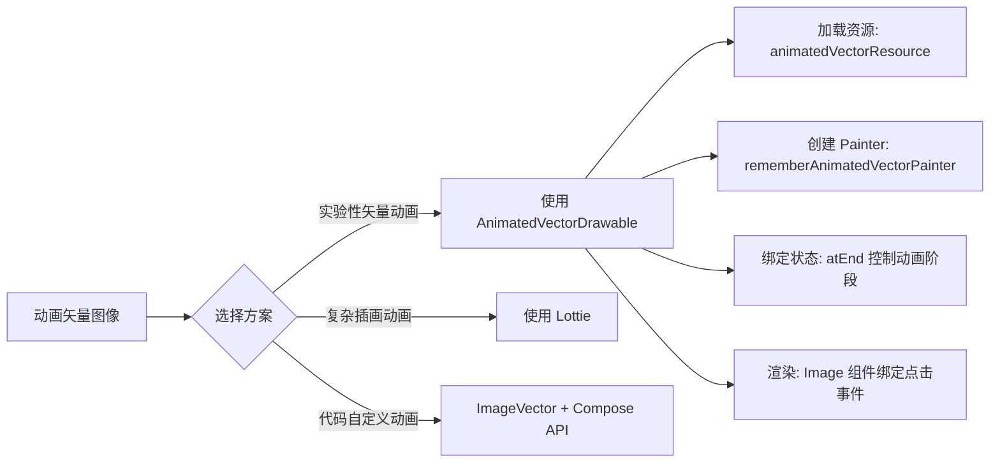

# Compose 中的动画矢量图像  

原地址：<https://developer.android.google.cn/develop/ui/compose/animation/vectors?hl=zh-cn>  

## 一、动画矢量图像实现方式  

Compose 支持以下几种矢量图像动画方案：  

1. **`AnimatedVectorDrawable`（实验性）**：使用 XML 定义矢量动画，通过 Compose 内置 API 加载和控制。  
2. **`ImageVector` 结合 Compose 动画 API**：通过代码动态操作矢量路径（参考 [Medium](https://medium.com/androiddevelopers/making-jellyfish-move-in-compose-animating-imagevectors-and-applying-agsl-rendereffects-3666596a8888) 文章，文档未详述）。  
3. **第三方库（如 Lottie）**：适用于复杂动画场景（文档未展开）。  

## 二、`AnimatedVectorDrawable` 详解  

### 1. 核心概念  

- **文件格式**：基于 XML 定义矢量图形的属性变化（如路径、颜色、旋转等），类似 Android 传统 `AnimatedVectorDrawable`。  
- **实验性支持**：当前为实验性功能，可能存在限制。  

### 2. 关键 API  

- **`animatedVectorResource`**：加载动画矢量资源文件（如 `ic_hourglass_animated.xml`）。  
- **`rememberAnimatedVectorPainter`**：创建用于渲染动画矢量的 `Painter`，接受资源和状态参数。  

### 3. 示例代码  

```kotlin  
@Composable  
fun AnimatedVectorDrawableDemo() {  
    // 1. 加载动画矢量资源  
    val animatedVector = AnimatedImageVector.animatedVectorResource(R.drawable.ic_hourglass_animated)  
    // 2. 声明动画状态（是否结束）  
    var atEnd by remember { mutableStateOf(false) }  
    // 3. 创建动画 Painter  
    val painter = rememberAnimatedVectorPainter(animatedVector, atEnd)  
    // 4. 渲染图像并绑定点击事件切换状态  
    Image(  
        painter = painter,  
        contentDescription = "Timer",  
        modifier = Modifier.clickable { atEnd = !atEnd },  
        contentScale = ContentScale.Crop  
    )  
}  
```  

### 4. 交互逻辑  

- **状态控制**：通过 `atEnd` 布尔值控制动画的起始和结束状态（`true` 表示动画结束状态）。  
- **点击事件**：点击图像时切换 `atEnd` 状态，触发动画播放。  

## 三、其他方案说明  

1. **`ImageVector` 自定义动画**：  
   - 通过 Compose 的动画 API（如 `animateFloatAsState`）动态修改 `ImageVector` 的路径参数（需自行实现插值逻辑）。  
2. **Lottie 动画**：  
   - 使用 `LottieComposition` 和 `AnimatedLottieComposition` 组件，适用于复杂插画动画（需引入第三方库）。  

## 四、流程图（mermaid）  



## 五、注意事项  

- **实验性限制**：`AnimatedVectorDrawable` 在 Compose 中可能存在兼容性问题，建议用于简单场景。  
- **性能考量**：复杂矢量动画可能影响帧率，优先使用硬件加速或简化动画路径。  
- **资源路径**：确保动画矢量文件放置在 `drawable` 目录，并正确引用资源 ID。
