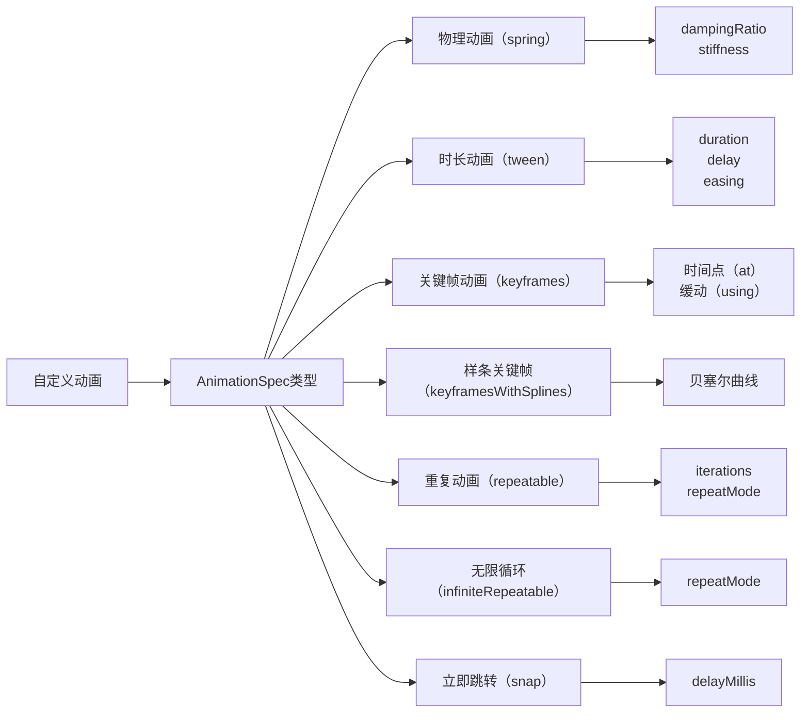

# 自定义动画  

原地址：<https://developer.android.google.cn/develop/ui/compose/animation/customize?hl=zh-cn>  

## 一、`AnimationSpec` 核心概念  

`AnimationSpec` 是 Compose 中自定义动画行为的核心参数，用于控制动画的时间、物理特性、插值方式等。  
**作用**：  

- 定义动画的时间规格（如时长、延迟）。  
- 配置物理特性（如弹簧阻尼、刚度）。  
- 控制值的插值方式（如缓动函数、关键帧）。  

**适用场景**：  

- `animate*AsState`、`updateTransition`、`rememberInfiniteTransition` 等动画 API。  

## 二、动画规格类型  

### 1. **`spring`：基于物理的动画**  

**特点**：模拟弹簧物理效果，支持中断时保持速度连续性。  
**参数**：  

- `dampingRatio`（阻尼比）：控制弹簧振动幅度（默认 `Spring.DampingRatioNoBouncy`）。  
  - `DampingRatioHighBouncy`：高弹性，振动明显。  
  - `DampingRatioLowBouncy`：低弹性，快速停止。  
- `stiffness`（刚度）：控制弹簧趋近目标值的速度（默认 `Spring.StiffnessMedium`）。  

**示例**：  

```kotlin  
val value by animateFloatAsState(  
    targetValue = 1f,  
    animationSpec = spring(  
        dampingRatio = Spring.DampingRatioHighBouncy,  
        stiffness = Spring.StiffnessLow  
    )  
)  
```  

**场景**：按钮点击回弹、列表项拖动释放动画。  

### 2. **`tween`：基于时长的补间动画**  

**特点**：在指定时长内通过缓动函数平滑过渡。  
**参数**：  

- `durationMillis`：总时长（必填）。  
- `delayMillis`：延迟启动时间（可选）。  
- `easing`：缓动函数（默认 `LinearEasing`）。  

**示例**：  

```kotlin  
val value by animateFloatAsState(  
    targetValue = 1f,  
    animationSpec = tween(  
        durationMillis = 300,  
        delayMillis = 50,  
        easing = FastOutSlowInEasing  
    )  
)  
```  

**内置缓动函数**：  

- `FastOutSlowInEasing`：先快后慢  
- `LinearOutSlowInEasing`：开始线性，结束缓慢  
- `CubicBezierEasing`：自定义贝塞尔曲线  

### 3. **`keyframes`：关键帧动画**  

**特点**：在特定时间点（毫秒或比例）设置值，支持不同缓动。  
**参数**：  

- `durationMillis`：总时长。  
- `at`：时间点（如 `0ms`、`15ms` 或 `0.5f` 比例）。  
- `using`：该关键帧的缓动函数。  

**示例**：  

```kotlin  
val value by animateFloatAsState(  
    targetValue = 1f,  
    animationSpec = keyframes {  
        durationMillis = 375  
        0.2f at 15 using FastOutLinearInEasing // 15ms 时达到 0.2f  
        0.4f at 75 // 75ms 时达到 0.4f（默认缓动）  
    }  
)  
```  

### 4. **`keyframesWithSplines`：样条曲线关键帧**  

**特点**：使用贝塞尔曲线实现平滑过渡，适合复杂路径动画（如抛物线移动）。  
**示例**：  

```kotlin  
val offset by animateOffsetAsState(  
    targetValue = Offset(300f, 300f),  
    animationSpec = keyframesWithSplines {  
        durationMillis = 6000  
        Offset(0f, 0f) at 0  
        Offset(150f, 200f) atFraction 0.5f // 50% 进度时到达该点  
    }  
)  
```  

### 5. **重复动画规格**  

- **`repeatable`**：指定次数重复动画。  

  ```kotlin  
  val value by animateFloatAsState(  
      targetValue = 1f,  
      animationSpec = repeatable(  
          iterations = 3,  
          animation = tween(300),  
          repeatMode = RepeatMode.Reverse // 来回重复  
      )  
  )  
  ```  

- **`infiniteRepeatable`**：无限循环动画（测试环境中可能不运行）。  

  ```kotlin  
  val color by rememberInfiniteTransition().animateColor(  
      initialValue = Color.Red,  
      targetValue = Color.Blue,  
      animationSpec = infiniteRepeatable(tween(1000), RepeatMode.Reverse)  
  )  
  ```  

### 6. **`snap`：立即跳转**  

**特点**：无动画，直接切换值（可添加延迟）。  

```kotlin  
val value by animateFloatAsState(  
    targetValue = 1f,  
    animationSpec = snap(delayMillis = 50) // 延迟 50ms 后立即跳转  
)  
```  

## 三、自定义缓动函数  

**实现方式**：  
创建 `Easing` 对象，定义输入值（`fraction`，0-1）到输出值的映射。  

```kotlin  
val CustomEasing = Easing { fraction ->  
    fraction * fraction // 二次方加速  
}  

// 使用示例  
val value by animateFloatAsState(  
    targetValue = 1f,  
    animationSpec = tween(300, easing = CustomEasing)  
)  
```  

**内置缓动**：  

- `LinearEasing`：线性过渡  
- `FastOutSlowInEasing`：符合 Material Design 规范的标准缓动  

## 四、自定义数据类型动画  

**核心原理**：  
通过 `TwoWayConverter` 将自定义类型与 `AnimationVector` 相互转换。  
**步骤**：  

1. **定义自定义类型**：  

   ```kotlin  
   data class MySize(val width: Dp, val height: Dp)  
   ```  

2. **创建转换器**：  

   ```kotlin  
   val MySizeConverter: TwoWayConverter<MySize, AnimationVector2D> = TwoWayConverter(  
       convertToVector = { size -> AnimationVector2D(size.width.value, size.height.value) },  
       convertFromVector = { vector -> MySize(vector.v1.dp, vector.v2.dp) }  
   )  
   ```  

3. **应用动画**：  

   ```kotlin  
   val animSize by animateValueAsState(  
       targetValue = MySize(200.dp, 100.dp),  
       converter = MySizeConverter  
   )  
   ```  

**内置转换器**：  

- `Color.VectorConverter`：转换 `Color` 到 `AnimationVector4D`  
- `Offset.VectorConverter`：转换 `Offset` 到 `AnimationVector2D`  

## 五、流程图（mermaid）  



## 六、核心对比  

| **规格类型**       | **核心参数**                | **适用场景**                  | **特点**                          |  
|--------------------|---------------------------|-----------------------------|-----------------------------------|  
| `spring`           | dampingRatio, stiffness    | 物理交互（如按钮回弹）        | 支持中断，速度连续                |  
| `tween`            | duration, easing           | 简单线性过渡（如淡入淡出）    | 可控时长和缓动                    |  
| `keyframes`        | 时间点, 缓动               | 多阶段动画（如加载进度）      | 精确控制各阶段值                  |  
| `keyframesWithSplines` | 样条曲线点                | 平滑路径动画（如抛物线）      | 贝塞尔曲线插值                    |  
| `repeatable`       | iterations, repeatMode     | 有限次数循环（如加载动画）    | 可正序/反向重复                   |  
| `infiniteRepeatable`| repeatMode                 | 无限循环（如呼吸效果）        | 永久运行                          |  
| `snap`             | delayMillis                | 立即切换（如状态跳转）        | 无动画，适合状态突变              |  

通过合理选择 `AnimationSpec`，可灵活实现从简单过渡到复杂物理交互的各种动画效果，同时保持代码的可维护性和性能优化。
