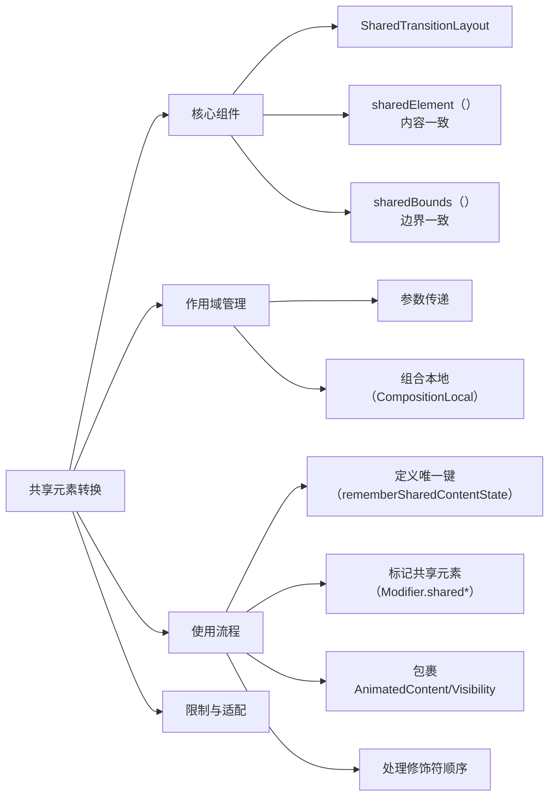

# Compose 中的共享元素转换  

原地址：<https://developer.android.google.cn/develop/ui/compose/animation/shared-elements?hl=zh-cn>  

## 一、核心概念  

**共享元素转换** 用于在不同可组合项（如页面切换）之间创建无缝过渡，通过共享视觉元素（如图像、文本）增强交互连贯性。  

- **实验性**：从 Compose 1.7.0 引入，API 可能变更，需关注更新。  
- **核心组件**：  
  - `SharedTransitionLayout`：定义共享元素作用域的根布局。  
  - `Modifier.sharedElement()`：标记内容一致的共享元素（如图像）。  
  - `Modifier.sharedBounds()`：标记边界共享但视觉不同的元素（如容器变换）。  

## 二、关键组件与用法  

### 1. `SharedTransitionLayout`  

- **作用**：提供 `SharedTransitionScope`，包裹需要共享元素的可组合项（如 `AnimatedContent`）。  
- **基本结构**：  

  ```kotlin  
  SharedTransitionLayout {  
      AnimatedContent(showDetails) { targetState ->  
          if (targetState) DetailsContent() else MainContent()  
      }  
  }  
  ```  

### 2. `Modifier.sharedElement()`  

- **适用场景**：内容一致的元素（如同一图片在列表和详情页的过渡）。  
- **关键参数**：  
  - `key`：通过 `rememberSharedContentState(key)` 定义唯一键（建议用数据类而非字符串）。  
  - `animatedVisibilityScope`：关联 `AnimatedContent` 或 `AnimatedVisibility` 的作用域。  
- **示例**：  

  ```kotlin  
  Image(  
      modifier = Modifier  
          .sharedElement(rememberSharedContentState(key = "image"), animatedVisibilityScope = this@AnimatedContent)  
          .size(100.dp)  
  )  
  ```  

### 3. `Modifier.sharedBounds()`  

- **适用场景**：视觉不同但需共享区域的元素（如字体变化、容器形状转换）。  
- **关键参数**：  
  - `enter/exit`：定义进入/退出过渡（如 `fadeIn() + scaleIn()`）。  
  - `resizeMode`：控制尺寸变化模式（如 `ScaleToBounds` 缩放填充）。  
- **示例**：  

  ```kotlin  
  Row(  
      modifier = Modifier  
          .sharedBounds(  
              rememberSharedContentState(key = "bounds"),  
              enter = fadeIn(),  
              exit = fadeOut(),  
              resizeMode = SharedTransitionScope.ResizeMode.ScaleToBounds()  
          )  
  )  
  ```  

## 三、作用域管理  

### 1. 作用域传递  

- **通过参数传递**：将 `SharedTransitionScope` 和 `AnimatedVisibilityScope` 作为参数传入子组件。  

  ```kotlin  
  MainContent(sharedTransitionScope = this@SharedTransitionLayout, ...)  
  ```  

- **通过组合本地（CompositionLocal）**：在嵌套布局中共享作用域，避免上下文覆盖。  

  ```kotlin  
  compositionLocalOf<SharedTransitionScope?> { null }  
  CompositionLocalProvider(LocalSharedTransitionScope provides this) {  
      // 子组件访问作用域  
  }  
  ```  

### 2. 与 `AnimatedVisibility` 结合  

在列表项中使用共享元素，点击时展开为详情页：  

```kotlin  
SharedTransitionLayout {  
    LazyColumn {  
        items(snacks) { snack ->  
            AnimatedVisibility(visible = snack != selectedSnack) {  
                Box(Modifier.sharedElement(key = snack.id)) { /* 列表项 */ }  
            }  
        }  
    }  
    if (selectedSnack != null) {  
        DetailsScreen(Modifier.sharedElement(key = selectedSnack.id)) { /* 详情页 */ }  
    }  
}  
```  

## 四、修饰符顺序与唯一键  

### 1. 修饰符顺序规则  

- **原则**：  
  - 不影响尺寸的修饰符（如 `padding`）放在 `sharedElement` 前。  
  - 影响尺寸的修饰符（如 `size`）放在 `sharedElement` 后，避免布局跳跃。  
- **反例**：  

  ```kotlin  
  // 错误顺序：padding 放在 sharedBounds 后导致边界不匹配  
  Box(Modifier.sharedBounds(...).padding(12.dp))  
  ```  

### 2. 唯一键设计  

- **推荐方案**：使用数据类结合唯一标识（如 `snackId` + 类型枚举）。  

  ```kotlin  
  data class SnackKey(val id: Long, val type: SharedElementType)  
  enum class SharedElementType { Image, Title }  
  ```  

## 五、当前限制与替代方案  

| **限制场景**               | **替代方案**                              |  
|---------------------------|------------------------------------------|  
| View 与 Compose 互操作     | 避免混合使用，或手动管理布局动画          |  
| 图片缩放（ContentScale）   | 使用 `sharedBounds` + `animateEnterExit`   |  
| 形状剪裁动画（如方变圆）   | 手动定义形状过渡，或使用 `AnimatedContent`|  
| 自动边界计算错误          | 确保修饰符顺序一致，使用 `requiredSize`   |  

## 六、流程图（mermaid）  



## 七、最佳实践  

1. **键的唯一性**：使用数据类而非字符串，避免列表项键冲突。  
2. **修饰符顺序**：先放置非尺寸修饰符，再放置 `sharedElement`，最后是尺寸相关修饰符。  
3. **作用域隔离**：在导航场景中，通过 `NavHost` 传递作用域，避免嵌套布局冲突。  
4. **复杂场景**：对多元素共享（如图像+标题），为每个元素定义独立键，分别标记 `sharedElement`。  

通过合理使用共享元素转换，可显著提升 Compose 应用的转场体验，尤其在列表与详情页、导航切换等场景中，但需注意实验性限制和性能优化。
