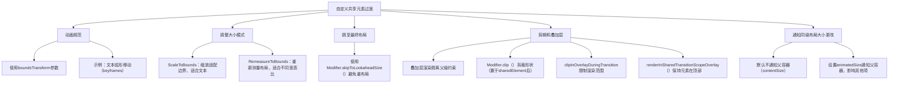

# 自定义共享元素过渡

原地址：<https://developer.android.google.cn/develop/ui/compose/animation/shared-elements/customize?hl=zh-cn>

## 一、核心知识点总结

### （一）动画规范

- **实现方式**：借助 `Modifier.sharedElement()` 的 `boundsTransform` 参数，能够对共享元素大小和位置移动的动画规范进行修改。该参数会提供初始 `Rect` 位置与目标 `Rect` 位置。
- **示例**：若要让文本以弧形移动，可指定 `boundsTransform` 参数并使用 `keyframes` 规范，具体代码如下：

  ```kotlin
  val textBoundsTransform = BoundsTransform { initialBounds, targetBounds ->
      keyframes {
          durationMillis = boundsAnimationDurationMillis
          initialBounds at 0 using ArcMode.ArcBelow using FastOutSlowInEasing
          targetBounds at boundsAnimationDurationMillis
      }
  }
  Text(
      "Cupcake",
      fontSize = 28.sp,
      modifier = Modifier.sharedBounds(
          rememberSharedContentState(key = "title"),
          animatedVisibilityScope = animatedVisibilityScope,
          boundsTransform = textBoundsTransform
      )
  )
  ```

- **适用范围**：可使用任意 `AnimationSpec`，像 `tween`、`spring` 等规范均可。

### （二）调整大小模式

| **模式** | **原理** | **适用场景** |
| --- | --- | --- |
| **ScaleToBounds** | 先运用预测性（或目标）约束条件对子布局进行测量，接着缩放子项的稳定布局，使其与共享边界相契合，可看作是各个状态之间的“图形刻度”。 | 适用于 `Text` 可组合项，能够避免文本重新布局和重新流动到不同行。 |
| **RemeasureToBounds** | 依据目标尺寸，利用带动画的固定约束条件对 `sharedBounds` 的子布局重新进行测量和布局，重新测量由边界大小变化触发，且边界大小变化可能每帧都会发生。 | 当边界具有不同宽高比，并且期望两个共享元素之间保持流畅连续性时适用。 |

### （三）跳至最终布局

- **问题**：在两个布局进行转换时，布局大小会在开始状态和最终状态之间添加动画效果，这可能会使文本等内容出现不必要的重新流动。
- **解决方案**：添加 `Modifier.skipToLookaheadSize()` 修饰符，可防止内容增加时发生重新流布局。
- **示例对比**：
  - 无该修饰符时，“Lorem Ipsum”文本会随着容器大小增大而重新流动。
  - 有该修饰符时，文本在动画开始时就会保持最终状态，不会重新流动。

### （四）剪辑和叠加层

1. **叠加层渲染机制**：在不同可组合项之间共享元素时，当开始向目的地中的匹配项转换，可组合项的渲染会提升到图层叠加层。如此一来，它能脱离父级的边界及其图层转换（例如 alpha 和缩放），呈现在其他非共享界面元素之上，转换完成后会从叠加层移至自己的 `DrawScope`。
2. **剪辑操作**：若要将共享元素剪裁为特定形状，可使用标准的 `Modifier.clip()` 函数，且要将其放置在 `sharedElement()` 后面，示例如下：

   ```kotlin
   Image(
       painter = painterResource(id = R.drawable.cupcake),
       contentDescription = "Cupcake",
       modifier = Modifier
           .size(100.dp)
           .sharedElement(rememberSharedContentState(key = "image"), animatedVisibilityScope = this@AnimatedContent)
           .clip(RoundedCornerShape(16.dp)),
       contentScale = ContentScale.Crop
   )
   ```

3. **相关参数**：
   - `clipInOverlayDuringTransition`：默认情况下，对于嵌套的共享边界，该参数会使用父 `sharedBounds()` 中的剪裁路径，用于确保共享元素不会在父容器之外呈现。
   - `Modifier.renderInSharedTransitionScopeOverlay()`：可使特定界面元素（如底部栏或悬浮操作按钮）在共享元素过渡期间始终保持在顶部，添加该修饰符后，元素会保持 elevated 状态。例如在 Jetsnack 中，`BottomAppBar` 需添加此修饰符以在共享元素之上保持到屏幕不可见。
   - `renderInOverlayDuringTransition`：默认值为 `true`，若设置为 `false`，共享元素将不会渲染在叠加层中。

### （五）通知同级布局共享元素大小的更改

- **默认行为**：`sharedBounds()` 和 `sharedElement()` 在布局转换时，不会将大小更改通知给父级容器。
- **解决方案**：将 `placeholderSize` 参数更改为 `PlaceHolderSize.animatedSize`，这样项在放大或缩小时，布局中的其他项会对大小更改做出响应。
- **对比**：
  - `PlaceholderSize.contentSize`（默认）：其他项不会因某一项的大小变化而移动。
  - `PlaceholderSize.animatedSize`：列表中的其他项会随着某一项的增大而向下移动。

## 二、流程图


