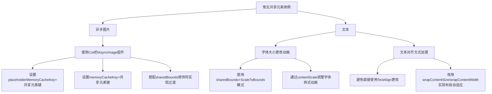

# 常见共享元素用例

原地址：<https://developer.android.google.cn/develop/ui/compose/animation/shared-elements/common-use-cases?hl=zh-cn>

## 一、核心知识点总结

### （一）异步图片

- **场景**：使用图片加载库（如Coil的`AsyncImage`）实现跨界面的图片共享过渡时，需确保缓存键与共享元素键一致，以实现无缝动画。
- **关键配置**：
  - **`placeholderMemoryCacheKey`**：设置占位图的缓存键，需与共享元素键（如`sharedBounds`的`key`）一致。
  - **`memoryCacheKey`**：设置图片内存缓存键，需与共享元素键一致。
  - **作用**：使匹配的共享元素使用相同的缓存键，加载新图片前，新元素会使用匹配项的缓存作为占位符，避免过渡闪烁。
- **示例代码**：

  ```kotlin
  AsyncImage(
      model = ImageRequest.Builder(LocalContext.current)
          .data("your-image-url")
          .crossfade(true) // 启用淡入淡出过渡
          .placeholderMemoryCacheKey("image-key") // 与共享元素键一致
          .memoryCacheKey("image-key") // 与共享元素键一致
          .build(),
      placeholder = null,
      contentDescription = null,
      modifier = Modifier
          .size(120.dp)
          .sharedBounds(
              rememberSharedContentState(key = "image-key"), // 共享元素键
              animatedVisibilityScope = this // 动画可见性作用域
          )
  )
  ```

- **注意事项**：确保`sharedBounds`的`key`与缓存键完全一致，否则可能导致缓存匹配失败，过渡效果不连贯。

### （二）文本

#### 1. **字体大小更改的动画**

- **推荐方案**：使用`Modifier.sharedBounds()`并搭配`resizeMode = ScaleToBounds`。
- **原理**：
  - `ScaleToBounds`模式通过缩放子布局适配目标边界，避免文本因重新测量布局而换行或重新流动。
  - 配合`contentScale`参数可微调字体粗细或样式的动画效果（如缩放比例）。
- **示例代码**：

  ```kotlin
  Text(
      text = "This is an example of how to share text",
      modifier = Modifier
          .wrapContentWidth() // 自适应宽度，避免固定宽度限制
          .sharedBounds(
              rememberSharedContentState(key = "sharedText"),
              animatedVisibilityScope = this,
              enter = fadeIn(), // 入场动画：淡入
              exit = fadeOut(), // 出场动画：淡出
              resizeMode = SharedTransitionScope.ResizeMode.ScaleToBounds // 缩放适配模式
          )
  )
  ```

#### 2. **文本对齐方式（`TextAlign`）的限制**

- **问题**：默认情况下，`TextAlign`的更改（如从左对齐改为居中对齐）不会触发动画效果。
- **解决方案**：
  - 避免直接使用不同的`TextAlign`，改用`Modifier.wrapContentSize()`或`Modifier.wrapContentWidth()`来实现布局自适应。
  - 通过调整布局尺寸间接实现对齐效果的过渡，确保共享转场流畅。
- **原理**：`TextAlign`属于文本布局属性，不涉及边界尺寸变化，而共享元素过渡依赖于`Rect`边界的动画，因此需通过布局尺寸变化触发动画。

## 二、流程图


