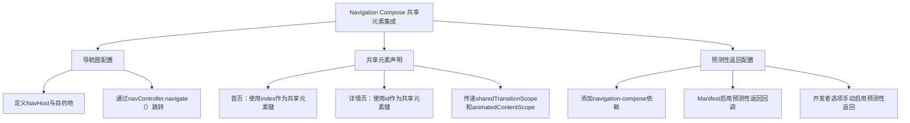

# 使用 Navigation Compose 构建共享元素

原地址：<https://developer.android.google.cn/develop/ui/compose/animation/shared-elements/navigation?hl=zh-cn>

## 一、核心知识点总结

### （一）Navigation Compose 与共享元素集成

#### 1. **关键组件与参数**

- **`Modifier.sharedElement()`**：需传入 `AnimatedVisibilityScope` 参数，用于控制共享元素的显示时机和动画范围。
- **`SharedTransitionScope`**：提供共享元素状态管理，通过 `rememberSharedContentState(key)` 定义共享元素的唯一键（如 `key="image-$id"`）。

#### 2. **实现步骤**

1. **定义导航图（NavHost）**：
   - 在 `NavHost` 中配置起始目的地（如 `"home"`）和详情页（如 `"details/{item}"`）。
   - 通过 `navController.navigate()` 触发页面跳转。
2. **在页面组件中声明共享元素**：
   - **首页（HomeScreen）**：在列表项中为图片和文本添加 `sharedElement` 修饰符，使用 `index` 作为键（如 `key="image-$index"`）。
   - **详情页（DetailsScreen）**：对应元素使用相同键（如 `key="image-$id"`），确保跨页面匹配。
3. **传递作用域参数**：
   - 将 `SharedTransitionScope` 和 `AnimatedContentScope` 从父组件传递到子组件，确保动画上下文一致。

#### 3. **示例代码**

```kotlin
// 导航宿主
@Composable
fun SharedElement_PredictiveBack() {
    SharedTransitionLayout {
        val navController = rememberNavController()
        NavHost(navController = navController, startDestination = "home") {
            composable("home") { HomeScreen(...) }
            composable("details/{item}") { backStackEntry ->
                val id = backStackEntry.arguments?.getInt("item")!!
                DetailsScreen(id, listSnacks[id], ...)
            }
        }
    }
}

// 详情页：图片和文本共享元素
@Composable
fun DetailsScreen(..., sharedTransitionScope: SharedTransitionScope, ...) {
    with(sharedTransitionScope) {
        Column {
            Image(
                modifier = Modifier.sharedElement(
                    rememberSharedContentState(key = "image-$id"),
                    animatedVisibilityScope = animatedContentScope
                )
            )
            Text(
                modifier = Modifier.sharedElement(
                    rememberSharedContentState(key = "text-$id"),
                    animatedVisibilityScope = animatedContentScope
                )
            )
        }
    }
}

// 首页：列表项共享元素
@Composable
fun HomeScreen(..., sharedTransitionScope: SharedTransitionScope, ...) {
    LazyColumn {
        itemsIndexed(listSnacks) { index, item ->
            Row {
                with(sharedTransitionScope) {
                    Image(modifier = Modifier.sharedElement(
                        rememberSharedContentState(key = "image-$index"),
                        animatedVisibilityScope = animatedContentScope
                    ))
                    Text(modifier = Modifier.sharedElement(
                        rememberSharedContentState(key = "text-$index"),
                        animatedVisibilityScope = animatedContentScope
                    ))
                }
            }
        }
    }
}
```

### （二）预测性返回功能与共享元素结合

#### 1. **依赖项配置**

- 使用最新 `navigation-compose` 依赖（如 `2.8.0-beta02`）：

  ```gradle
  dependencies {
      def nav_version = "2.8.0-beta02"
      implementation "androidx.navigation:navigation-compose:$nav_version"
  }
  ```

#### 2. **Manifest 配置**

- 在 `<application>` 标签中启用预测性返回回调：

  ```xml
  <application
      android:enableOnBackInvokedCallback="true"
      ...>
  </application>
  ```

#### 3. **开发者选项设置**

- 手动在系统开发者选项中启用“预测性返回”功能（需用户手动操作）。

#### 4. **效果**

- 当用户从详情页返回首页时，共享元素（如图像、文本）会以动画形式无缝过渡，增强交互流畅性。

## 二、流程图


