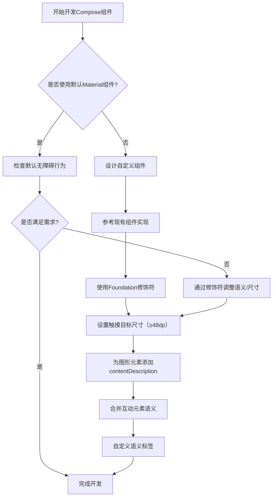

# API 默认值

原地址：<https://developer.android.google.cn/develop/ui/compose/accessibility/api-defaults?hl=zh-cn>  

## 一、概述

Material、Compose 界面和 Foundation API 内置了许多无障碍功能，包含遵循组件角色和功能的语义，无需额外开发即可提供基础支持。使用时需检查默认行为是否符合需求，也可通过 Compose 提供的方法进行自定义。

## 二、最小触摸目标尺寸

### 1. 标准与要求

- 所有可交互元素最小尺寸应为 48dp，遵循 Material Design 无障碍指南。
- Material 组件（如 Checkbox、RadioButton、Switch 等）在可接收用户操作时（如 onCheckedChange 非 null）会自动添加内边距至 48dp；若不可交互（onCheckedChange 为 null），则不添加内边距。

### 2. 代码示例

```kotlin
// 可交互复选框（自动添加内边距至48dp）
@Composable
private fun CheckableCheckbox() {
    Checkbox(checked = true, onCheckedChange = {})
}

// 不可交互复选框（无内边距）
@Composable
private fun NonClickableCheckbox() {
    Checkbox(checked = true, onCheckedChange = null)
}
```

### 3. 触摸目标扩展

- 若可点击组件尺寸小于 48dp，Compose 会自动扩展触摸区域（如点击小 Box 周围区域也可触发事件）。
- 为避免触摸区域重叠，建议使用 sizeIn 修饰符显式设置最小尺寸：

```kotlin
@Composable
private fun LargeBox() {
    Box(Modifier.size(100.dp)) {
        Box(
            Modifier.align(Alignment.Center)
                .clickable { /* 点击逻辑 */ }
                .background(Color.Black)
                .sizeIn(minWidth = 48.dp, minHeight = 48.dp)
        )
    }
}
```

## 三、图形元素的语义描述

### 1. contentDescription 的作用

- 为 Image、Icon 等图形元素提供文字性说明，供视障用户理解内容。
- 示例：为分享图标添加描述

```kotlin
@Composable
private fun ShareButton(onClick: () -> Unit) {
    IconButton(onClick = onClick) {
        Icon(
            imageVector = Icons.Filled.Share,
            contentDescription = stringResource(R.string.label_share)
        )
    }
}
```

### 2. 装饰性元素处理

- 若图形仅作装饰，无交互或状态，将 contentDescription 设置为 null：

```kotlin
@Composable
private fun PostImage(post: Post, modifier: Modifier = Modifier) {
    val image = post.imageThumb ?: painterResource(R.drawable.placeholder_1_1)
    Image(
        painter = image,
        contentDescription = null, // 声明无语义含义
        modifier = modifier.size(40.dp).clip(MaterialTheme.shapes.small)
    )
}
```

### 3. 其他组件的语义

- Material 组件（如 Button、Text）和互动修饰符（clickable、toggleable）自带预定义语义，可通过 Compose API 修改。

## 四、互动元素的语义合并

### 1. 合并子元素语义

- clickable 和 toggleable 修饰符会将子元素语义合并为一个逻辑实体，便于无障碍服务分组处理。
- 示例：Button 合并图标和文本语义

```kotlin
Row(Modifier.clickable { openArticle() }) {
    Icon(painter = painterResource(R.drawable.ic_logo), contentDescription = "Open")
    Text("Accessibility in Compose")
}
```

### 2. 自定义操作标签

- 使用 onClickLabel、onLongClickLabel 为无障碍服务提供更精准的操作提示：

```kotlin
Row(
    modifier = Modifier.clickable(
        onClickLabel = "Open this article"
    ) { openArticle() }
) { /* 子元素 */ }

// 长按示例
Row(
    modifier = Modifier.combinedClickable(
        onLongClickLabel = "Bookmark this article",
        onClickLabel = "Open this article",
        // 点击和长按逻辑
    )
)
```

### 3. 使用 semantics 修饰符

- 当无法直接访问 clickable 修饰符时，通过 semantics 单独设置语义标签：

```kotlin
@Composable
private fun ArticleList(openArticle: () -> Unit) {
    NestedArticleListItem(
        onClickAction = openArticle,
        modifier = Modifier.semantics {
            onClick(label = "Open this article") { /* 操作逻辑 */ }
        }
    )
}
```

## 五、自定义组件的无障碍支持

### 1. 最佳实践

- 参考 Material 或 Compose 库中类似组件的实现，模仿其无障碍行为（如 Checkbox 使用 triStateToggleable 修饰符）。
- 优先使用 Foundation 修饰符，其内置无障碍支持逻辑。

### 2. 示例参考

- 可查阅“清除和设置语义”部分的自定义切换开关示例，或 API 指南中关于自定义组件无障碍功能的详细说明。

## 六、流程图：Compose 无障碍功能实现流程


