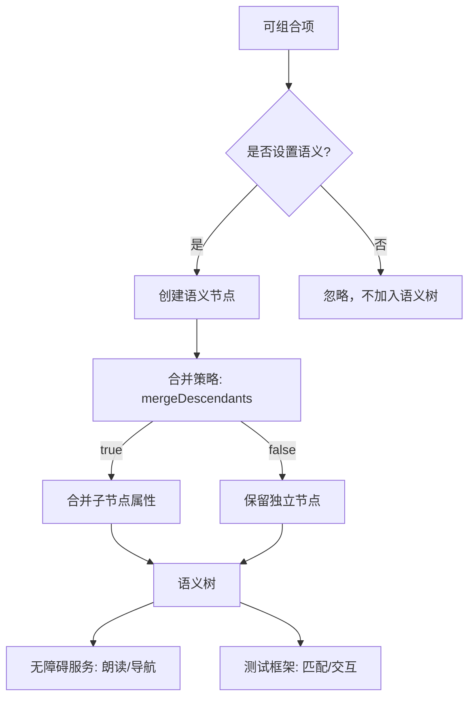

# 语义 - Jetpack Compose 无障碍开发指南  

[原文地址](https://developer.android.google.cn/develop/ui/compose/accessibility/semantics?hl=zh-cn)  

## 一、核心概念：语义的作用  

**语义（Semantics）** 是界面元素的补充信息，用于向无障碍服务（如TalkBack）、测试框架等传达组件的含义和行为。  

- **示例**：相机图标需通过语义说明“拍照”，Switch需说明“开启/关闭状态”。  
- **默认支持**：Material和Compose基础组件（如`Text`、`Icon`）已内置语义，但自定义组件需手动补充。  

## 二、语义属性：关键属性与场景  

### 1. 基础属性  

| 属性名               | 说明                                                                 | 示例场景                     |  
|----------------------|----------------------------------------------------------------------|------------------------------|  
| `Role`               | 组件类型（如`Switch`、`Button`）                                     | Switch的`Role.Switch`         |  
| `StateDescription`   | 状态描述（替代默认值，如“已订阅”替代“开启”）                         | 自定义开关的状态说明         |  
| `ToggleableState`    | 可切换状态（`On/Off`）                                               | Switch的当前状态             |  
| `OnClick`            | 交互行为                                                             | Button的点击事件             |  

### 2. 特殊组件属性  

| 组件类型       | 语义属性                     | 作用                                                                 |  
|----------------|------------------------------|----------------------------------------------------------------------|  
| **标题**       | `heading()`                  | 标记标题，支持无障碍导航（如TalkBack快速跳转章节）                  |  
| **弹窗/提醒**  | `liveRegion`（`Polite`/`Assertive`） | 通知内容更新（Polite：非紧急，Assertive：紧急如警报）              |  
| **错误组件**   | `error`                      | 补充错误详情（TalkBack先读主文本，再读error描述）                  |  
| **进度条**     | `progressBarRangeInfo`       | 传递进度范围（当前值、最小值、最大值）                              |  
| **列表**       | `collectionInfo`+`collectionItemInfo` | 告知列表项总数及当前索引（无障碍服务提示“第3项/共10项”）            |  

### 3. 代码示例：标题与实时区域  

```kotlin
// 标题组件（支持无障碍章节导航）
@Composable 
fun Subsection(text: String) {
    Text(
        text = text,
        style = MaterialTheme.typography.headlineSmall,
        modifier = Modifier.semantics { heading() } // 标记为标题
    )
}

// 紧急弹窗（实时区域，强制提醒）
PopupAlert(
    message = "Emergency alert",
    modifier = Modifier.semantics { liveRegion = LiveRegionMode.Assertive }
)
```

## 三、语义树：结构与合并策略  

### 1. 树结构原理  

- **界面树**：可组合项的层级结构（如`Button`包含`Icon`和`Text`）。  
- **语义树**：并行树，仅包含语义属性节点，用于无障碍服务和测试。  
- **合并策略**：  
  - `mergeDescendants = true`（默认）：合并子节点语义（如`Button`作为单节点，包含子节点的`Text`和`OnClick`）。  
  - `mergeDescendants = false`：保留所有节点（用于需要精细控制的场景）。  

### 2. 合并 vs 未合并树  

| 场景               | 合并树（默认）                  | 未合并树                      |  
|--------------------|----------------------------------|---------------------------------|  
| **测试匹配**       | `onNodeWithText("Like")` 直接匹配Button | 需逐层匹配子节点              |  
| **无障碍服务**     | 简化导航（单节点交互）          | 保留原始结构（适合复杂布局）  |  
| **典型组件**       | `Button`、`ListItem`            | 自定义`Layout`、`Canvas`       |  

### 3. 检查工具  

- **布局检查器**：支持切换合并/未合并树，可视化语义属性（如`Role`、`StateDescription`）。  
- **测试日志**：  

  ```kotlin
  // 打印合并树（默认）
  composeTestRule.onRoot().printToLog("SEMANTICS")  
  // 打印未合并树
  composeTestRule.onRoot(useUnmergedTree = true).printToLog("SEMANTICS")  
  ```

## 四、高级应用：自定义操作与状态  

### 1. 自定义无障碍操作  

- **场景**：滑动删除、拖放等复杂手势，转换为可点击的菜单项。  
- **代码示例**：  

  ```kotlin
  SwipeToDismissBox(
      modifier = Modifier.semantics {
          customActions = listOf(
              CustomAccessibilityAction(
                  label = "删除文章", 
                  action = { removeArticle(); true } // 返回true表示操作成功
              )
          )
      }
  ) { /* 内容 */ }
  ```  

  - **效果**：TalkBack显示操作菜单，支持语音或开关控制触发。

### 2. 状态说明覆盖  

- **场景**：替换默认状态标签（如“已订阅”替代“开启”）。  
- **代码示例**：  

  ```kotlin
  Row(
      modifier = Modifier
          .semantics { stateDescription = if (selected) "已订阅" else "未订阅" }
          .toggleable(/*...*/)
  )
  ```

## 五、最佳实践与注意事项  

1. **避免过度合并**：自定义布局（如日历）需拆分语义节点，避免整页作为单节点。  
2. **谨慎使用`Assertive`**：仅用于紧急通知（如警报），避免干扰用户。  
3. **测试驱动开发**：通过`SemanticsMatcher`验证语义（如`expectValue(Role.Switch)`）。  
4. **清除冗余语义**：使用`clearAndSetSemantics`移除子节点默认行为（如自定义操作时）。  

## 六、流程图：语义树构建与使用  



## 七、总结  

Compose的语义系统通过属性、树结构和自定义操作，为无障碍服务和测试提供了精细化控制。核心原则是“**为每个可交互组件赋予明确含义**”，尤其在自定义组件中需手动补充语义，确保所有用户（包括残障用户）能平等使用应用。通过布局检查器和测试工具，可验证语义的正确性，避免无障碍漏洞。
